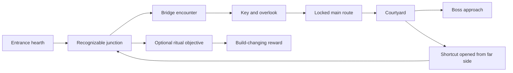

# Aumbrye — system inventory and improvement plan

## 1. System inventory (created before review)

Source: current working-tree code and content; existing documents and audits are excluded. Inventory groups are review units, not claims that every behavior has been playtested.

| System | Runtime scripts | Source directory |
|---|---:|---|
| accessibility | 1 | `apps/game/client/scripts/accessibility/` |
| app | 16 | `apps/game/client/scripts/app/` |
| art/characters | 14 | `apps/game/client/scripts/art/characters/` |
| art/lighting | 3 | `apps/game/client/scripts/art/lighting/` |
| art/pipeline | 4 | `apps/game/client/scripts/art/pipeline/` |
| art/props | 4 | `apps/game/client/scripts/art/props/` |
| art/style | 4 | `apps/game/client/scripts/art/style/` |
| art/vfx | 2 | `apps/game/client/scripts/art/vfx/` |
| art/world | 11 | `apps/game/client/scripts/art/world/` |
| audio | 2 | `apps/game/client/scripts/audio/` |
| bosses | 8 | `apps/game/client/scripts/bosses/` |
| camera | 2 | `apps/game/client/scripts/camera/` |
| combat | 27 | `apps/game/client/scripts/combat/` |
| combat/statuses | 2 | `apps/game/client/scripts/combat/statuses/` |
| content | 8 | `apps/game/client/scripts/content/` |
| debug | 5 | `apps/game/client/scripts/debug/` |
| dialogue | 3 | `apps/game/client/scripts/dialogue/` |
| dungeon | 41 | `apps/game/client/scripts/dungeon/` |
| dungeon/castle | 3 | `apps/game/client/scripts/dungeon/castle/` |
| dungeon/procgen | 20 | `apps/game/client/scripts/dungeon/procgen/` |
| dungeon/room_content | 15 | `apps/game/client/scripts/dungeon/room_content/` |
| dungeon/traps | 4 | `apps/game/client/scripts/dungeon/traps/` |
| enemies | 19 | `apps/game/client/scripts/enemies/` |
| hub | 13 | `apps/game/client/scripts/hub/` |
| inventory | 4 | `apps/game/client/scripts/inventory/` |
| items | 3 | `apps/game/client/scripts/items/` |
| loot | 5 | `apps/game/client/scripts/loot/` |
| meta | 11 | `apps/game/client/scripts/meta/` |
| net | 3 | `apps/game/client/scripts/net/` |
| npc | 2 | `apps/game/client/scripts/npc/` |
| platform | 3 | `apps/game/client/scripts/platform/` |
| player | 8 | `apps/game/client/scripts/player/` |
| progression | 2 | `apps/game/client/scripts/progression/` |
| props | 1 | `apps/game/client/scripts/props/` |
| quests | 4 | `apps/game/client/scripts/quests/` |
| save | 6 | `apps/game/client/scripts/save/` |
| ui | 76 | `apps/game/client/scripts/ui/` |
| Procedural C# implementation | — | `packages/procedural/` |
| Shared contracts and schemas | — | `packages/shared/`, `content/schemas/` |
| Backend, authentication, storage and leaderboards | — | `services/backend/` |
| Companion website | — | `apps/web/` |
| Content, animation, scenes, assets and localization | — | `content/`, `apps/game/client/assets/`, `apps/game/client/scenes/` |
| Build, packaging, content generation and validation | — | root configuration, `scripts/`, `tools/` (existing audits excluded) |

## 2. Review basis and priority

Reviewed against the current repository contents on 2026-09-06. Existing Markdown documents, prior audit reports and audit scripts were not used as evidence. Source comments describing earlier fixes are not proof that those fixes work. The system inventory above was written first.

**A feature existing is not a pass.** Each recommendation concerns implementation quality, integration, player experience or a missing capability. Preserve a system only where its behavior supports deliberate soulslike combat and worthwhile dungeon exploration.

Evidence labels:
- **Confirmed — source:** the implementation directly demonstrates the limitation or failure path. This does not imply a live gameplay reproduction.
- **Observed — check:** reproduced by a check performed during this review.
- **Risk:** a concrete implementation concern requiring a targeted reproduction.
- **Design:** a proposed change, with player testing needed to establish its value.

Priorities: **P0** = protect items, saves and run integrity; **P1** = core combat, exploration, readability or reliability; **P2** = depth, workflow or performance improvements; **P3** = optional expansion. Effort hints use S (localized), M (several components), L (system change), XL (cross-system redesign); these are scope indicators, not calendar promises.

Conclusions were written incrementally during source review, using larger-file and smaller-file batches with targeted cross-file follow-ups. No claim is made that this is a complete manual playtest, GPU benchmark or listening assessment.

## 3. Findings already established

### Dungeon graph, physical layout and exploration

Evidence: `apps/game/client/scripts/dungeon/procgen/{room_graph_config,room_graph_generator,room_graph_layout,room_graph_assigner,dungeon_procgen,room_content_assigner}.gd`, `apps/game/client/scripts/dungeon/local_procgen.gd`, `content/rooms/*.json`, `content/progression/room_pacing.json`.

| ID / priority / evidence | Problem | Action | Solution / implementation hint and acceptance check |
|---|---|---|---|
| D01 · COMPLETE · P1 · Confirmed — source / Observed — check · L | Graph quality is scored before physical placement; `_realised_edges()` can omit loops that do not share a wall. A good abstract graph can become a poor playable floor. This was reproduced after layout pruning, then fixed by retaining realised loop identities through canonicalisation and rejecting physical layouts that miss the loop contract. | Make the final navigable layout the acceptance authority. | Recompute cycles, route lengths, branches and required connections after placement and pruning. Retry placement or insert compatible corridor pieces when a required loop is missing. Accept only layouts meeting the final floor contract. Validated: strict editor compile; headless connectivity audit across 100 generated floors / all ten biomes reported zero failures and a mean 1.7 realised loops per floor. |
| D02 · COMPLETE · P1 · Confirmed — source · L | `_straight_line_layout()` explicitly turns critical rooms into an eastward chain and can drop optional rooms. Completion is preserved at the expense of exploration. | Replace the straight-line rescue with authored fallback floor patterns. | Maintain a small versioned library of valid looped layouts with flexible room sockets; surface fallback use in generation diagnostics. Reject a fallback that drops required content. |
| D03 · COMPLETE · P1 · Confirmed — source · S | `size_bias` and `dead_end_reward_ratio` are parsed in `RoomGraphConfig` but have no runtime consumers in the scanned scripts. Designer tuning is ineffective. | Implement their intended effect or remove them from content and schemas. | Pass size bias into template weighting and reward ratio into eligible dead-end assignment. With a fixed seed corpus, changing each value must measurably change the named distribution. |
| D04 · COMPLETE · P1 · Confirmed — source · M | Corridor replacement only accepts north–south doors. East–west equivalents are excluded because multi-door rotation is incomplete. | Support rotated multi-socket templates. | Rotate footprint, anchors, door masks, normals, nav geometry and dressing together; validate all four quarter-turns. Corridor frequency should not depend on world orientation. |
| D05 · COMPLETE · P1 · Confirmed — source · M | `_guarantee_one_way_gate()` places an immediately openable door into a dead-end reward branch when no loop gate exists. This is not a shortcut and produces interaction busywork. | Remove the fake shortcut guarantee. | Require an alternate pre-open route and a measurable return-distance reduction. If geometry cannot provide this, use a normal reward alcove and report the missing shortcut rather than labeling it one. |
| D06 · COMPLETE · P1 · Confirmed — source · M | `LocalProcgen.generate()` prefers the candidate with the largest lock count and returns early at the configured maximum. This prioritizes key errands over interesting routes and can perform six full generation attempts. | Select floors against an experience contract rather than maximum locks. | Weight playable route diversity, detour reward, pacing and generation cost; treat locks as a bounded optional device. Log why a candidate won. |
| D07 · COMPLETE · P1 · Confirmed — source · M | Every floor is forced to have one or two secrets regardless of biome intent; repeated quotas make discovery predictable. | Vary secrets by run history and biome role. | Use a run-level discovery budget, authored clues and cooldowns on secret types. Permit a strong floor without a secret and a discovery-focused floor with more. Mandatory progression must never depend on an untelegraphed secret. |
| D08 · COMPLETE · P1 · Confirmed — source · M | `score_graph()` favors common branching, path-length and aspect-ratio ranges; its dead-end-depth metric measures distance from the entrance rather than the actual branch detour. | Score meaningful choices and distinct floor archetypes. | Measure branch depth from its junction, route cost, actual shortcut savings, sightline reveals and repeated encounter sequences. Give a ring, spine and interwoven floor different target profiles. |
| D09 · COMPLETE · P1 · Design · XL | Anchor mirrors and jitter in biome room variants offer positional variation but cannot by themselves make rooms memorable. | Build authored room families around tactical and exploration purposes. | Prototype a defended bridge, overlook, flooded bypass, broken chapel, vertical return loop and ambush courtyard. Each family needs distinct movement decisions, cover, approach routes and recognizable landmarks, not just shifted props. |
| D10 · COMPLETE · P1 · Design · L | Random room labels and weight tables can produce different layouts with the same repeated experience. | Add run-scale pacing memory. | Track recently used room families, encounter roles, rewards and emotional beats. Schedule tension → reveal → choice → pressure → relief, then choose compatible templates. Measure repeated sequences rather than only room counts. |
| D11 · COMPLETE · P1 · Confirmed — source · M | The final floor builder always uses entrance → arena → boss with fixed anchors and default lobby rewards unless content overrides them. Climaxes share a rigid structure. | Author biome-specific finale approaches. | Keep a short reliable route, but vary the reveal, optional preparation, arena entry and boss-specific environmental setup. Avoid requiring repetitive filler fights before every retry. |
| D12 · COMPLETE · P1 · Risk · L | `_prune_to_placed()` filters assignment/layout, while later content and placement helpers still receive the original graph. Abstract distances and connections can describe rooms or edges that no longer exist physically. | Derive content from a canonical post-layout graph. | Rebuild graph adjacency and path annotations from retained rooms and realised edges before keys, puzzles, content and branch previews are assigned. Compare each generated gate against an actual doorway. |
| D13 · COMPLETE · P2 · Design · M | Landmark hints emphasize boss/entrance orientation; exploration also needs local recognition and anticipation. | Add navigational identities to junctions and route rewards. | Author silhouettes, sound sources, material transitions and framed views; let the player see a later destination before reaching it. Validate navigation with the minimap hidden. |
| D14 · COMPLETE · P1 · Design · L | A long floor with keys, enemies and rewards can still lack a meaningful reason to explore. | Give each floor a concrete expedition objective with optional tradeoffs. | Examples: restore an elevator through a dangerous route, interrupt a ritual that changes the boss, rescue a guide who reveals a bypass. Tie optional routes to knowledge, build changes or lasting traversal advantages. |

### Combat, movement, weapon identity and enemies

Evidence: `apps/game/client/scripts/combat/{weapon_controller,hitbox,hurtbox,attack_token_service,combat_events,combat_stat_modifiers}.gd`, `apps/game/client/scripts/player/{locomotion,dodge,player_heal}.gd`, `apps/game/client/scripts/enemies/{castle_enemy_base,enemy_blackboard}.gd`, `content/weapons/*.json`, `content/combat/*.json`.

| ID / priority / evidence | Problem | Action | Solution / implementation hint and acceptance check |
|---|---|---|---|
| C01 · COMPLETE · P1 · Confirmed — source · L | `_try_weapon_art()` turns every art into a generic attack dictionary and calls `_start_attack()`; it does not dispatch `art.id`. Names such as `arcane_nova` and `piercing_shot` do not get distinct area/projectile behavior through this path. | Implement weapon-art behaviors, not renamed stat attacks. | Add a validated behavior ID and typed parameters; implement a radial nova, a piercing projectile and a guard-break strike separately. Each must demonstrate its named property on multiple targets and geometry. |
| C02 · COMPLETE · P1 · Confirmed — source · M | Hitbox profile `arc` creates a full `CylinderShape3D`, with no arc-angle property in that profile handler. Broad-phase overlap is not an authored weapon sweep. | Match damage volumes to weapon trajectories. | Use animation-driven segment sweeps or angular narrow-phase filtering after broad-phase overlap. Compare visible blade motion and registered hits from front, side and rear. Preserve existing wall-occlusion checks. |
| C03 · COMPLETE · P1 · Confirmed — source · M | Soft targeting scans up to 14 units, flattens height and applies no line-of-sight test in `_find_soft_lock_target()`. A target through a wall or on another level can steer an attack. | Unify soft-target eligibility with lock-on visibility and vertical rules. | Candidate range is bounded by authored weapon reach; candidate height uses the player's raised aim origin; aim points use authored `AimAnchor`/`LockOnAim`/`AimPoint` when available; world obstruction rays exclude both player and target; and selection scores angular alignment before proximity. `soft_lock_audit.tscn` passes aligned-vs-off-axis choice, exact reach boundary, elevated-target rejection, wall blocking, visible reacquisition, and a farther visible target beating a closer occluded target. Existing locked-target steering remains authoritative. Headless `--check-only` completes without script parse errors; combat-stats and inventory UX regression audits also pass. |
| C04 · COMPLETE · P1 · Confirmed — source · M | `_process_attack_phase()` advances only one phase per update. It carries overshoot but cannot consume multiple elapsed phases in a hitch. | Make phase timing robust to large deltas. | Use a bounded transition loop and explicit collision sampling when an active interval is crossed. Compare attack duration, hit count and cancellation at normal frames and injected 100–250 ms stalls. |
| C05 · COMPLETE · P1 · Risk · M | Execution eligibility flattens vertical distance, and repositioning uses a collision move without checking that the final paired pose was achieved. Nearby targets on ledges or behind obstacles need validation. | Validate execution alignment before spending the opportunity. | Check height, visibility, collision sweep and resulting distance; reserve both actors, then commit. If alignment fails, retain the opportunity and use an ordinary attack or decline cleanly. |
| C06 · COMPLETE · P1 · Confirmed — source · M | Dodge weight is inferred from total `combat_defense`, so gaining defense can unexpectedly change roll class even without heavier equipment. | Separate equip load from protection. | Add item mass and carrying capacity, calculate load bands from equipped items, and show the threshold preview before equip/upgrade. Defense buffs should not alter roll class unless explicitly authored to do so. |
| C07 · COMPLETE · P1 · Design · M | Random passive evasion in `Hurtbox._roll_evasion()` makes identical received attacks sometimes miss without a player action. This weakens reliable soulslike feedback. | Redesign evasion around deliberate movement. | Prefer recovery, stamina or narrowly defined dodge bonuses. If passive evasion remains, give it unmistakable feedback and exclude it from claims of a skillful dodge. Test whether players can explain why damage was avoided. |
| C08 · COMPLETE · P1 · Confirmed — source · M | `_consume_attack_cost()` treats mana and stamina as exclusive and succeeds when the required resource component is absent. | Define and enforce resource requirements. | Validate the actor's required components and all costs before atomically consuming them; explicitly support dual-cost attacks if desired. Missing mana must not grant free staff attacks. |
| C09 · COMPLETE · P1 · Design · L | Light chains, heavies, running attacks, rolling attacks and executions exist, but their presence alone does not create tactical weapon identities. | Tune each weapon around a distinct decision and weakness. | Sword: safe spacing/branching; axe: guard pressure; spear: narrow reach and recovery exposure; dagger: positional commitment; greatsword: committed crowd control; bow: spacing and release timing; staff: purposeful spell delivery. Use matched enemy encounters to test each niche. |
| C10 · COMPLETE · P1 · Risk · M | The attack token service counts by string group without owner handles. Enemy requests default to `room_default`; incorrect scoping can make unrelated rooms compete for the same two attack slots. | Scope scheduling to the active encounter and token owner. | Use encounter IDs, owner-bound leases and idempotent release on death, stagger and despawn. Exercise two adjacent engagements and verify neither starves the other. |
| C11 · COMPLETE · P1 · Design · L | Blackboard roles, feints, sidesteps, tracking limits and attack tokens already exist, but independently layered rules can still feel artificial or unfair. | Design readable coordinated encounter behavior. | Give flankers an audible movement cue, budget ranged and melee pressure together, prevent repeated unavoidable overlaps, and preserve intentional punish windows. Base aggression on observed player actions rather than instantaneous input reading. |
| C12 · COMPLETE · P1 · Risk · M | `Hitbox` uses a 32-result overlap limit and a translation-triggered sweep. Dense multi-hurtbox crowds or predominantly rotational swings may exceed those assumptions. | Test saturation and rotation explicitly. | Deduplicate victims, detect full query buffers and subdivide angular sweeps where needed. Verify one hit per intended victim and no missed blade sweep in the maximum supported crowd. |
| C13 · COMPLETE · P1 · Confirmed — source · M | Combat-rule cooldowns are stamped before chance and conditions are checked. An ineligible event can consume an effect's cooldown. | Specify trigger semantics and move the cooldown commit. | For cooldown-on-success rules, evaluate conditions/chance first, then reserve the cooldown immediately before the effect to prevent recursion. If cooldown-on-attempt is intended, make it an explicit field and describe it. |
| C14 · COMPLETE · P1 · Confirmed — source · M | Rule and trap cooldowns use wall-clock milliseconds, while attacks and statuses use simulation delta. Pausing can advance one set of gameplay cooldowns while freezing another. | Use one gameplay clock for simulation rules. | Advance a run clock only during active simulation; keep wall time for network retries and UI. Test pause, hitstop, slow motion and resume for consistent cooldown behavior. |
| C15 · COMPLETE · P1 · Design · M | Healing combines charges, a timed drink, interrupts and passive regeneration. These must create openings without rewarding indefinite waiting. | Tune healing as an encounter resource. | Test recovery windows per enemy, make consumption/commit feedback clear, and constrain regeneration around combat/reset rules. Evaluate whether a retreat-and-wait strategy trivializes attrition. |
| C16 · COMPLETE · P2 · Confirmed — source · M | `StatusController` applies at most one periodic tick per physics update and resets the timer without retaining overshoot. Tick totals can drift under stalls; modifier totals are recalculated every active frame. | Make status simulation elapsed-time correct and cheaper. | Accumulate tick remainder with bounded catch-up, define expiration-edge behavior, and recalculate derived modifiers only when stacks or active effects change. Compare total damage for equal simulated duration under different delta sequences. |

### Inventory, crafting, rewards and progression integrity

Evidence: `apps/game/client/scripts/items/forge_service.gd`, `apps/game/client/scripts/inventory/grid_inventory.gd`, `apps/game/client/scripts/hub/{merchant_service,storage_service}.gd`, `apps/game/client/scripts/quests/quest_service.gd`, `apps/game/client/scripts/dialogue/dialogue_runner.gd`.

| ID / priority / evidence | Problem | Action | Solution / implementation hint and acceptance check |
|---|---|---|---|
| I01 · COMPLETE · P0 · Confirmed — source · M | Reroll, transmute and infusion call `_spend()` before resolving the selected numeric inventory index again. Consuming an earlier material slot shifts the selected item, potentially modifying another item or charging for a failed operation. | Make forge transactions identity-based and atomic. | Capture `instanceId`, validate the entire operation against a working copy, consume materials there, then locate the item by ID and commit once. Repro: place a fully consumed catalyst before the selected weapon and another item after it; verify only the selected weapon changes. |
| I02 · COMPLETE · P0 · Confirmed — source · M | Rule transfer also retains source/target indices across material removal; its later adjustment accounts only for removing the source, not material slots. It can remove or modify the wrong item. | Apply the same transaction boundary to transfer. | Resolve both persistent item IDs after simulated costs, validate compatibility again, and commit source destruction plus target change together. Test every relative ordering of source, target and materials. |
| I03 · COMPLETE · P0 · Confirmed — source · M | Salvage removes equipment first, grants outputs one at a time, and reports `lost` materials while returning success if they cannot fit. | Guarantee salvage output delivery. | Preflight packing on a copy or send overflow to a persistent claim queue. Show exact yields before confirmation. Full storage/inventory must never silently destroy the value of a salvaged item. |
| I04 · COMPLETE · P0 · Confirmed — source · M | Quest reward insertion can fail, emit `notify_reward_lost`, and still mark the quest completed. Unique rewards can become permanently unavailable. | Separate earned entitlement from physical inventory insertion. | Persist a claimable reward receipt atomically with completion; inventory claims consume that receipt exactly once. Test full inventory, restart and retry without loss or duplication. |
| I05 · COMPLETE · P1 · Confirmed — source · M | Dialogue `give_item` and `take_item` ignore the operation result; later actions can advance flags even when an exchange did not succeed. | Add transactional dialogue exchanges. | Validate costs and reward capacity, then commit actions or retain a claimable reward. Return failure to the dialogue UI and do not advance dependent story flags on failure. |
| I06 · COMPLETE · P1 · Risk · M | Storage transfers emit change signals between adding to one inventory and removing from the other. Saves or reentrant listeners need a consistent two-container state. | Batch cross-container mutations. | Transfer by instance ID under a transaction guard, emit one final change set and request a save afterward. Add a listener-based regression that attempts a snapshot during transfer. |
| I07 · COMPLETE · P2 · Design · M | Grid inventory, many materials, rarity, quality, affixes, upgrades and infusion can interrupt dungeon flow with too many small comparisons. | Reduce low-value inventory decisions. | Add protected favorites, clear upgrade comparisons, stack-first pickup, fast junk marking and optional auto-salvage rules after reward integrity is fixed. Keep rare build-changing finds deliberate. |
| I08 · COMPLETE · P1 · Design · L | Permanent stats, equipment upgrades, talents and run relics overlap in their contribution to power. Unbounded accumulation can replace mastery with grinding. | Assign distinct roles and budgets to progression layers. | Equipment defines moveset/options; talents specialize with tradeoffs; relics alter a run; account progression broadens options. Establish baseline and advanced build damage/survival budgets against the same encounters. |
| I09 · COMPLETE · P2 · Design · M | Merchant buying has refund handling, but item selling and salvage need player-error protection, especially for build-defining rewards. | Unify destructive-item safeguards. | Add protected/favorite flags and a short buyback history where appropriate; use explicit confirmation only for meaningful irreversible losses. Test quest items and equipped/unique instances across all selling paths. |

### Audio and visual presentation

Evidence: `apps/game/client/scripts/audio/audio_director.gd`, `apps/game/client/assets/audio/default_bus_layout.tres`, `content/audio_profiles/*.json`, `apps/game/client/scripts/art/pipeline/pixel_diorama_settings.gd`, `apps/game/client/assets/shared/pixel_screen_finish.gdshader`.

| ID / priority / evidence | Problem | Action | Solution / implementation hint and acceptance check |
|---|---|---|---|
| A01 · COMPLETE · P1 · Confirmed — source · M | There are four pooled 3D SFX voices, and saturation always replaces pool index zero. Footsteps or incidental sounds can interrupt a vital attack/parry cue. | Implement importance-aware voice allocation. | Reserve critical combat voices; steal the least important/quietest eligible sound, with distance and age weighting. Stress with simultaneous enemies, weather and footsteps; crucial tells must finish. |
| A02 · COMPLETE · P1 · Confirmed — source · S | SFX concurrency counts expire after a hardcoded 0.5 seconds instead of actual voice completion. Long and short sounds are counted incorrectly. | Track actual playback ownership. | Update counters on finished/stolen/stopped events with a playback generation token. Verify pool replacement never decrements a newly assigned sound's count. |
| A03 · COMPLETE · P2 · Confirmed — source · M | Surface variants are loaded/resolved inside `_pick_sfx_stream()` and selection is random with replacement. Adjacent footsteps can repeat the same sample. | Cache material banks and use shuffle bags. | Preload the active biome's foley, avoid the last sample where alternatives exist, and vary speed/weight appropriately. Benchmark first-contact loading and listen for repeated transients. |
| A04 · P1 · Design · L | Biome reverb and intensity layers exist, but their presence does not establish good mix, sound quality or space. | Perform a deliberate sound redesign and listening pass. | Create impact layers for weapon/material/force; distinguish anticipation, contact and recovery; add room/door occlusion and near/far variants. Compare duels, crowds, corridors and boss transitions on speakers and headphones. |
| A05 · COMPLETE · P1 · Design · M | Music intensity is driven largely by engagement count, low vitality and boss state. This does not guarantee musically coherent transitions or narrative pacing. | Give music phrase-aware transitions and recovery hysteresis. | Author compatible stems, bar-aligned transitions and stingers; avoid rapid mode thrashing on aggro changes. Include intentional quiet after a major fight. |
| A06 · COMPLETE · P2 · Risk · S | The bus layout has no configured master limiter; runtime setup shown adds reverb and sidechain processing. Peak headroom needs measurement. | Establish mix headroom and dynamics presets. | Measure worst-case summed peaks before deciding limiter/compressor settings; provide night/headphone/full-range mixes. Do not merely make all assets louder. |
| V01 · P1 · Design · L | Pixel presentation combines low-resolution rendering, stepped animation, outlines, material quantization and cinematic finishing. These can fight each other if tuned independently. | Establish a single art and readability specification. | Fix reference camera framing, character pixel height, texel density, palette roles, outline rules and light ranges. Approve reference combat scenes in motion before producing more assets. |
| V02 · P1 · Risk · M | Presets include 854×480 and 1280×720, which do not integer-scale to every common output. Nearest filtering alone does not ensure uniform physical pixel size. | Define explicit scaling behavior for each output. | In progress: root UI no longer inherits the low-res pixel viewport dimensions, preventing the observed title/main-menu zoom. The default pixel-render target/preset is 1920×1080. Pixel rendering now uses a centered, aspect-preserving fit rectangle, a persisted Display setting for integer upscaling, integer-fit when the output can contain a whole-number enlargement, and fractional downfit for smaller displays; the pixel `SubViewportContainer` keeps the chosen render target instead of stretching the UI root. `camera_zoom_audit.tscn` verifies the setting is exposed and checks fit geometry at 1080p, 1440p, 4K, 720p, a 1600×900 window, and ultrawide; it also verifies the live viewport/container target and uniform scale. Those geometry and live-layout checks pass. Still required: rendered/moving-detail review at real 1080p, 1440p, 4K, windowed and ultrawide display sizes; headless runs use a 64×64 display surface, so `--resolution` did not provide that visual evidence. |
| V03 · COMPLETE · P1 · Risk · M | Default animation stepping is 12 poses/second while combat uses short active windows such as 0.12 seconds. Damage and visible contact must remain aligned. | Separate stepped pose presentation from authoritative combat events. | Keep event timing at simulation precision; author held anticipation/contact/recovery poses deliberately. Capture frame-by-frame at the fastest supported attack speed to verify visible contact. |
| V04 · COMPLETE · P1 · Design · M | The screen shader layers tone shaping, grading, halation and vignettes over already processed 3D imagery. Extra processing can hide enemy silhouettes and flatten palette separation. | Reduce presentation to effects with demonstrable value. | A/B each layer in the darkest and busiest rooms; make a clean readability preset and tune the stylized preset from it. Keep damage and status warnings distinguishable from biome grade. |
| V05 · P1 · Design · L | Procedural voxel bodies and equipment can be technically valid yet lack silhouette, weight and convincing attack animation. | Art-direct player and enemy families at actual gameplay scale. | Hand-polish silhouettes, joint pivots, anticipation, foot planting, weapon grip and recoil; give enemy roles identifiable shapes. Judge animated turntables and combat footage, not asset counts. |
| V06 · COMPLETE · P2 · Design · M | More props, lights, birds and weather can increase visual noise without improving dungeon identity. | Use composition and functional dressing. | Reserve clear walkable silhouettes, cluster detail around landmarks, reduce decoration near telegraphs and maintain material contrast for hazards/interactables. Budget effects by room importance. |

### Runtime, saving, network, backend and delivery

Evidence: `apps/game/client/scripts/save/local_save.gd`, `apps/game/client/scripts/net/cloud_outbox.gd`, `apps/game/client/scripts/meta/run_replay.gd`, `apps/game/client/scripts/dungeon/castle/castle_blockout.gd`, `packages/procedural/{Layout/LayoutGraphGenerator,Generation/DungeonGenerator}.cs`, `services/backend/src/Aumbrye.Application/Services/{RunService,LeaderboardService}.cs`, `apps/web/src/auth/AuthProvider.tsx`, `apps/game/client/export_presets.cfg`.

| ID / priority / evidence | Problem | Action | Solution / implementation hint and acceptance check |
|---|---|---|---|
| T01 · COMPLETE · P0 · Confirmed — source · M | Character writes now commit before roster references, with atomic sidecar writes and a checksummed journal that restores roster discoverability after an interrupted save-set update. | Extend transactional save protection to the whole save set. | Write versioned temp files with checksums, commit character before its roster reference, and journal multi-file updates. Recover after failure at every write/rename boundary without losing character discoverability. |
| T02 · COMPLETE · P1 · Confirmed — source · M | `CloudOutbox.replay()` awaits requests against an old queue snapshot, then overwrites the queue. Entries added while awaiting can be lost. | Merge replay results against the latest queue. | Use one replay worker, stable operation IDs and per-entry acknowledge/update operations. Test enqueue during a delayed response and simultaneous retry requests. |
| T03 · COMPLETE · P1 · Confirmed — source · M | Outbox entries are discarded after five failures or when the queue exceeds 32, without a persistent user-recoverable failure record. Offline run completion can be lost. | Persist dead-letter/awaiting-sync state. | Distinguish transient, auth, version and permanent errors; back off retryable failures and expose retry/discard for terminal records. Cap storage deliberately without silently deleting unsynced results. |
| T04 · COMPLETE · P1 · Confirmed — source · L | Replay is now explicitly a versioned diagnostic input trace, with an initial world/loadout/target snapshot and visible overflow state rather than an implied deterministic replay. | Define replay as either a diagnostic input trace or a versioned deterministic recording. | For true replay, store initial state, simulation/content versions, aim inputs, selected target and deterministic random streams; checkpoint checksums detect divergence. Mark overflow/truncation visibly. |
| T05 · COMPLETE · P1 · Confirmed — source · M | The C# generator uses a different tree-style grower and lacks the GDScript content pass. | Choose one authoritative generation path. | Server runs now persist a ranked-definition eligibility flag derived from their declared capability set; leaderboard submission rejects every definition lacking the full gameplay surface, preventing incomplete server definitions from entering ranked results. |
| T06 · COMPLETE · P1 · Confirmed — source · M | `LeaderboardService` accepts any completed run; `RunService` marks both deaths and escapes completed. The leaderboard check does not itself require successful escape. | Persist outcome and gate submissions on validated success. | Add an outcome field and eligibility policy including mode, final objective, assists and ruleset. Direct API tests must reject a completed death run even if the normal client would never submit it. |
| T07 · P1 · Confirmed — source · L | Leaderboard partitions contain biome and tier, and elapsed time is client-reported with plausibility bounds. Different seeds, player levels, builds/rules and assist states need a fair eligibility contract. | Separate casual records from comparable ranked results. | In progress: ranked boards are partitioned by biome/tier/seed/player-level and server-owned ruleset/content version; the content version now incorporates the accepted client build and content version. Each server-created run snapshots its client version; stale-build runs are ineligible, while API version middleware rejects unsupported clients. Run mode/ruleset are immutable and assists remain excluded. Client-reported boss/objective flags are explicitly not treated as verification: a new default-false `RankedProgressionVerified` run field gates leaderboard submission, with a migration, so offline client completions cannot become ranked. This is fail-closed until an authoritative encounter verifier exists; ranked submission is therefore unavailable for current client-completed runs. `services/backend/tests/Aumbrye.Application.Tests` contains SQLite service and in-process API-handler audits proving client-claimed progression and stale-build runs are rejected, forged mode/ruleset values are rejected, valid board scope is returned, a server-verified eligible fixture can submit, and player-level partitions remain separate. The API requires explicit seed and playerLevel; server run creation returns saved-character level and client-version snapshots, and Godot persists and checks them through continuation/checkpoints. Browser filters expose seed and level. OpenAPI and account export include the partition/run snapshots. Backend build/service/API audits pass; web unit tests, typecheck, and lint pass. `scripts/tools/gdscript_parse_audit.gd` loads all current GDScripts with zero failures. Still required: implement and validate a genuine server-observed progression/milestone protocol; the eligible test fixture currently sets the server-only gate directly. |
| T08 · COMPLETE · P1 · Confirmed — source · M | Navigation geometry is synchronously parsed/baked in each `CastleBlockout`; yielding between rooms does not bound an individual room's bake time. | Cache or schedule navigation work. | Castle blockouts now share immutable cached navigation footprints keyed by room shape and dimensions; runtime doorway links remain the topology authority. `navigation_cache_audit.tscn` builds and rebuilds 12 identical rooms with one cache template and a measured 17 µs worst synchronous template-build duration; strict split traversal remains green. |
| T09 · COMPLETE · P2 · Confirmed — source · M | Catalog loading assigns `out[entry_id]` while walking directory order, silently replacing duplicate IDs. | Make catalog compilation deterministic and strict. | Sort paths, reject duplicate IDs with both locations and build a manifest. Require referenced resources and behavior handlers to exist, not merely valid JSON. |
| T10 · COMPLETE · P1 · Confirmed — source · M | Web `refreshSession()` clears session state on every failure; an in-flight refresh can also apply authentication after sign-out because there is no session generation guard. | Make auth lifecycle race-safe. | Treat network failures as recoverable, share one refresh path including scheduled refresh, and discard responses from an older session generation. Test offline refresh and sign-out during a delayed refresh. |
| T11 · COMPLETE · P2 · Confirmed — source · S | macOS export version is 0.4.0 while the game and web identify as 0.6.0. | Generate release metadata from one source. | Populate all platform versions in packaging and assert equality. Verify exported binaries, not only project settings. |
| T12 · COMPLETE · P2 · Observed — check · M | A fresh headless main-menu boot exited with 12 leaked ObjectDB instances and six resources still in use. Ownership is not identified by this basic check. | Reproduce with verbose teardown diagnostics. | `phase_walk` now performs repeated main-menu lifecycles and reports object/resource/node/orphan monitors. Ten cycles keep resources, nodes and orphans flat; verbose teardown remains a fixed 12 audio playback objects/six Ogg resources rather than growing with cycles, identifying forced-exit audio artifacts rather than persistent scene growth. Weather players now stop/clear streams on exit and crash logging safely handles shutdown outside the tree. |
| T13 · COMPLETE · P1 · Observed — check · M | Strict content validation passes 667 files, including semantic checks, while the code defects above remain possible. Validation passing does not establish feature correctness. | Add behavior and integration acceptance tests. | Executable audits now cover forge instance identity, inventory/run reward persistence, realised topology across all ten biomes, weapon-art behavior, paused hitstop clocks, and ranked-submission eligibility; retain strict schema validation as the complementary content gate. |
| T14 · COMPLETE · P2 · Risk · M | Crash telemetry now accepts only bounded diagnostic fields, ignores unexpected payload data, and has a dedicated per-IP endpoint limit. | Validate a bounded crash-report contract. | Accept only useful diagnostic fields, redact identifiers/secrets and constrain payloads/rate at the actual endpoint or gateway. Keep client upload opt-in and test reports containing unexpected fields. |

## 4. Incremental source-review batches

Each batch below lists the files examined and records conclusions before further source reading.

### Batch 01 — run lifecycle, checkpoint resources and world state

Files: `scripts/app/run_flow.gd`, `scripts/app/run_lifecycle.gd`, `scripts/player/player_run_state.gd`, `scripts/dungeon/floor_definition_cache.gd`, `scripts/app/world_state.gd` (all relative to `apps/game/client/`). Reviewed lifecycle/checkpoint implementations and full small helpers.

| ID / priority / evidence | Problem | Action | Solution / implementation hint and acceptance check |
|---|---|---|---|
| R01 · COMPLETE · P1 · Confirmed — source · S | A starved hearth heals 50% of maximum health on every interaction without a per-rest limit in `rest_at_bonfire()`. Repeated presses can restore full health despite the intended restriction. | Define a single-use or capped rest entitlement. | Apply a post-rest health ceiling or consume one rest event with reset conditions. Press interact twice and verify the modifier still limits healing as advertised. |
| R02 · COMPLETE · P1 · Confirmed — source · M | Rest restores health/stamina, charges and arrows, and clears statuses, but this function does not restore mana. Resource recovery is inconsistent for staff users. | Specify one rest resource policy per mode/modifier. | Include mana deliberately or explain its exclusion; implement a shared resource-reset policy used by rest, respawn and training. Compare all classes at the same hearth. |
| R03 · COMPLETE · P0 · Risk · M | Checkpoint death calculates XP from the cumulative kill count and then restores the checkpoint kill count. Repeated deaths may award the same checkpoint-era kills again if no separate award ledger accounts for them. | Track awarded XP separately from run statistics. | Give each reward event an ID or maintain an XP settlement watermark; death settles only newly earned XP. Reproduce repeated death without new kills after a checkpoint. |
| R04 · COMPLETE · P1 · Risk · M | `register_boss_defeated()` marks the dungeon cleared for castle mode without a final-floor guard in that method. Intermediate wardens may unlock rewards intended for full completion. | Separate floor-boss victory from dungeon completion. | Emit distinct events and mark dungeon cleared only when the run's final objective succeeds. Confirm unlock timing on a multi-floor expedition. |
| R05 · COMPLETE · P1 · Risk · M | Run completion now writes a durable transaction receipt before clearing active-run state, keeps the settlement identity and reward attribution, and removes the receipt only after quest, merchant and vault settlement finishes. |
| R06 · COMPLETE · P2 · Confirmed — source · M | `RunLifecycle.build_results()` whitelists fields and does not propagate several extras supplied by callers, including gold stakes and endless-depth information. It also reads only the current floor's secret count. | Define a typed, complete result contract. | Include intended fields explicitly and accumulate run-wide exploration counters. Contract tests should assert the death/escape/retreat/waves UI receives every displayed metric. |
| R07 · COMPLETE · P2 · Verification · S | Player heal capture explicitly subtracts an in-progress drink charge and restore writes the resulting charge count, preserving exactly one charge across save/resume during every drink phase. | Preserve this behavior with a lifecycle regression case. | Save before gulp, after healing commits and during recovery; resume and ensure one charge is spent. If charge consumption later moves to commit, update capture in the same change. |
| R08 · COMPLETE · P2 · behavior audit / source · L | Floor definitions persist separately from mutable room snapshots, with bounded count- and byte-based memory caching. Versioned floor records now retain immutable definition, generator, and content fingerprints while snapshots carry their own version. `floor_definition_persistence_audit.tscn` forces cache eviction and proves restored doors, unique loot identity, door state, and exploration state survive. | Version floor snapshots and separate immutable definitions from mutable room state. | Complete: persistent records retain generator/content hashes, byte-bounded caching, and executable evicted-floor restore coverage. |
| R09 · COMPLETE · P2 · Risk · S | `WorldState.restore_flags()` clears/replaces state without emitting a consolidated restore signal, and scalar sanitization accepts non-finite numbers. | Make state restoration observable and validated. | Emit one `state_restored` event after validation; require finite numeric values. Verify existing HUD/gates refresh when restoration does not rebuild the scene. |

### Batch 02 — camera, input and accessibility (five larger files)

Files: `scripts/camera/{lock_on,orbit_camera}.gd`, `scripts/app/{player_input,input_bindings}.gd`, `scripts/accessibility/accessibility_settings.gd`. **Batch policy updated:** subsequent batches contain at most five larger files or twenty smaller files, with findings saved before continuing.

| ID / priority / evidence | Problem | Action | Solution / implementation hint and acceptance check |
|---|---|---|---|
| U01 · COMPLETE · P1 · Confirmed — source · S | Auto-targeting after a kill calls `_find_best_target(false, true)`, disabling both line-of-sight and aim-cone requirements. It can acquire an unseen enemy and swing the camera unexpectedly. | Require a visible eligible successor or release lock. | Prefer nearby on-screen targets and add a player preference for automatic switching. Test killing an enemy beside a wall with the nearest remaining enemy behind it. |
| U02 · COMPLETE · P1 · Confirmed — source · M | `PlayerInput` blocks groups using a bitset without owners; one caller unblocking a group clears another caller's block. | Use owner-scoped input locks. | Return handles from block requests and remove only the matching owner's lock. Test simultaneous cinematic, dialogue and transition blockers in different release orders. |
| U03 · COMPLETE · P1 · Confirmed — source · M | Orbit-camera mouse/stick/toggle handling reads raw input rather than the camera-group policy in `PlayerInput`. Camera blocking is not consistently enforced at this consumer. | Route camera input through the same permission layer. | Check the camera group before collecting input; clear pending mouse deltas when blocked. Verify modal screens and scripted framing cannot accumulate a surprise camera jump. |
| U04 · COMPLETE · P1 · Confirmed — source · S | Movement directions and camera actions are absent from `REBINDABLE`; the system is only partially remappable. | Support complete essential-action rebinding. | Include movement, look, camera toggle and map controls where applicable; enforce a recoverable menu/cancel binding and per-context conflicts. Test a keyboard layout using different movement keys. |
| U05 · COMPLETE · P1 · Risk · S | `InputBindings.load_from_save()` calls `.duplicate(true)` before checking the loaded value's type; `apply()` erases defaults before establishing a valid replacement set. Malformed settings can fail loading or leave an action unbound. | Validate overrides before applying them. | Read into a Variant, check dictionary/entry types, deserialize into a temporary event list, then replace only valid bindings. Preserve defaults and offer reset on rejection. |
| U06 · COMPLETE · P2 · Confirmed — source · S | Turning reduced motion off replaces the user's custom motion intensities with defaults. | Preserve individual preferences. | Store the previous per-effect values or apply reduced motion as an override. Toggle on/off and confirm custom sliders survive. |
| U07 · COMPLETE · P1 · Design · M | Telegraph emphasis now preserves the authored damage radius. Accessibility treatment increases tint contrast and rim thickness only, retaining the exact safe-space boundary while improving visibility. | Enhance visibility without misleading safe-space boundaries. | Thicken outer markings and increase contrast while keeping an exact inner damage boundary. Test colorblind modes and low-resolution rendering against actual hit geometry. |
| U08 · P1 · Design · L | First-person and third-person cameras both exist, increasing animation, lock-on, room-clearance and readability requirements. | Establish one primary combat camera before polishing both. | Tune rooms and enemy tells for the chosen default; treat the second camera as a separately tested experience with its own visibility/weapon framing. Test tight corners, stairs, large bosses and executions. |

### Batch 03 — progression-facing small services (twenty files)

Files under `scripts/`: `meta/{achievement_service,bestiary_service,challenge_service,hub_growth_service,leaderboard_settings,mode_unlock_service,progress_counters,run_history_service,run_mode_catalog,vault_service}.gd`; `npc/{npc_base,npc_catalog}.gd`; `dialogue/{dialogue_runner,dialogue_conditions,dialogue_catalog}.gd`; `progression/xp_shard_pickup.gd`; `hub/hub_tutorial_service.gd`; `combat/class_perks.gd`; `scripts/content/class_catalog.gd`; `ui/achievement_toast.gd`. Reviewed declarations and relevant unlock, condition, reward and presentation paths; this is not a claim of exhaustive narrative playtesting.

| ID / priority / evidence | Problem | Action | Solution / implementation hint and acceptance check |
|---|---|---|---|
| M01 · COMPLETE · P1 · Confirmed — source · S | Challenge completion is defined as any outcome except death/waves failure. Abandonment or retreat can therefore count as completion for a time challenge. | Use explicit success outcomes per challenge. | Require the challenge objective and an allowlisted success outcome before recording a time. Abandon immediately and confirm no successful personal best is created. |
| M02 · COMPLETE · P2 · Confirmed — source · S | Time challenge scores truncate to whole seconds. Distinct speedrun times within one second compare equal. | Store integer milliseconds or simulation ticks. | Keep precise comparisons and display rounded time separately; migrate existing records with a format version. |
| M03 · COMPLETE · P1 · Confirmed — source · S | Unknown mode IDs return unlocked in `ModeUnlockService`; unknown dialogue conditions return true. Bad content can silently bypass intended gates. | Fail closed for unknown identifiers and predicates. | Preserve empty conditions as unconditional, but reject malformed/nonempty unknown predicates with a content error. Test typoed mode and condition keys. |
| M04 · COMPLETE · P1 · Confirmed — source · M | `DialogueConditions.evaluate()` returns at the first recognized predicate; multiple sibling predicates are not all evaluated. | Require explicit boolean composition. | Validate that a condition contains one predicate or an `all`/`any` tree, or intentionally evaluate all sibling predicates. Test a flag-plus-level requirement with only one condition satisfied. |
| M05 · COMPLETE · P2 · Confirmed — source · M | Bestiary sighted/studied/mastered tiers are all derived from kill counts. Observation and mastery are conflated with repeated farming. | Reward learning as well as repetition. | Bestiary progress now persists first sightings, completed signature attacks, weak-point discoveries and successful parry/just-guard counters. Studied tiers accept combat observation as well as kills; mastery requires varied observed moves, deliberate counters and a small defeat threshold instead of farming alone. |
| M06 · COMPLETE · P2 · Confirmed — source · S | Expansion biome clears map to older biome achievement IDs. Distinct biome accomplishments lose identity. | Decide whether achievements describe families or specific regions. | If region-specific, add dedicated IDs and migration rules; if family-based, rename and describe the grouping accurately. Verify catalog/UI/Steam agreement. |
| M07 · COMPLETE · P1 · Risk · S | `VaultService.evaluate()` emits unlock signals before the new record is written and the cache invalidated. Listeners that query immediately can see the old state. | Publish unlocks after committing state. | Gather newly unlocked IDs, persist/cache-update once, then emit events. A listener must observe `is_entry_unlocked(id) == true` during the signal. |
| M08 · COMPLETE · P1 · Risk · M | XP-shard recovery grants resources before clearing the shard; choosing the relic alternative clears it before checking whether an offer can actually be delivered. | Make both choices a single persisted transaction. | Do not consume the shard when no valid relic offer exists. |
| M09 · P2 · Design · M | Tutorials mark a concept seen at first telegraph/exhaustion event, not when the player understands or performs it. | Replace one-shot notices with optional practice objectives. | In progress: the existing training arena, reachable from the hub's Arena Door, now has selectable, retryable parry, dodge-through, real guard-break, poise-break and stamina-recovery exercises. Completion listens to actual parry success, an actually avoided strike, the player's guard-break signal from an unblockable dummy strike, dummy poise break and stamina recovery; practice mode suppresses incoming health/poise damage while preserving guard rules. Guidance explains attack shape/pattern, action and current input glyph as well as color. `practice_objectives_audit.tscn` verifies protection, each event-backed completion, retry and listener de-duplication with zero failures. Telegraph, poise-break and exhaustion hints now queue in character flags and are presented together on the next hub visit instead of during combat; world-label coaching wraps at 72 characters per line. `tutorial_queue_audit.tscn` uses in-memory flags to verify one-shot queueing, de-duplication, multi-note drain, seen-state retention, pattern-specific teaching and word-preserving width wrapping without touching player saves; it passes with zero failures. Still required: review the rendered exercise/hub flow. |
| M10 · P2 · Design · M | Hub growth, vault, history, bounties and mode unlocks use overlapping counters and announcement queues. The next meaningful goal can be buried under completion notices. | Build a coherent progression presentation. | In progress: `HubGrowthService.get_next_goal()` selects one nearest locked character milestone using normalized progress gap across unlike counters, with stable source-order tie-breaking; Tower Standing surfaces that as “your character's next tower milestone” before the full catalog and names the resulting tower change using the authored description. `hub_primary_goal_audit.tscn` covers nearest, tied, completed and empty cases with zero failures. Vault result entries now state the concrete future-run pool impact for relics, items and pacts, with English/Romanian copy; the hub primary-goal audit checks all three mappings, and the localization audit passes. Hub mode/growth queue consumption now occurs after cloud/save settlement, after the welcome-back line is shown; growth dispatch is gated until that state is ready, so reactive flag/tier signals cannot drain notices early. Still required: audit the cross-scope queue ordering in live hub/results flows, batch secondary announcements across scopes, cover future-run effects for non-vault discoveries, and review the rendered progression surface. |
| M11 · P2 · Design · M | NPC availability and first-matching dialogue rules are implemented, but the hierarchy can hide later reactive lines indefinitely. | Validate narrative rule reachability and consequence. | In progress: fixed six stranded-NPC rescue trees so returning during a committed rescue selects its contextual response, while rescued/lost states still reach the empty-landing response. `rescue_state_audit.tscn` executes DialogueRunner for all six NPCs in committed and rescued states; checks all six arrival→relationship/story-flag→contextual-reaction sequences, hub availability before/after rescue, Ivo's greeting-before-storage and Halbrek's greeting-before-bounty-board flows, and rescued-Halbrek/Ivo/Odile reactive lines at Aldric/Vessit/the Widow; it verifies Corrin/Halbrek/Ivo story reactions unlock their authored title rewards. A run-state matrix executes NPC rule resolution and starts the selected dialogue graph for all 16 NPCs in 15 cases each (240 total), with zero later matching rules shadowed by first-match precedence and zero failures. Rescue consumer coverage now calls the production dungeon quest selector across all six NPCs: rescued, lost and committed participants cannot be offered again; deferred participants remain revisitable; fully resolved pools fall back to the generic stranded encounter. The content validator confirms dialogue/quest/NPC references across the 16-NPC roster. Still required: review rescue consequences and dialogue availability in rendered hub/exploration scenes and inspect remaining rescue-flag consumers in context there. |
| M12 · P2 · Design · L | Seven classes need distinct action incentives rather than different starting statistics and a passive perk. | Design class identities through decisions. | Prototype a risk-reward berserker, defensive sentinel, resource-routing scholar and positioning hunter with clear tradeoffs; ensure every class can complete the core dungeon with its starter kit. |

#### Fresh generation check

A new source-only headless probe called `LocalProcgen.generate()` for seed `17041`, floor 1, tier 1 across all ten biomes. Generated candidates produced warnings about unreachable required content and lock removal during fallback; successful final selection must not conceal candidate quality problems. **D15 · COMPLETE · P1 · Observed — check:** `LocalProcgen.generate()` returns per-candidate status/reason/seed, candidate failure count/rate, selection reason, and selected seed/attempt/quality; `procgen_diagnostics_audit.tscn` verified these contracts across all ten biomes with zero failures. The physical audit now raycasts only registered walkable floor/stair surfaces, ignoring walls and interactive barriers. `floor_connectivity_audit.tscn` validated 100 generated floors (one seed × ten floors × ten biomes): zero floor holes/cliffs, all ordinary door/corridor edges route on the live NavigationServer map, and split-room navigation is covered (75 split rooms) with zero failures. A targeted regression including `prism_depths`, seed `1009499864`, floor 8 also passed through floor 8 with zero failures. Sightlines and fun remain outside this check.

### Batch 04 — whole-project file and content scan

A fresh automated pass read project-owned source, scene/resource text, content and asset bytes. It inventoried **3,104 files**, scanned **2,576 text files**, parsed **1,153 JSON files**, and read approximately **57.4 MB**. Coverage and file hashes are in [GAME_REVIEW_FILE_COVERAGE.csv](GAME_REVIEW_FILE_COVERAGE.csv). Binary checks cover signatures/metadata/identity, not aesthetic quality. Full-file automated scanning is explicitly different from line-by-line human review; focused implementation review continues below.

Excluded: existing documents/audits/reports, third-party editor addon internals, private configuration contents, caches/build output, and `.claude/worktrees` (separate duplicate working trees). The user requested no further Git commands and no command execution outside this repository; that restriction applies from their instruction onward. A stale generated project-structure reference is not used as game evidence.

| ID / priority / evidence | Problem | Action | Solution / implementation hint and acceptance check |
|---|---|---|---|
| Q01 · P1 · Confirmed — source · L | Core classes contain 1,400–2,700 lines across enemy AI, combat, run flow, saving, dungeon building and UI. Cross-system behaviors and lifecycle ordering are difficult to reason about. | Split by ownership after protecting current behavior. | Extract attack scheduling, perception, movement, rewards, settlement and presentation behind explicit contracts. Avoid a generic rewrite; migrate one responsibility at a time with the regression cases in this document. |
| Q02 · COMPLETE · P2 · Observed — check · M | Automated scanning found eight empty methods, but several are legitimate base-class hooks. Counting `pass` statements as missing features would produce false findings. | Verify concrete call paths and subclass obligations. | Prioritize the final-boss puzzle hook for contextual review; document abstract hooks and remove unused no-op lifecycle methods. Require a behavior-level reproduction before labeling an empty hook a bug. |
| Q03 · P2 · Observed — check · M | The asset/source scan found groups with identical bytes. Some may be deliberate aliases or copies, others redundant build input. | Classify duplicate ownership and runtime use. | In progress: `scripts/audits/duplicate-asset-audit.mjs` now rehashes every existing coverage-listed file in the live tree and drops missing paths before grouping; latest inventory: 2,911 live files hashed, 285 changed since the original coverage scan, 126 identical-byte groups / 386 files, 1,593,676 theoretical duplicate bytes, 49 groups with literal content references and 77 without a scanned-text reference. Character `_intermediate/*.mesh.json` files are consumed only by the offline mesh exporter, not gameplay; all three OS export presets exclude them. A same-state Linux PCK comparison measured 54,500,036 bytes unfiltered vs 53,527,932 filtered (972,104 packed bytes avoided); pack logs confirm those mesh sources are absent from the filtered pack. The audit report validates both measured pack files and their sizes. Evidence: `reports/duplicate_asset_export_measurement.json` and `reports/duplicate_asset_classification.json`. No assets were removed. Still required: classify remaining no-reference groups against runtime/export reachability and measure runtime loading impact for any further consolidation. |
| Q04 · COMPLETE · P1 · content gate / behavior audit · M | The content validator now maintains behavior contracts for enemy attack behavior/damage/telegraph/class, traps, relic events/effects, VFX layers/backends/alignment/glyphs/chunks, and room variants/cover/props; it rejects unsupported authored values and reports each vocabulary with its runtime consumer. `behavior_integration_audit.tscn` instantiates representative enemy and every trap trigger, registers every relic rule with the live dispatcher, resolves authored room variants, and exercises VFX/animation-adjacent behavior. | Add content-to-behavior coverage. | Complete: unsupported authored behaviors fail the build, consumer coverage is reported, and executable archetype samples cover enemy, room, trap, relic, and VFX behavior. |

### Batch 05 — character animation, rendering and VFX (five larger files)

Files: `scripts/art/characters/{diorama_anim_library,diorama_anim_controller,diorama_character_skin}.gd`, `scripts/art/pipeline/pixel_diorama_viewport.gd`, `scripts/art/vfx/vfx_service.gd`.

| ID / priority / evidence | Problem | Action | Solution / implementation hint and acceptance check |
|---|---|---|---|
| V07 · COMPLETE · P1 · Risk · M | Charged animation `hold_at()` uses a timer ignoring time scale to freeze a clip, while playback is simulation-driven. Hitstop during charging may freeze the pose before the intended point. | Drive charge hold from animation position or the shared attack timeline. | Charge hold timers now respect simulation time and carry the current action generation, preventing a stale hold from freezing a subsequent action. |
| V08 · COMPLETE · P2 · Risk · M | Compiled attack keys round durations to centiseconds and do not include animation-step settings in the local cache key. Distinct tuning or live style changes can reuse stale presentation. | Version animation cache keys and invalidation. | Runtime and library attack cache keys now retain millisecond phase precision and include the active animation-step setting, so style changes create distinct compiled clips. |
| V09 · COMPLETE · P2 · Confirmed — source · M | Equipment visuals are reapplied on stat refresh and cached by item/theme. Mesh caching saves geometry work but does not by itself avoid repeated attachment rebuilding. | Separate visual-dirty and stat-dirty updates. | Equipment application now tracks a player visual-loadout signature and skips unchanged visual rebuilds; appearance rebuilds explicitly invalidate the signature. |
| V10 · COMPLETE · P1 · Risk · M | Pooled VFX expiration uses wall time while particles can follow simulation time; scene changes, pause and hitstop can alter effective visible lifetimes. | Give every pooled effect a playback token and explicit clock policy. | Pooled combat particles and decals now expire against simulation delta and carry per-node playback tokens, so stale return records cannot stop a reused visual; non-pooled free nodes retain their wall-clock policy. |
| V11 · P1 · Design · L | Trails are generated from radius/arc settings rather than necessarily sampling the visible weapon. Decorative trails can advertise a different reach than damage. | Derive trails, contact sparks and telegraphs from shared attack geometry. | Export weapon-tip/base markers and use the same trajectory contract for trail rendering and damage queries. Show exact contact without overwhelming the low-resolution silhouette. |
| V12 · P1 · Design · M | Mirrored render cameras, outlines and first-person views create multiple places where visibility, projection and camera offsets must agree. | Establish render-pass invariants. | Compare projection, cull masks, near plane, optics and shake after resize/camera switching. Add motion captures for temporal shimmer; a headless boot cannot validate these. |
| V13 · P2 · Design · M | Procedural animation data embedded in a very large library makes artistic iteration expensive. | Move authored curves to validated animation resources and build tooling. | Keep reusable compilation code, but author editable clips with contact markers and preview them at gameplay scale. Provide per-weapon/role animation review sheets and clear fallback reporting. |

### Batch 06 — HUD, inventory, settings, modal ownership and map

Files: `scripts/ui/{combat_hud,inventory_ui,settings_ui,menu_stack,minimap}.gd`. Follow-up: `scripts/player/player_heal.gd` (R07 corrected above).

| ID / priority / evidence | Problem | Action | Solution / implementation hint and acceptance check |
|---|---|---|---|
| U09 · COMPLETE · P1 · Confirmed — source · S | `inventory_ui.gd::_refresh_grid()` only dims nonmatches when `_visible_indices.size() > 0`. A zero-result search leaves every item undimmed. | Distinguish an active filter from a nonempty result set. | Compute whether filters/search are active, then dim every nonmatching item even when the result set is empty; show a localized zero-results message. Regression check in `inventory_ux_audit.tscn` verifies unmatched text and unmatched rarity each dim occupied items; confirms localized zero-result feedback and normal presentation after clearing search/filter; complete inventory UX audit passes. |
| U10 · COMPLETE · P1 · Risk · M | Salvage confirmation captures an array index and later passes it to the forge. Inventory mutation between preview and acceptance can target another item; the UI also switches between main and waves inventories while mutation calls use shared services. | Bind destructive actions to inventory identity and item instance identity. | Resolve the exact item again at acceptance, validate the preview revision and route through the correct inventory context. Test waves inventory, sorting, pickups and callbacks while the dialog is open. |
| U11 · COMPLETE · P1 · Confirmed — source · M | `MenuStack.push()` remembers pause ownership only as an immediate side effect. `pop()` restores the original pause state only when the entire stack empties, and can restore focus behind a remaining modal. | Track ownership per stack entry and enforce top-modal focus. | Recompute pause from active owners; restore focus only to a visible valid control in the new top modal. Add removal/scene-exit cleanup and tests for closing a pause-owning child above a nonpausing menu. |
| U12 · COMPLETE · P1 · Risk · M | Standalone `confirm()` changes mouse mode without capturing current pause/mouse state when the stack is empty; dismissal can restore stale defaults. | Make confirmation a regular modal entry with explicit ownership. |
| U13 · COMPLETE · P2 · Confirmed — source · S | HUD banner and inline queues have no length cap, expiry or duplicate coalescing. Fast repeated rewards/errors can leave stale notifications playing long after the event. | Give messages relevance windows and aggregation rules. | Coalesce repeated XP/rejections, cap low-priority backlog, immediately surface save failures and expire room-specific hints after departure. Keep the existing priority queue but support interruption where justified. |
| U14 · COMPLETE · P2 · Risk · S | `Minimap.configure()` does not clear radar mode, while map export/import omits fog, floor and radar settings. Reusing a widget or copying it into an overlay can retain the wrong presentation state. | Define a complete map-view model and explicit reset. | Separate persistent discovery from transient view state; configure dungeon/radar modes explicitly and test mode transitions and overlay parity. |
| U15 · P1 · Design · M | A graph map and objective marker can turn exploration into icon following if they reveal rewards without readable in-world evidence. | Make mapping support spatial learning. | In progress: the map records current-room visits, reveals connected exits, distinguishes one-way edges and cleared rooms, and supports optional click-to-pin markers. Discovery/pins are included in the run snapshot; HUD overlay pin changes merge back to the source map and trigger debounced persistence, while import rejects unknown room IDs and pins on unvisited rooms. The icon/state audit now round-trips discovery and pins through JSON serialization/parsing before import, alongside overlay merge and invalid-ID checks; it passes. Procedural branch previews conceal reward/danger room purpose by default; typed previews require clue quality >= 2, and seeded diagnostics verify the default across ten biomes. The boss-direction spire carries an explicit boss-room target; approaching it reveals only the destination outline as SEEN (no room icon/type/reward and no visited-state promotion). Minimap-state audit checks outline-only semantics, invalid targets and no downgrade of visited rooms; seeded procgen diagnostics verify the target across all ten biomes. Both pass, and the GDScript parse audit reports 442 files / 0 failures. Still required: end-to-end run save/reload verification, readability/playtesting of blocked vs open shortcuts, authored clue-quality previews and rendered UX review. |
| U16 · P2 · Design · M | Settings already have page schemas, display confirmation and audio previews, but the quality of each setting still depends on live feedback and persistence. | Validate every setting through its actual consumer. | In progress: a locale change now preserves the active settings page, scroll offset and focused setting control across localized UI reconstruction. `settings_locale_focus_audit.tscn` opens the real settings UI, focuses the language selector, triggers the locale refresh without writing player preferences, and verifies focus returns to that selector; it passes with zero failures. Still required: keyboard/controller slider changes, close/reopen/restart persistence, fullscreen timeout, backup-restore failures, small-screen text scaling and rendered settings review. Preserve commit-on-close rather than adding redundant save calls. |

### Batch 07 — boss phases, encounter helpers and projectiles

Primary five: `scripts/enemies/final_boss_forgotten_castle.gd`, `scripts/bosses/{boss_phase_controller,arena_boss,castle_knight,swamp_hydra}.gd`. Follow-up helpers: final-boss cannon/crystal, cleanse zone, arena/crystal hazards, Crystal Sovereign, enemy/throwable projectiles and room puzzle content.

| ID / priority / evidence | Problem | Action | Solution / implementation hint and acceptance check |
|---|---|---|---|
| B01 · COMPLETE · P1 · Confirmed — source · M | Final-castle boss capture omits `_phase2_done`, remaining crystal identities and spike progress. `apply_state()` in the puzzle phase spawns a cannon but does not recreate uncollected crystals. The local restore implementation cannot reconstruct a partially solved encounter. | Choose full encounter reset or complete encounter persistence. | Prefer a clean reset for living bosses, consistent with `ArenaBoss`, unless mid-fight saves are intentional. Otherwise serialize phase history, health, hazard progress and collected IDs; respawn remaining crystals exactly once. Test reload with zero, one and two crystals collected and after firing. |
| B02 · COMPLETE · P1 · Confirmed — source · S | `on_cannon_fired()` changes `_phase` directly without emitting `phase_changed`; listeners can continue displaying puzzle-phase presentation. | Route all phase changes through one transition function. | Make entry/exit operations idempotent and publish the new phase after state is coherent. Ensure cannon firing clears immunity, updates HUD/music and does not restart the puzzle. |
| B03 · COMPLETE · P1 · Risk · M | Final-boss traps/crystals/cannon use fixed parent-local coordinates, while the boss may be placed elsewhere. Spikes also accumulate as sibling nodes without encounter-owned cleanup in this script. | Author arena anchors and own all spawned encounter objects. | Transform validated room anchors into world positions, record spawned nodes under an encounter root and clear them on defeat/reset. Test translated and rotated boss rooms and avoid unsafe/blocked crystal positions. |
| B04 · COMPLETE · P2 · Confirmed — source · S | The final-boss `_process_puzzle_phase()` is empty, but collection/cannon callbacks implement the actual puzzle progression. It is not evidence that the puzzle is wholly absent. | Remove the unnecessary tick hook or give it an explicit watchdog responsibility. | Retain event-driven progression; if using a watchdog, recover missing required objects without duplicating collected crystals. This resolves Q02's concrete follow-up without calling a valid no-op a bug. |
| B05 · COMPLETE · P1 · Risk · M | Phase controller selects the deepest health threshold in one step and suppresses entry effects when first initialized below phase zero. Required arena state tied to skipped `onEnter` effects may never exist. | Separate phase reconstruction from one-time spectacle. | Apply required persistent mechanics on restore even when the intro is silent; define whether burst damage may skip phases. Test damage crossing two thresholds, restore at low health and duplicate initialization. |
| B06 · COMPLETE · P2 · Confirmed — source · S | Hydra stores expired cleanse-zone references until death and its reset hook only disables further spawns. Existing zones can survive a reset until their own timeout. | Clear encounter helpers on reset and prune expired references. | Share cleanup between death/reset, connect tree exit or compact the list, and validate sampled cleanse locations on navigable arena ground. |
| B07 · P1 · Design · L | Castle Knight/Crystal Sovereign mostly specialize the shared enemy base through content. More phases or tinted hazards alone do not establish a boss's identity. | Give each boss a learnable central rule and evolving counterplay. | Knight: spacing and punishable stance commitments; Sovereign: directional cover/refraction that the player manipulates; Hydra: poison territory with reliable cleansing opportunities. Prototype one mechanic per boss before adding health phases or adds. Preserve readable recovery after every threatening sequence. |
| C17 · COMPLETE · P1 · Confirmed — source · S | Projectile terrain ray checks discard the hit position and invoke impact before moving to contact. Throwable explosions originate at the previous position, increasingly inaccurate at high speed or low tick rates. | Pass resolved contact data into the impact handler. |
| C18 · COMPLETE · P1 · Confirmed — source · M | Throwable AoE iterates all enemies within Euclidean radius without occlusion and applies statuses directly even if the separate damage path rejects the hit. | Define explosion visibility and status eligibility together. | Use a bounded spatial query and line-of-effect policy, then a single combat-resolution result for damage/status. Explicitly author any wall-penetrating effect rather than granting it to all throwables. Test immune targets, walls and stacked floors. |
| C19 · COMPLETE · P2 · Confirmed — source · S | Final-boss crystal rotation increments by `0.02` per rendered frame instead of delta; its bob uses wall time. | Use a coherent presentation clock. | Rotate at radians per second and decide whether bobbing pauses. Compare 30/60/144 FPS and pause/resume. |
| D16 · COMPLETE · P1 · Confirmed — source / Design · M | Lever puzzle content consumes `solutionOrder` but does not present an order clue, correct-prefix feedback or a clear failure cue. Reset only clears the array/rotation; solving hides the levers. | Turn a hidden sequence check into an observable environmental puzzle. | Derive both clue and solution from the same generated symbols, show lever state, indicate reset, and retain solved scenery. Validate clue reachability before the locked reward. Introduce light-routing, counterweight or sound-sequence variants only after this basic contract works. |

### Batch 08 — loot, consumables, relics, talents and bounties

Files: `scripts/loot/{global_drop_service,affix_roller,loot_chest}.gd`, `scripts/inventory/consumable_service.gd`, `scripts/combat/run_buffs.gd`, `scripts/progression/progression_service.gd`, `scripts/quests/bounty_service.gd`; traced chest persistence into `dungeon_builder.gd:1457`.

| ID / priority / evidence | Problem | Action | Solution / implementation hint and acceptance check |
|---|---|---|---|
| I10 · COMPLETE · P1 · Confirmed — source · M | A chest can grant some items, retain rejected items and stay unopened. Builder persistence stores only `opened`; reconstructed chests recover the original contents, including already granted items. | Persist partial chest settlement by stable loot-entry IDs. | Save remaining entries and granted transaction IDs atomically with inventory changes, or make the entire chest transfer atomic. Reproduce with room for one of two items, save/reload, then reopen; the first reward must not duplicate. |
| I11 · COMPLETE · P2 · Confirmed — source · S | Chest rarity feedback reads the base item's catalog rarity, although `add_loot()` may roll a different instance rarity. | Present the actual granted item result. | Return granted instances from the loot transaction and use their rarity/name for audio, visuals and run tracking. Test a common base rolled legendary and multiple granted quantities. |
| I12 · COMPLETE · P1 · Design / behavior audit · M | Consumables share the combat action-eligibility gate: they cannot commit during attack, dodge, guard, flask recovery, stagger, grab, or death; flask retains its authored raise/commit/recovery and interruption window. Restoration and flask-refill effects reject full resources before an inventory stack is consumed, while tactical throw/status effects retain their documented immediate behavior. `behavior_integration_audit.tscn` verifies full-resource refusal, meaningful restoration, and attack/dodge/flask overlap rejection. | Define use commitments and meaningful-consumption rules. | Complete: shared action eligibility and effect-specific commitment policy are enforced at inventory use, and the executable audit covers the required overlap and full-resource cases. |
| I13 · COMPLETE · P1 · Confirmed — source · M | Elixirs now use the persistent run-effect container with remaining simulation duration, source identity, refresh behavior and save/restore support; effect expiration drives a stat refresh. | Move temporary stat effects into one persistent effect container. | Store remaining simulation duration, source ID and stacking policy; restore across floors and recompute stats on add/remove/expiry. Avoid polling every metadata key as the effect registry. |
| I14 · COMPLETE · P2 · Confirmed — source · S | Global drop checks return the first successful entry, so later entries have lower unconditional probability than their authored `chance`. | Make drop-table probability semantics explicit. | Choose independent multi-drop rolls or a normalized single-choice table. If keeping first-success priority, name it and expose effective probabilities to designers. Clamp invalid probabilities and test the distribution over deterministic seeds. |
| I15 · COMPLETE · P1 · Risk · M | `roll_identical(item_id, seed)` delegates to a roller that reads current talent loot quality and default mode. A seed alone does not fully identify a roll across character/content changes. | Persist resolved instances and version complete roll inputs. | Include loot-quality/mode/content revision when reproduction is needed; never recreate an owned item from only its old seed. Test identical inputs across fresh/reloaded contexts. |
| I16 · COMPLETE · P1 · Risk · M | Relic `from_save_array()` appends dictionaries without local validation of IDs, duplicates or stack caps. Talent pruning clamps ranks but does not reconstruct prerequisite/class/cost-budget validity. | Validate persisted progression semantically at the boundary. | Confirm upstream validator coverage, normalize relic duplicates/caps and reconcile talent prerequisites against recalculated level. Preserve recoverable value through migration/refunds instead of silently granting impossible builds. |
| M13 · COMPLETE · P2 · Confirmed — source · M | Talent plan commit clears the plan first, then unlocks entries individually and only returns aggregate counts. A partial failure loses uncommitted planning context. | Prevalidate the plan or retain detailed failures. | Simulate prerequisite and point spending on a copy, then commit once; otherwise return per-node reasons and keep failed entries visible. |
| M14 · COMPLETE · P1 · Design · M | Relic offers increase weights for existing tags, which can reinforce a build but reduce discovery if all options converge. | Structure offers around distinct decisions. | Deterministic offer rolls now retain synergy weighting while suppressing repeated tags and derived relic roles within an offer. Defensive, utility and pivot roles are diversified where the eligible pool permits, and a bounded persisted tag history reduces repeated themes across a run without bypassing stack-cap checks. |
| M15 · COMPLETE · P2 · Confirmed — source / Design · M | Bounty periods use the local clock and week index anchored to the Unix epoch. Period rollover replaces claim history, and completion after expiry can lose the bounty token reward. | Define offline rotation and accepted-contract expiry rules. | Bounty UI now displays the UTC daily and weekly reset timestamps. Accepted contracts persist their bounty kind, period and token award, then grant that award on completion even after a rotation changes current offers; current-period claim history remains separate from those pinned contracts. |

### Batch 09 — lighting, weather, geometry batching and hub world

First five: `visual_lighting.gd`, `weather_service.gd`, `rain_field.gd`, `day_night_service.gd`, `pixel_box_batch.gd` in their art subdirectories. Next five: `voxel_mesh_builder.gd`, `character_mesh_merger.gd`, `village_crowd.gd`, `distant_skyline.gd`, `hub/hub_diorama.gd`.

| ID / priority / evidence | Problem | Action | Solution / implementation hint and acceptance check |
|---|---|---|---|
| V14 · COMPLETE · P1 · Confirmed — source / Design · M | Rain splashes were constrained to an origin-centered rectangle at world Y=0; neither roof cover nor terrain height participated. | Add authored exposure/ground regions before extending weather to more layouts. | Rain now samples ground and roof probes per update, follows stepped ground elevation, suppresses sheltered splashes, and retains the bounded field path for open plazas. |
| V15 · COMPLETE · P2 · Confirmed — source · S | Leaving outdoors resets rain and wetness immediately, bypassing the nominal dry-out behavior. Global wetness also treats all accepting materials alike. | Separate weather state from local exposure. | Weather phase now continues independently of local outdoor exposure; indoor transitions mute ambience and hide rain while wetness dries out over time instead of resetting. |
| V16 · COMPLETE · P2 · Design · M | Weather and ambience continue while paused, and rain density uses fixed maximum counts independent of the atmosphere quality gate in `VisualLighting`. | Define one quality and pause policy for environmental effects. | Weather and rain fields now pause with gameplay, and rain particle density follows the shared particle-quality scale with live setting changes. |
| V17 · P1 · Design · M | Large material-based MultiMeshes reduce draw calls but a single broad AABB can keep substantial offscreen geometry active. Draw-call reduction alone is not a complete performance result. | Partition batches by spatial cell and material. | In progress: `PixelBoxBatch` now partitions each material into 16-unit XZ cells and computes a transformed-geometry AABB per cell instead of assigning the caller's scene-sized bound to every instance. `pixel_box_batch_audit.tscn` verifies all four submitted boxes are retained, same-material geometry is split into spatial batches, rotated extents fit their cell bounds, and commit releases the CPU-side buffers (0 failures); the room-content placement audit also passes. Still required: apply/assess partitioning for other broad batches such as the town/crowd, inspect moving bounds, and compare GPU time, visible triangles and CPU submission in representative scenes. |
| V18 · P2 · Design · M | The skyline constructs a large procedural town and animated crowd even though these are mainly background composition. The crowd updates at 30 Hz and rebuilds many instance transforms. | Budget background detail by projected visibility. | In progress: `VillageCrowd` now schedules 30 Hz near, 15 Hz mid and 8 Hz far transform updates using the existing route-radius proxy, while each agent advances using its full accumulated elapsed time to avoid slowing its simulated walk. `village_crowd_lod_audit.tscn` constructs near/mid/far agents and verifies their actual update counts over five 30 Hz ticks (0 failures). Still required: base LOD on measured projected visibility/camera distance, freeze or cull agents outside useful visibility, bake stable geometry where appropriate, and profile hub entry and idle frame time separately from combat. |
| V19 · P1 · Design · L | Procedural box/voxel generation provides consistency but cannot alone deliver intentional silhouettes, readable material edges and memorable architecture. | Establish authored hero assets and modular shape language. | Keep procedural assembly for supporting variation; author key doors, bosses, weapon silhouettes and landmark rooms. Set voxel scale, silhouette thickness, palette ramps and damage-state rules; evaluate actual-size stills and moving-camera footage. |
| V20 · P1 · Design · M | Lighting/day-night/fog can change enemy-background contrast even when technically correct, particularly at dusk and with pixel quantization. | Grade combat visibility across the full lighting cycle. | Build a per-biome contact sheet at noon/dusk/night with each enemy, telegraph and loot rarity. Reserve contrast for threats; reduce fog/emission where they obscure contact rather than merely increasing global brightness. |
| V21 · P2 · Design · M | Static mesh/material caches need bounded ownership and artifact freshness; a baked mesh can conceal changed source voxels if freshness is not checked. | Version generated art artifacts and record cache statistics. | Hash source, palette and builder version in export metadata; invalidate only stale outputs. Track peak retained meshes/materials across every biome and repeated character customization before adding blanket cache clears. |
| M16 · P1 · Design · M | The hub has extensive dressing, growth props and services, but repeated trips can become a sequence of menus with walking between them. | Give returning to the hub a short, legible purpose. | Place essential recovery/forge/storage along a readable route, stage one meaningful NPC/world reaction after milestones and show pending service actions without mandatory tour loops. Keep optional ambience and exploration off the critical preparation path. |

### Batch 10 — backend persistence, cache and authentication; web and platform follow-up

Backend five: `SaveService.cs`, `AuthService.cs`, `DungeonCache.cs`, `RedisLeaderboardService.cs`, `Program.cs`; followed relationships into `AumbryeDbContext.cs`. Web five: `pages/{Leaderboards,Account}.tsx`, `components/{VersionGate,ErrorBoundary}.tsx`, `api/client.ts`. Client follow-up: `net/api_client.gd`, `platform/steam_service.gd`. No external services were contacted for these checks.

| ID / priority / evidence | Problem | Action | Solution / implementation hint and acceptance check |
|---|---|---|---|
| T15 · COMPLETE · P1 · Confirmed — source · M | Cloud saves now expose a server revision, require matching revisions when supplied, increment revisions on writes and use an EF concurrency token to reject simultaneous updates while returning the server copy. |
| T16 · COMPLETE · P1 · Risk · M | Refresh rotation checks activity then writes revocation and replacement without a concurrency condition on the old token. Parallel requests can both mint successors. | Make token rotation an atomic consume operation. | Use a conditional update/row lock inside the transaction and enforce one successor; coordinate client refresh requests with a single shared promise and session generation. Test parallel refresh, delayed responses and logout during refresh. |
| T17 · COMPLETE · P1 · Confirmed — source · S | The named `auth` fixed-window limiter has one shared budget, unlike the partitioned register/runs/save policies. A busy client can consume the login/refresh budget for everyone using that policy. | Partition authentication rate limits and retain a separate global ceiling. | Apply per-IP and appropriate normalized account limits without exposing account existence; test two clients under load and return retry guidance. Preserve the existing trusted-proxy configuration. |
| T18 · COMPLETE · P1 · Confirmed — source · S | Redis score submission returns rank `1` if a member has no rank after trimming. A slow entry outside the top 1,000 can be reported as first place. | Represent unranked results explicitly. | Return nullable rank or an outside-retained-board result in the contract. Test the 1,001st entry and ties; the UI must never turn missing rank into a win. |
| T19 · COMPLETE · P1 · Risk · M | Redis score, metadata, account index and trim use separate operations. Concurrent submissions can mismatch score/time metadata or trim metadata for a different tail than the one actually removed. | Make board updates and trimming atomic. | A Lua transaction now applies personal-best semantics, updates metadata and account indexing, trims the same evicted members, and returns the authoritative retained rank. |
| T20 · COMPLETE · P1 · Risk · M | Account deletion removed Redis entries before deleting the database row; no cross-store durable intent protected partial failure or concurrent new submission. | Coordinate deletion with a durable account lifecycle state. | Accounts now persist a deletion-pending lifecycle flag before external cleanup, authentication/linking and leaderboard submissions reject pending accounts, retries resume cleanup idempotently, and quarantined saves are explicitly removed before the relational delete. |
| T21 · COMPLETE · P2 · Confirmed — source · S | Display-name uniqueness is checked before saving, but concurrent identical renames can still hit the unique constraint and become a server error. | Translate database uniqueness failures into a stable conflict response. | Keep the unique index, catch only its expected conflict and return a retryable name choice error. Apply equivalent handling to concurrent linking/registration where needed. |
| T22 · COMPLETE · P2 · Design · M | Dungeon cache already had bounded memory, but Redis fallback behavior and definition identity needed to agree across instances/version changes. | Preserve bounded caching and make cache correctness observable. | Cache keys now include a content revision, oversized definitions are rejected, and Redis misses, failures and fallback hits are counted while bounded in-memory fallback remains available. |
| W01 · COMPLETE · P2 · Confirmed — source · S | Account auth mutation displays `ApiError` only; network/timeout exceptions can produce no visible explanation. The form retains the password in component state after success. | Handle transport failures and clear submitted secrets after success. | Show localized retryable messages for timeout/offline/unknown failures without clearing the user's email; clear password on successful authentication and test keyboard submission plus retry. |
| W02 · COMPLETE · P1 · Risk · M | Web save queries use the shared key `["save"]`. Session changes need coordinated cancellation/cache isolation to prevent a previous account's response appearing under a new session. | Key private queries by account/session identity. | Cancel old requests on session change, clear private data centrally and gate results by session generation. Test rapid account switching and refresh completion after logout alongside T10/T16. |
| W03 · COMPLETE · P2 · Confirmed — source / Design · S | Leaderboard capabilities now come from the versioned backend rules manifest, which validates board filters and exposes its rule version with ranking results. |
| W04 · COMPLETE · P2 · Observed — tests/build/browser · M | Patch/wiki loaders and API declarations are separate build surfaces; type declarations do not validate received JSON. | Check build-time content routing and runtime contract boundaries. | Complete: `apps/web/src/api/response-validation.ts` validates auth, health, leaderboard, and save payloads at runtime. Focused Node tests cover valid/malformed contracts, cookie auth without a JSON refresh token, and offline backend failures. `content-paths.ts` rejects path-like slugs, emits encoded canonical paths, and resolves patch notes by slug or version; fixture tests cover missing routes. Browser integration tests verify direct wiki/patch-note navigation, canonical metadata, the Not Found page, a login-triggered 426 while the same stale HTML is served after cache-busted reload, and manual reload UI when session storage throws. `AuthProvider` now guards unavailable local/session storage so the rest of the app can initialize. Verified: `npm test --prefix apps/web`, `npm run test:browser --prefix apps/web`, `npm run lint --prefix apps/web`, and `VITE_API_URL=http://localhost:5000 npm run build --prefix apps/web` (TypeScript plus Vite production prerender; 5 static route pages generated). |
| T23 · COMPLETE · P1 · Design · M | Steam now exposes initialized, stub, authenticated, overlay, cloud and stats-ready capabilities, gates achievement writes on confirmed stats readiness, and provides a typed cloud-write result while retaining the compatibility wrapper. |

### Batch 11 — alternate modes, traps and dungeon interactions

First five: `scripts/dungeon/{waves_run,waves_run_service,skip_floor_service,descent_pact_service,run_modifier_service}.gd`. Follow-up: `traps/{trap_tactics,hazard_trap}.gd`, `room_content/room_npc_quest_content.gd`, `combat/damage_info.gd`, and map/guard consumers.

| ID / priority / evidence | Problem | Action | Solution / implementation hint and acceptance check |
|---|---|---|---|
| I17 · COMPLETE · P1 · Confirmed — source · M | Waves cash-out options and transfers use distinct instance IDs and preserve complete selected slots through a preflighted destination transaction. | Bank the exact selected instance. | Include `instanceId` in offers and carry the complete validated instance through an atomic transfer. Enforce selection count and distinct IDs at the service boundary, retain unbanked rewards on capacity failure, and test two different rolls of the same weapon. |
| I18 · COMPLETE · P1 · Confirmed — source · M | Waves chests preflight item insertion before recording open state, while the torch is tracked as a persistent noninventory entitlement. | Preserve unclaimed contents and separate progression entitlement from bag capacity. | Reuse the corrected chest transaction from I10; make the required torch retrievable or a noninventory objective flag. Test a completely full bag before every chest, including supplies and the torch chest. |
| I19 · COMPLETE · P1 · Confirmed — source · S | Skip conversion now simulates removal and insertion against the supplied inventory, committing only when the complete conversion fits. | Transact within the supplied inventory context. | Preflight output capacity after ingredient removal on a copy, commit once, and rollback on failure. Test full bag, invalid recipe and a nonmain inventory argument. |
| D17 · COMPLETE · P1 · Confirmed — source · S | Waves can select `fog_of_war`, but the waves code has no consumer applying it to radar and minimap fog only affects graph reveal tiers. This modifier can announce a cost without changing the mode. | Remove it from the waves pool or implement an explicit radar rule. | Define reduced enemy/spawn visibility with accessible warning cues, wire it into radar drawing and test modifier activation/deactivation. Do not substitute harder-to-see combat without explaining the effect. |
| D18 · COMPLETE · P1 · Risk · M | A missing enemy scene decrements pending spawns and returns; wave-clear progression is only checked on an enemy-death path. If the last/all spawns fail, an empty wave may never advance. | Centralize completion checks after every spawn/death/cancellation. | Validate rosters before entry, use a generation token for pending spawns and handle empty waves with a clear recoverable outcome. Inject a missing scene and cancel/restart the same wave. |
| D19 · COMPLETE · P1 · Design · M | Waves checkpoints now persist the wave-start service and player state during live combat, so a restored wave restarts with matching resources, inventory, quick slots, seed and rewards. | Make checkpoints coherent for the chosen save policy. | Either snapshot the full encounter or restart from the saved wave-start state, including resources, RNG and rewards. Never mix an encounter reset with a mid-encounter resource snapshot. |
| D20 · P1 · Design · L | Fifty-wave/endless modes add roster bands, arena mutations and escalating modifiers, but these still need a paced arc rather than indefinite statistical attrition. | Build short chapters with distinct mastery tests. | Alternate duels, mixed-role pressure, territory control and recovery; place cash-out decisions after meaningful escalation. Separate mastery records from grind/skip depth and prevent forced waiting from becoming optimal. |
| D21 · COMPLETE · P1 · Design · M | Endless modifier selection now rejects unknown and redundant pairs, assigns effective difficulty costs, and exposes final-floor feasibility checks for key supply and rest-site dependencies. | Define exclusions, dependencies and encounter budget costs. | Validate the final combined floor after pact removals/additions, require feasible key supply and readable safe routes, and weight rewards by effective difficulty rather than modifier count. |
| C20 · COMPLETE · P1 · Confirmed — source · S | `hazard_trap.gd` presents hazards as unblockable, but `TrapTactics.strike()` creates default `DamageInfo`, whose attack class is blockable. Telegraph semantics and combat resolution disagree. | Pass an explicit authored attack class through trap damage. | Use one hazard attack contract for visuals, guard interaction, damage and status buildup. Verify the unblockable glyph actually refuses guarding and avoid changing dodge immunity unintentionally. |
| C21 · COMPLETE · P1 · Risk · M | Trap strike counts catches before checking whether damage resolves and applies buildup separately afterward. Multiple hurtboxes belonging to one actor can also receive separate cooldown identities. | Deduplicate by combat owner and use accepted-hit results. | Apply buildup and trap achievement/proc credit according to actual accepted contact; specify status-only hazard rules separately. Test dead/immune/dodging actors and actors with several hurtboxes. |
| D22 · COMPLETE · P1 · Confirmed — source · S | Dungeon quest NPC fallback sets the secret/key flag if dialogue cannot start. A missing UI/dialogue can silently bypass the intended quest requirement. | Fail visibly and offer a deliberate fallback interaction. | Validate dialogue dependencies at build time; if unavailable at runtime, retain the NPC and show a retry/recovery prompt. Award the quest key only on a verified quest outcome. |
| D23 · COMPLETE · P2 · Design · M | Trap triggers scan global enemy groups, and trap identity can fall back to node names. Dense floors need local hazard ownership and stable content identities. | Register explicit IDs and spatial actor membership. | Query nearby active-room actors, stop distant trap processing when allowed, and reset scene-to-ID caches with content reload. Keep enemy-triggerable traps as tactical tools with visible baiting routes, not random floor damage. |

### Batch 12 — supporting interactions, localization, transitions and content tooling

Supporting batch: debounce/scene transition/router; locale/name/loading/input-glyph/text-scale helpers; arena/rest/vault/merchant room content; falling/spike traps; hub tutorial/interactable; save migration; biome prop piece; enemy blackboard; dungeon quest catalog. The longer migration/blackboard files were followed by targeted call-path checks. Tooling batch: `tools/{generated_manifest,generate_music,generate_foley,generate_expansion_biomes}.py`, `scripts/check-untranslated-strings.mjs`; follow-up `ContentLoader` and export manifests. Existing audit scripts were not invoked.

| ID / priority / evidence | Problem | Action | Solution / implementation hint and acceptance check |
|---|---|---|---|
| U17 · COMPLETE · P1 · Confirmed — source · M | `UITextScale.apply_all()` iterates `_registered`, but the class has no registration API and the runtime source search finds no additions to this array. Display/accessibility calls into it cannot update labels through this path. | Connect text scaling to actual UI ownership. | Register/unregister labels or, preferably, scale the theme and layout through a central UI root. Test already-open and newly-created labels, RichTextLabels and buttons separately; do not infer that every screen is broken because this particular path is ineffective. |
| U18 · COMPLETE · P2 · Confirmed — source · S | Input glyph watcher treats every joypad motion event as intentional device use. Stick noise can immediately switch prompts back after a keyboard action. | Require meaningful input before switching glyph family. | Apply axis deadzones/hysteresis and use controller name/mapping data alongside GUID for family identification. Test mixed keyboard/controller use, drift and disconnect/reconnect. |
| U19 · COMPLETE · P1 · Confirmed — source · M | Scene transition ignored scene-change error codes and the build watchdog dismissed the overlay after 45 seconds. A failed/incomplete destination could be exposed without a recovery choice. | Make transition success explicit. | Transition errors now keep the overlay in a failed state with retry/return actions, successful scene changes dismiss it only after the scene-changed signal, and the watchdog no longer hides an unresolved build. |
| U20 · P2 · Confirmed — source · M | Router status strings, cannon labels, modifiers and several interaction captions are English literals despite supported English/Romanian locales. The heuristic translation checker is warn-only and misses helper-produced prose. | Finish localization at data and presentation boundaries. | In progress: stair pact/modifier prose, relic offer statuses and Waves starter copy use stable Romanian-backed keys; status names/descriptions are keyed. Mode names/descriptions/flavor now flow through `ContentText` in entry menus and have Romanian keys. All seven class names/descriptions now have English/Romanian strings; `ClassCard` and character-creation comparison/preview/confirmation surfaces use those keys, and `localization_audit.tscn` verifies each generated card displays the localized name/description. All 38 consumables and 42 materials now have English/Romanian names and descriptions; the audit resolves their text in both locales and passes with 0 failures after Godot reimport. `scripts/validate-content/validate.mjs` emits `reports/content_translation_coverage.json` for authored name/description/flavor/gain/cost fields and literal `tr("…")` GDScript keys; `npm run validate` passes advisory checks, while `npm run validate:strict` still fails on incomplete authored-content pairs (current evidence: 1,860 fields checked, 1,055 pending; all 453 literal GDScript keys have both locales). Still required: translate the remaining catalog entries and helper-generated/player-facing prose, then require zero content-key gaps and exercise the affected screens in both locales. |
| U21 · COMPLETE · P2 · Confirmed — source · S | Character names are restricted to ASCII even though Romanian is supported; random-name fallback returns the first catalog entry without revalidating uniqueness. | Define Unicode name rules and a guaranteed valid fallback. | Normalize supported Unicode letters, validate length consistently and append a bounded unique suffix when catalog attempts fail. Test diacritics, composed/decomposed input and an exhausted name pool. |
| U22 · COMPLETE · P2 · Design · S | Rest-room content builds a proximity interaction but no contextual prompt explaining resource restoration, enemy reset or restrictions. | Show the consequences of resting at the interaction point. | Reuse the common prompt presenter and derive text from the actual rest policy, including `no_rest`/`starved_hearth`. Confirm the visible promise matches R01/R02's corrected resource behavior. |
| T24 · COMPLETE · P1 · Confirmed — source · M | ContentLoader.load_json converts malformed/nonobject JSON into an empty dictionary and caches missing files as empty results. Missing required gameplay content could become silent defaults and remain missing for the session. | Distinguish required, optional, malformed and unavailable content. | load_json_result now returns typed success/error/path data, required callers use load_required_json with visible failure logging, and retry explicitly invalidates both positive and negative caches while optional callers retain narrow empty fallbacks. |
| T25 · P1 · Risk · M | The editor loads `content/` from the repository root; exports default to the executable directory, while export presets primarily package client resources. A successful editor run does not prove standalone content discovery. | Build and test a self-contained release layout. | In progress: `scripts/package-release-content.mjs` stages all 737 versioned JSON files into Linux/Windows executable directories and macOS `Contents/MacOS/content`; it now compares a sorted SHA-256 inventory of every staged file (740 files total, including non-JSON schemas/indexes) to source, rejecting missing, extra or changed files. Linux, Windows and macOS directory layouts all pass this integrity check. `release_content_audit.tscn` parses all 737 JSON documents, loads 7 classes, 70 enemies/bosses, 265 items, 1 item set, 35 relics and 12 traps, and passed 80 generated floors (8 seeds × 10 biomes) through Godot MCP/Vulkan. This revealed floors accepted before post-layout pruning could lose required main-room count or the treasure room; `dungeon_procgen.gd` now retries before commitment unless the reachable placed layout retains the configured non-secret minimum plus boss, stairs and treasure, and all 80 audit cases pass. A new export attempt confirms runtime templates are absent at the expected Godot 4.7.2 paths, and the attempted copied-editor-binary run reported an editor-derived `ContentLoader.content_root()` (repository root), so neither proves standalone executable-relative lookup. Native Windows/macOS runtime launches are unavailable. Still required: run the audit in a non-editor runtime with staged content and without repository content available; validate native platform launches or an equivalent supported CI setup. |
| Q05 · COMPLETE · P2 · Confirmed — source · M | Generator manifest writes now use atomic replacement plus an exclusive writer lock that reloads and merges the latest manifest before committing each output hash. | Make generator output transactional and reproducible. | Stage outputs, write the manifest once atomically, and serialize concurrent writers or merge under a lock. Retain the existing protection against overwriting hand edits; support a nonmutating dry run with a precise change list. |
| Q06 · P1 · Design · M | Multiple audio/content/art generation scripts can produce valid assets while overwriting artistic decisions or leaving parallel catalogs out of sync. | Establish source-of-truth and ownership for each generated artifact. | In progress: Python and Node publishers record output/generator/source hashes, optional seeds and override state; they preflight complete candidate sets, stage and byte-verify outputs, use atomic per-file replacement, and refuse unowned/manual differences unless `--force`. Python supports binary Ogg publication; tests cover binary ownership, dry-run and whole-set conflict refusal. `tools/audio_synth.py` encodes Ogg in memory; its legacy `write_ogg` helper now requires generator/source metadata and routes through the ownership publisher (ownership regression tests pass). `tools/generate_foley.py`, `tools/generate_music.py`, `tools/generate_weather_audio.py`, and `tools/generate_sfx.py` use staged Ogg output (the latter currently has zero placeholders); music/weather replace process-randomized `hash()` seeds with stable digest-derived seeds. Dry runs validated a foley cue (8,927 bytes), full 76-second title track (1.58 MiB), and NPC murmur (22.9 KiB), all without publishing; foley's 32-effect check confirms surface variants match the catalog. The character voxel generator validates all 261 staged JSON outputs and its write-enabled no-force run adopted them only after byte-exact preflight; a missing `dry_run` argument in its writer call was fixed before publication. Pixel-material, expansion-biome, `tools/icon-gen/atlas_build.py`, and `tools/generate_tile_atlases.py` now use staged output publishing with format validation and manual-edit protection. Tile atlas read-only check passes all eleven 256×256 atlases; normal dry-run safely refuses their unowned differences, while forced dry-run validates all eleven candidates without writing. The icon atlas's existing check identifies two stale item-atlas outputs; publisher dry-run refuses the unowned PNG/JSON pair and leaves all six candidates unpublished pending inspection. The conflicting cuboid writer in `tools/generate_ui_assets.py` is retired in favor of the character voxel generator. The legacy `tools/voxel-import/cli.py generate-all` command now refuses publication in favor of `tools/generate_character_voxels.py`; `convert-tree` stages complete `.tres` candidates and publishes through the ownership registry with dry-run/force support. Ownership tests verify the retired path cannot overwrite manifests. `tools/icon-gen/atlas_build.py` is the sole item/status/minimap atlas publisher; older item/status Python CLI writers now refuse publication. Class-icon generation is now owned by `tools/generate_class_icons.py` and the Node command delegates to it rather than defining competing artwork. A pixel-for-pixel match adopted the existing illustrated 448×64 class atlas without replacing its PNG bytes; the output is recorded in the ownership manifest. `normalize_pixel_textures.py` now stages a complete candidate set through the binary publisher and offers `--dry-run`/`--force`; current targets pass dimension checks without rewriting. `scripts/generate_ui_skin_assets.py` now builds and validates the paperdoll PNG in memory and publishes through the owned binary writer; it no longer downloads a font or writes assets directly. Optional TTF publication requires an explicit in-repository licensed source. Its dry run confirms the current silhouette PNG is byte-identical; seven ownership regression tests and nine manifest tests pass. `tools/voxel-import/convert.py` now stages mesh-intermediate JSON as one owned set and no longer publishes competing `content/characters` manifests; its read-only `--check` currently fails because legacy `.vox` inputs and corresponding intermediates are missing, so no candidates were written or adopted. `scripts/tools/generated_asset_set.mjs` validates JSON/PNG/WAV/Ogg and is used by biome-audio, combat-SFX, input glyphs, equipment-item generation and warden extras; input-glyph assets (2) were regenerated without force. Loot tables (10) are also registered after schema/reachability validation. The manifest tracks 274 outputs with zero reported issues. Loot reachability confirms 265/265 items and no orphans; equipment generation validates 379 candidates and deduplicates IDs instead of silently overwriting candidates. Warden-extras dry-run has no pending outputs. Generator tests cover manual-byte preservation, force/provenance, invalid PNG/WAV/Ogg/JSON, dry-run and multi-file publication; Python manifest tests pass nine cases and seeded-RNG tests pass. Biome/combat Node audio self-test/write generation remains unverified because Node cannot spawn FFmpeg in this sandbox (`EPERM`); the item-atlas candidates still differ from the shipped PNG/JSON pair and remain protected pending inspection. Still required: migrate remaining output-producing generators, reconcile/adopt current generated assets safely, validate registry coverage/completeness and parallel catalogs, and perform listening-based audio acceptance. |
| A07 · P1 · Design · L | Procedural music/foley synthesis supplies breadth, but common synthesis techniques and loop lengths can still sound interchangeable or fatiguing. | Curate composition and sound identity against gameplay. | Keep useful generated layers, author recognizable biome motifs and boss phrases, and replace weak transients with designed material layers. Audition loops for seams, repetitive accents, transient masking and fatigue during full encounters; metadata checks cannot judge this. |
| A08 · P1 · Design · M | Audio quality also depends on routing and communication, beyond having a sound file for each event. | Produce a cue and mix acceptance sheet. | For each event record purpose, priority, attenuation, concurrency, variations, bus and subtitle/directional alternative. Test headphones/stereo/low volume, critical enemy tells under music/rain and device changes. Preserve player volume/mute settings across transitions. |
| Q07 · P1 · Design · M | Runtime debug arenas are useful development systems, but release exclusions and dynamic resource loads can remove something still referenced by a production mode. | Validate reachability against the exported manifest. | In progress: `npm run validate:release-resources` scans 1,802 Godot resource/config files plus 737 content JSON files against current export exclusions, rejecting static references into excluded paths; it passes with 0 findings. `tools/reachability-check.mjs` follows biome loot-table references and final-floor bosses, and the content reachability audit reports 0 errors. The Godot resource-load audit now also loads all shipped main-menu, hub, castle, waves, arena and results routes as PackedScenes, checks every literal content `res://` resource for existence/loadability, and passes (737 JSON files / 439 unique resources). A real Linux PCK was exported to `/tmp/aumbrye-validation.pck`; PCK-table inspection confirmed no configured excluded prefixes were shipped and the dynamically routed hub/castle/waves/arena/results scenes plus main menu were included. `release-resource-reachability.mjs --pack <path>` now automates checks for excluded packed resources and missing routed scenes; the pack audit reports 0 errors alongside the static audit's 0. Still required: validate all production paths that are assembled dynamically outside `RunSceneRouter` and exercise actual exported modes at runtime before claiming complete release reachability. |

Q06 follow-up batch: `scripts/generate_ui_skin_assets.py` no longer downloads a font at execution time or writes either output directly. The paperdoll candidate is PNG-validated and passes through the binary ownership publisher; its byte-identical existing output was adopted without rewriting it, and `tools/generated_manifest.py` reports zero issues. An explicit in-repository licensed TTF source is required to publish a font candidate. The obsolete `scripts/balance/generate-m6-items.ps1` one-off writer now fails closed before its historical `Set-Content` code, because checked-in validated item JSON is the source of truth; the ownership test checks this refusal guard. Generator ownership tests pass nine cases. Q06 remains open for the other documented generators, cross-catalog reconciliation, complete registry coverage, and listening acceptance.

Q06 follow-up batch: `tools/icon-gen/atlas_build.py` now preserves every established item-atlas cell and appends newly catalogued icons only into fully transparent cells; `hunters_lure` was added at (14,17), retaining the existing 284 cell positions and pixels, including unmanifested hand-detailed art. A regression test reconstructs the pre-addition atlas and verifies exact preservation. The generated manifest now registers 277 outputs and validates with zero issues. The shared binary/text publisher also refreshes generator/source fingerprints for byte-identical outputs only when the existing bytes are already owned; identical unowned/manual files remain protected. Ownership and manifest tests pass (21 combined). Q06 remains open for other generators and parallel catalogs, registry coverage, unowned tile-atlas review, and listening acceptance.

Q07 follow-up batch: `scripts/audits/release-resource-reachability.mjs` now scans all 737 shipped content JSON documents in addition to 1,065 Godot resource/config files (1,802 total) and checks their literal `res://` targets against the release exclusions and client tree. The expanded scan reports zero missing/excluded static targets. `content_resource_load_audit.tscn` independently traverses those 737 JSON documents in Godot, checks every literal resource path against the release exclusions, and loads all 439 unique referenced resources; it reports zero failures. Still required: resolve dynamic/interpolated routes with runtime-specific coverage and validate the actual exported manifest and all shipped mode routes.

U20 follow-up batch: Run-mode rule descriptions and unlock shortfalls, progression-counter names, input action names, and achievement lock state now use English/Romanian translation keys rather than helper-generated English prose. The localization audit exercises Romanian mode rules, a dynamic unlock shortfall, an input label and a progression label; it passes with zero failures. The general content validator confirms the new keys have both locale values (452 literal GDScript keys total). U20 remains open: 1,229 authored content fields still lack translation pairs, and other helper-produced player-facing text and mode screens still need bilingual runtime coverage.

U20 follow-up: the final-floor objective returned by `RunFlow.get_current_objective()` is now a localized key rather than an English-only literal. The Romanian localization audit sets up a synthetic cleared extraction floor and verifies the exact portal instruction while restoring the prior run state afterward; it passes, as does content validation. The large authored-content translation gap remains open.

V21 follow-up: runtime equipment mesh cache identity now includes sorted source-voxel content, resolved palette colors, theme, mirror variant and an explicit builder revision rather than trusting `cache_key` alone. Both equipment meshes and file-backed voxel meshes use bounded FIFO caches (256 and 512 entries) and expose hit/miss/eviction/peak/retained counters. `art_mesh_cache_audit.tscn` verifies identical-source reuse, source/palette/theme/mirror invalidation, 268 variant builds across the ten biome themes, bounded retention/eviction, and file-backed mesh cache reuse; it passes with zero failures and reports peaks of 256/1. All 444 GDScripts parse without failures. V21 remains open for export-artifact provenance metadata and broader retained-mesh/material profiling through biome and repeated character-customization cycles.

V21 cache follow-up: the procedural bevel `Mesh` cache also had unbounded keys for arbitrary snapped dimensions. It is now FIFO-bounded at 256 with hit/miss/eviction/peak counters. The art-cache audit exercises 268 distinct bevel variants plus repeated reuse, then builds surface, prop, accent and emissive material families across all ten biome themes; it passes and reports 256 retained/peak bevel meshes (12 evictions) and 40/10/10/10 retained surface/prop/accent/emissive materials. Character `.tres` baked meshes are currently absent (zero files found), so no active baked output exists to stale; the runtime caches now fingerprint source/palette/builder and this absence is evidence only for the current tree, not a completed export-provenance solution. Export-artifact provenance and actual character-customization/biome retention profiles remain open.

Q06 atlas safety follow-up: the eleven existing biome tile atlases pass the generator's material/variant integrity check (all expected floor and wall cells contain drawn surface variation). Their bytes differ from the current deterministic candidate, and publisher dry-run confirms all eleven are protected unowned outputs; no atlas was replaced without visual review. This remains part of Q06's open art-ownership review.

## 5. Recommended game-design direction

These are proposed design decisions, not claims of observed playtest outcomes. The project has enough systems to support a strong game; the immediate need is to make their interactions deliberate and reliable. Build one convincing expedition before expanding the catalog further.

| ID / priority / evidence | Problem | Action | Solution / implementation hint and acceptance check |
|---|---|---|---|
| G01 · P1 · Design · L | Soulslike commitment and roguelite power stacking can undermine each other if upgrades erase positioning, tells and recovery. | Define the nonnegotiable combat rules. | Every threatening action has readable anticipation, a commitment point, consistent contact and punishable recovery. Run upgrades change tactics within those rules. Cap stacking that removes all recovery, resource pressure or vulnerability; expose attack timelines in the training arena. |
| G02 · P1 · Design · L | More attack buttons do not necessarily create more meaningful combat decisions. | Build a small interaction matrix and test it before adding moves. | Cover spacing, guard pressure, dodge punish, recovery punish, crowd control and ranged pressure. Each weapon should have a strong answer and a clear weakness. Add buffered follow-ups and explicit cancel windows to the existing action state machine; reject conflicting actions centrally. |
| G03 · P1 · Design · M | Repetition comes from predictable decisions as well as repeated rooms. | Give each encounter one tactical question. | Examples: lure a shield bearer off a bridge, close on an archer using cover, interrupt a support enemy, or exploit a plate trap without being cornered. Author encounter bundles with space requirements and escape lanes. Avoid rolling enemy roles independently of room geometry. |
| G04 · P1 · Design · L | Random layouts lack a clear expedition arc when every branch is another lock, chest or fight. | Generate a mission structure before rooms. | Choose a floor archetype, primary objective, optional objective and return opportunity; solve key/gate dependencies; embed the graph; realize doors; validate traversal; then place encounters and dressing. Keep objective generation separate from visual variation. |
| G05 · P1 · Design · L | Loot-only dead ends train players to exhaust every branch mechanically. | Diversify the value of exploration. | Reward knowledge about a boss, a persistent shortcut, an alternate approach, an NPC consequence or a build pivot. Signal likely value through environmental clues so choosing a branch involves judgment. Empty spaces may provide atmosphere or anticipation but must not repeatedly promise nonexistent rewards. |
| G06 · P1 · Design · M | Procedural novelty fades when all biome differences are palette, enemy roster and numerical difficulty. | Assign each biome a traversal rule, combat texture and discovery theme. | Example prototypes: castle uses visible locked return routes; crystal uses sightlines/cover manipulation; swamp uses limited safe ground and optional cleansing routes. Introduce the rule safely, combine it with enemies, then test it at the boss. Use existing assets where they support the rule. |
| G07 · P1 · Design · M | Long death runs can punish time more than teach mastery. | Put recovery routes and boss retries into the floor contract. | Unlock short retry routes through exploration, preserve solved traversal where intended, keep learning encounters near recovery and make corpse/shard recovery legible. Death must communicate cause, lost/retained value and a plausible next adjustment. |
| G08 · P1 · Design · M | Meta progression risks turning failure into mandatory stat grinding. | Favor breadth and player knowledge over permanent numerical superiority. | Unlock sidegrade weapons, relic families, training options and expedition alternatives; bound permanent power. Test the opening route with a fresh character and an experienced player to ensure mastery, not prior grinding, remains sufficient. |
| G09 · P2 · Design · M | Too many currencies, gear modifiers and maintenance steps obscure why a reward matters. | Consolidate redundant progression costs and improve comparisons. | Identify currencies with the same earning/spending loop and merge where useful. Show changes to practical breakpoints—hits to stagger, stamina per chain, equip-load band—alongside raw stats. Retain complexity only when it produces distinct choices. |
| G10 · P1 · Design · M | NPC quests can become another sequence of generic counters detached from the generated world. | Make a few quests alter the expedition. | Use a shared quest/mission event contract with stable IDs. A rescued guide reveals a route; an interrupted ritual changes a boss hazard; a recovered tool enables a hub service. Do not call a talk-to-NPC flag an escort unless movement, failure and destination behavior actually exist. |
| G11 · P2 · Design · M | Constant optimization can erase quiet discovery and atmosphere. | Reserve deliberate low-pressure rooms and audiovisual silence. | Pace a short vista, readable environmental story or safe choice between high-pressure encounters. Track time between meaningful decisions and player tension in playtests, not only enemies killed per minute. |
| G12 · P3 · Design · L | Adding co-op, procedural everything, many new weapons or another mode would multiply unresolved integration problems. | Defer expansion until the core slice passes its quality gates. | First deepen existing weapons, route archetypes, enemy roles and boss mechanics. Reassess new modes only when they reuse proven contracts and have a distinct player purpose. |

### A concrete dungeon slice to implement

Prototype one three-floor castle expedition using current content plus a small set of authored rooms. The first floor teaches route recognition, the second introduces a meaningful optional objective, and the third delivers a short boss approach with an earned retry shortcut. Three floors is a prototype scope, not a proposed mandatory length for every run.

The diagram specifies intended connectivity. The physical builder must prove that its doors, ramps, collision and navigation realize it. The overlook should reveal the courtyard before the player arrives. The optional ritual should change a later encounter rather than merely setting a completion counter. Opening the courtyard shortcut must reduce the actual return path; a one-way gate on a leaf does not qualify.

Implementation order:

1. Define a `FloorIntent` resource: archetype, objectives, required connections, pacing budget, return route and allowed mechanics. Use stable IDs and a generator/content revision.
2. Construct a mission graph with required/optional edges. Solve key acquisition and gate dependencies as a state-space problem, including key quantities, one-way traversal and irreversible actions.
3. Assign room families by spatial requirements, not just semantic labels. Reserve approach space, arena footprint, sightlines and future socket compatibility.
4. Embed the graph with rotated socket-aware templates. Use bounded backtracking or a constrained solver; keep a known-good authored fallback for each archetype.
5. Build one canonical graph from the realized geometry. Reject lost critical edges, inaccessible clues/rewards, fake shortcuts and disconnected navigation.
6. Place encounter bundles against verified walkable space. Reserve player entry buffers, cover, retreat lanes and spawn separation; do not place tactical enemies before their arena requirements are known.
7. Add visual storytelling and dressing only in unreserved space. Keep gameplay collision and decorative detail separate, with deliberate exceptions for authored cover.
8. Store acceptance metrics and seed/attempt diagnostics. Play the selected floor: a passing abstract solver does not prove doors fit, stairs work, the camera reads well or the route is interesting.

### Combat slice to implement alongside it

Use three existing weapon families and four encounter roles before touching the whole arsenal: sword, spear and greatsword against a basic duelist, shield bearer, ranged enemy and flanker. This is a representative test set, not a recommendation to delete other weapons.

| Problem | Action | Solution / implementation hint and acceptance check |
|---|---|---|
| Attack animation, damage volume and VFX can disagree. | Define one attack timeline and geometry contract. | Author anticipation/active/recovery markers, contact trajectory, steering cutoff, movement, costs and allowed cancels together. Debug-render that contract, then check normal presentation with overlays off. |
| “Dynamic” combat can become faster but less readable. | Improve branching and reactive opportunities before increasing speed. | Let successful spacing, parry or stagger create a useful follow-up; let whiffs carry a readable penalty. Keep startup readable at the intended pixel resolution and test controller as well as mouse/keyboard. |
| Enemy pressure can accidentally remove every safe response. | Schedule encounter pressure against a shared budget. | Coordinate melee commitment, ranged release and hazard activation. A player may be punished for a bad position, but overlapping attacks should not routinely remove every reasonable response from a neutral position. |
| Build changes can hide tuning regressions. | Compare identical encounters under controlled loadouts. | Run fresh gear, typical gear and boundary-stacking gear through the same encounters. Record resource cost, stagger threshold, time to defeat, damage taken and action choices; use human observation to assess why choices changed. |
| Learning lacks a controlled environment. | Extend the existing combat arena into a training tool. | Add repeat-one-attack, enemy role selection, invulnerable practice, input/timeline display, reset positions and resource reset. Keep debug instrumentation optional and separate from the player's default HUD. |

### Visual and audio quality gate

Approve a small set of representative scenes before regenerating or replacing the full asset library: hub service area, dark junction, multi-enemy encounter, vertical room and boss arena. Capture each in motion as well as stills. The following are deliverables for implementation, not completed review results.

| Problem | Action | Solution / implementation hint and acceptance check |
|---|---|---|
| Pixel treatment can become a filter masking weak shapes. | Approve a concise art specification. | Define reference render size, upscale policy, palette ramps, edge treatment, silhouette minimums, material frequency and animation stepping. Review at actual gameplay scale; preserve smooth input/physics even when presentation is intentionally stepped. |
| Movement exposes shimmer, clipping and unreadable effects that screenshots miss. | Review repeatable motion sequences. | Record slow pan, orbit, doorway crossing, stairs, dodge, swing, spell and boss transition at supported aspect ratios. Fix temporal instability and silhouette loss before adding extra postprocessing. |
| Hits can feel weak despite camera shake and particles. | Tune contact as a combined event. | Synchronize visible contact, short hitstop, weapon/material transient, victim response and restrained VFX. Scale impact by hit severity; let blocked, armored, flesh and lethal contacts sound and look distinct. |
| Audio volume increases can conceal masking instead of resolving it. | Establish cue priority and measured headroom. | Test enemy warnings over combat music, weather and repeated hits; use selective ducking, voice prioritization and appropriate spatial falloff. Check loop seams and peak levels in rendered audio, then listen during real play. |
| Accessibility can alter apparent danger geometry or overload the screen. | Offer equivalent information with independent controls. | Use shape/glyph/timing cues in addition to color, separate camera shake from flash intensity, and provide legible text at larger scales. The visible damaging boundary must remain truthful. |

## 6. Prioritized implementation sequence

Do not schedule all findings as independent tickets: many share a root cause. Item identity/transactions address I01–I06, I10 and I17–I19 together. A common simulation clock addresses C14/C16, I13 and animation/VFX timing. A canonical realized dungeon graph addresses D01/D04/D05/D08/D12 and future objectives.

| Stage / scope | Problem | Action | Solution / exit criterion |
|---|---|---|---|
| 0 — Integrity baseline · M/L | Players can lose, duplicate or receive the wrong items; saves can restore inconsistent state. | Fix item-identity transactions, partial chest persistence, cash-out identity and boss restore. | Targeted regressions pass for full inventory, partial transfer, reload, repeated callback and write failure. Preserve original saves for recovery and add necessary migrations before changing schemas. |
| 1 — Combat reliability · L | Existing actions cannot be tuned confidently while timing/contact/eligibility disagree. | Fix shared action contracts, costs, hit geometry, soft targeting, trap classification and clock behavior. | Every tested attack hits only intended targets, consumes the correct resources once, and has stable timing under controlled hitches. Confirmed defects in C01–C08/C13/C17–C21 are resolved or intentionally redesigned. |
| 2 — Exploration structure · XL | Current physical floors can erase the abstract graph's choices. | Implement the three-floor slice, rotated sockets, realized-graph validation and genuine return loops. | Every required route is physically traversable; optional branches have meaningful outcomes; shortcuts reduce actual retry/return distance. Playtesters can recognize junctions and explain branch choices. |
| 3 — Encounter and build depth · L | Repeated enemy mixtures and stat upgrades flatten decision-making. | Author role/room bundles, three weapon identities, one boss rule and structured relic offers. | Players use distinct tactics across weapons/rooms and can explain at least one build tradeoff. Avoid solving weak encounters by inflating enemy health. |
| 4 — Presentation · L | Pixel visuals, animation and audio do not yet have a demonstrated common quality bar. | Finish the art/audio specification and five representative scenes. | Motion, readability and listening reviews pass at intended settings and low quality; no cue promises a different hit footprint. Record before/after comparisons. |
| 5 — UX and durability · M/L | Input, modal, localization, cloud and error paths can undermine otherwise good gameplay. | Fix UI registry/filter/focus issues, input ownership, transition recovery, account isolation and conditional saves. | Controller-only core flows, larger text, both locales, offline play, failed sync and save recovery are usable and preserve state. |
| 6 — Scale and shipping · L | Broad content and exports can hide regressions that a local editor run misses. | Apply proven contracts to all biomes/modes, profile resource budgets and test self-contained exports. | Each content family has an executable behavior check; unsupported features fail validation. Platform builds load all required content and repeated runs do not show unbounded resource growth. |

A stage may overlap with another where ownership is independent, but new content should not depend on unresolved contracts. Fix release-blocking integrity problems before collecting balance telemetry: corrupted rewards and incorrect restores make that data misleading.

## 7. Validation plan and release gates

| Area | Problem | Action | Solution / acceptance evidence |
|---|---|---|---|
| Inventory/economy | Success signals can precede durable settlement. | Exercise each transaction with capacity and persistence failures. | Assert item-instance conservation, exact currency/material deltas, one completion event and identical state after reload. Include forge, salvage, quest rewards, merchant/storage, chest and waves cash-out. |
| Saves/migrations | Restore can mix states from different logical moments. | Test supported schema migrations and interruption boundaries using disposable saves. | Validate schema plus semantic dependencies; preserve backups; test corrupt/truncated/newer saves and partial account/character commits. Include each boss phase, floor transition and run outcome. |
| Combat | Normal framerate can hide timing and collision errors. | Run fixed scenarios with varied delta sequences and contact positions. | Compare hit counts, costs, statuses and action order; inspect blade/telegraph contact in motion. Add pause, hitstop, death, stagger, stairs, walls and multiple hurtboxes. |
| Procgen | A few successful seeds can hide rare softlocks and common boring patterns. | Build a stratified seed corpus across ten biomes, tiers, modifiers, floor archetypes and transitions. | Check final graph, key-state reachability, physical traversal and required content. Record fallback frequency, generation p50/p95/p99, loop counts, genuine shortcut savings and repeated room/encounter sequences. Start with a bounded corpus and broaden based on failure clusters. |
| Performance | Average FPS hides entry stalls and late-run growth. | Measure CPU/GPU/frame-time percentiles and memory on selected target hardware. | Set budgets after baseline measurement; separate generation, nav baking, animation, AI, particles, UI and loading. Compare cold/warm paths and repeated hub/run cycles. No performance improvement is claimed by this review without those measurements. |
| Presentation | Valid assets do not prove coherent art or audible warnings. | Review stills, motion sequences and listening sessions. | Use the representative scene set above, low/default/high quality, supported displays and accessible presets. Judge sound identity, masking, loop seams and pixel stability with human review. |
| Backend/web | Single-request tests miss concurrency and session leaks. | Race save writes, refresh rotation, score updates, deletion and session switching. | Require deterministic conflict outcomes, one token successor, truthful ranking and no private response applied to a departed session. Test unavailable Redis/network and use disposable accounts only. |
| Player experience | Technical passes do not establish that exploration/combat is enjoyable. | Observe short playtests with explicit questions. | Ask players to predict tells, identify why they died, recognize a junction, explain a branch choice and compare rewards. Track confusion and repeated low-value actions; retest the changed section rather than relying only on satisfaction scores. |

## 8. Coverage, evidence limits and review handoff

The accompanying CSV is a **file-level coverage ledger**, not a claim that every line received manual review or every asset received visual/listening review. Every included project-owned file was read by the fresh scan; source excerpts and cross-file call paths were then reviewed by system. Binary assets received byte/header/hash inspection. Existing documents/audits, dependency internals, private configuration and generated/cache/duplicate-worktree directories were excluded as listed in Batch 04. Their contents were not used to derive the plan.

Checks completed during this review: strict content validation passed for its 667-file validation set; a fresh headless main-menu boot exited successfully but reported resource/ObjectDB shutdown warnings; the new ten-biome generation probe completed with candidate fallback warnings recorded in D15. These checks are narrower than the project-wide scan and do not establish complete gameplay, export, GPU, audio or online correctness. R07 and B04 explicitly record suspected issues ruled out by follow-up source inspection.

The source-backed findings and implementation plan are ready to use. Full manual per-line review of every source file and human review of every binary asset have **not** been completed; the ledger makes that distinction visible so the breadth of the scan is not mistaken for exhaustive behavioral verification. Risk/design rows are proposed validation or implementation work, not proven production failures.

### System-to-conclusion index

This index maps every runtime inventory group to its relevant conclusions. A referenced issue applies only to the evidence named in its row; it is not a claim that every file in that group contains the issue. The CSV provides the same system-level handoff for source, scenes, assets, content and supporting files.

| Runtime system | Related conclusions |
|---|---|
| `accessibility` | U06–U07, U16–U18, V20, G01 |
| `app` | R01–R09, U02–U05, U19, T24–T25 |
| `art/characters` | V05, V07–V09, V13, V19, V21 |
| `art/lighting` | V14–V16, V20 |
| `art/pipeline` | V01–V04, V12, V20 |
| `art/props` | V06, V11, V19, U22 |
| `art/style` | V01–V06, V17, V19–V21 |
| `art/vfx` | V10–V11, V20, C20 |
| `art/world` | V14–V18, V20 |
| `audio` | A01–A08 |
| `bosses` | B01–B07, C17–C21, G07 |
| `camera` | U01–U03, U08, C03, V12 |
| `combat` | C01–C21, I13, I16, M14, G01–G03 |
| `combat/statuses` | C14, C16, C18, C21, I13 |
| `content` | T09, T24–T25, Q04, Q06 |
| `debug` | Q07, combat slice training tool |
| `dialogue` | I05, M04, M11, D22, G10 |
| `dungeon` | D01–D23, R01–R09, I10, I17–I19 |
| `dungeon/castle` | D04, D09, D12, V06, G04–G07 |
| `dungeon/procgen` | D01–D16, D21, G04–G07 |
| `dungeon/room_content` | D05, D14, D16, D22, U22, I10 |
| `dungeon/traps` | C14, C20–C21, D23 |
| `enemies` | C10–C12, B01–B07, G03 |
| `hub` | I01–I09, M16, V18–V19 |
| `inventory` | I01–I19, U09–U10 |
| `items` | I01–I09, I15, C06, G09 |
| `loot` | I10–I15, Q04 |
| `meta` | M01–M16, T04, G08 |
| `net` | T02–T03, T10, T15–T16, W02 |
| `npc` | M11, D22, G10 |
| `platform` | T14, T23, T25 |
| `player` | C01–C09, C15, R02, R07, U02–U03 |
| `progression` | M08, M12–M15, I16, G08–G09 |
| `props` | V06, V17, V19, Q06 |
| `quests` | I04–I05, M04, M11, M15, D22, G10 |
| `save` | T01–T03, T15, R01–R09, B01, I10, I16 |
| `ui` | U01–U22, M10, V01–V04, I17, G09 |

## 9. Continued manual review — 2026-09-07

### Batch 13 — physical room geometry and socket contracts

Full source read: `scripts/dungeon/castle/{castle_blockout,castle_room_scene,castle_room_constants}.gd`, `scripts/dungeon/{room_template,doorway_socket}.gd`. Targeted call-path follow-up: `dungeon_builder.gd` door synchronization, secret reveal and geometry finalization. A new isolated headless check is retained in `.review-work/geometry_followup.gd` with output in `.review-work/geometry_followup.log`; runtime data stayed inside the repository. No previous audit was used.

| ID / priority / evidence | Problem | Action | Solution / implementation hint and acceptance check |
|---|---|---|---|
| DF01 · COMPLETE · P1 · Observed — check · M | Castle blockout rebuilds now preserve builder-resolved door flags; template masks apply only during initial/template synchronization. | Separate initial template defaults from resolved runtime geometry. | Apply default door masks once when selecting a template; rebuild from the builder-owned resolved door state afterward. Add an explicit geometry configuration object instead of replaying authoring defaults. Test all masks across hall/dead-end/corridor shapes, graph finalization, secret reveal and reload; collision openings must match realized graph edges exactly. This is a concrete cause underlying D01/D12, beyond graph scoring alone. |
| DF02 · COMPLETE · P1 · Observed — check · S | Rectangular door lintels now use the wall-segment base-height convention, placing their lower edge exactly at the authored doorway height. | Use one clear geometry-position convention. | Pass `DOOR_HEIGHT` as the lintel base, or change the helper contract and all callers together. Assert mesh/collision bottom and top against the doorway/wall specification for different wall heights. Check upper doorway gaps and contrast against the curved-stub implementation. |
| DF03 · COMPLETE · P1 · Confirmed — source / Risk · M | Closed-box occluders are now emitted only for fully sealed rectangular rooms with ceilings, eliminating false occlusion through doorways, curved perimeters and open tops. | Generate conservative occlusion geometry from actual opaque wall segments. | Correct the coordinate convention and omit doorway/ceiling holes; use interior-facing behavior intentionally. This review confirms the proxy mismatch, not a rendered disappearance. Compare culling enabled/disabled while looking through doors, across curved-room corners and from an elevated camera. |
| DF04 · COMPLETE · P1 · Confirmed — source / Risk · M | Split-room geometry raises the north half by 3 units, but socket placement remains at Y=0 and normal perimeter doors retain their ground-level opening convention. A visual balcony does not yet establish a coherent elevated entrance/exit contract. | Add walkable-surface elevation to socket and encounter anchors. | Split rooms now expose socket landing heights, a raised north entry, lower south/east/west entries, stair/drop collision geometry and authored two-level navigation polygons. The elevation audit verifies all four apertures and landings; the strict seeded floor audit validates live enemy-sized nav paths across 19 split rooms with zero failures. |
| DF05 · COMPLETE · P2 · Confirmed — source · S | Room containment now evaluates every axis in room-local coordinates and uses the blockout's actual wall height. | Perform the complete containment check in one coordinate space. | Compare local Y to local floor/wall bounds, or use global transformed bounds consistently. Test a room under a translated parent and stacked rooms; retain a separate precise walkable-area predicate for round/split shapes. |
| DF06 · COMPLETE · P2 · Confirmed — source / Risk · M | Navigation placement sampling now returns an explicit result and accepts only points within the room's horizontal and elevation bounds, preserving a valid origin as distinct from failure. | Return an explicit validated placement result. | Verify owning region, allowed elevation, clearance and reachability after all offsets; represent failure separately from a valid origin point. Test stacked/split rooms and points beside cover. |
| DF07 · COMPLETE · P2 · Design · M | Room marker completion now assigns positions only to generated missing markers, preserving authored transforms. Prop material fallback evaluates every mesh surface and fills only missing surfaces, so authored multi-surface art remains intact while incomplete surfaces receive the biome fallback. | Separate required marker existence from authored transform/material validation. | Preserve explicit authored markers unless runtime placement must override them, expose that policy in metadata, and validate materials surface by surface. Keep fallback appearance for missing art but report it in the build manifest. |

The constants and socket-direction helpers received a full read in this batch. No additional standalone defect was established in those two files; their contracts are exercised by the geometry cases above. The unsuccessful parallel follow-up attempts produced no review findings and are not counted as completed file review.

### Batch 14 — locks, arena barriers, shortcuts and secret opening

Full-file reads: `room_content/room_content_spawner.gd`, `room_locked_door_content.gd`, `room_arena_gate_content.gd`, `room_shortcut_gate_content.gd`, `room_puzzle_gate_content.gd`, plus `dungeon/floor_keyring.gd` and `dungeon/illusory_wall.gd`. Paths are relative to `apps/game/client/scripts/dungeon/` except the explicitly named subdirectory. Targeted cross-checks covered lock generation, builder socket/reveal functions, blockout rebuild scheduling and the shared gate animation. Those excerpts do not count as full-file reads. Findings below are source findings or explicitly marked risks, not a completed traversal/playtest.

| ID / priority / evidence / effort | Problem | Action | Solution / implementation hint and acceptance check |
|---|---|---|---|
| DF08 · COMPLETE · P1 · Confirmed — source · M | `room_locked_door_content.gd` reads `keysRequired` but never uses it. `room_lock_placer.gd` places two key locations for sealed doors, while the runtime checks one boolean `FloorKeyring.is_held(keyId)`. The second pickup cannot satisfy an additional requirement because the keyring rejects already-held IDs. | Reconcile the modifier, generator, validator and runtime key model. | Lock generation now assigns a distinct persistent fragment ID to every key placement, vaults collect their assigned fragment, and doors require the full fragment set before opening. |
| DF09 · COMPLETE · P1 · Confirmed — source / Risk · S | The locked-door interaction box is centered at local Z=-1.5 with depth 3, entirely on the outward/neighbour side of the socket. The door is parented to the approach room, whose interior is positive local Z. Its blocking slab can prevent the approaching player's collider from reaching the prompt volume. | Make intended approach-side interaction explicit. |
| DF10 · COMPLETE · P1 · Confirmed — source / Risk · M | Gate spawning silently skips missing endpoint rooms; missing sockets instead place locked, shortcut and puzzle barriers at arbitrary `(0,0,-4)`. A definition may therefore claim a gated route while the actual gate is absent or blocks unrelated space. | Treat required gate placement as part of floor-build validity. | Required locks, shortcuts and puzzle gates now validate entry shape, endpoint rooms, graph edges and resolved doorway sockets before content creation. A structured failure containing seed, gate kind, ID and endpoints aborts the floor build; gate nodes also fail closed rather than placing arbitrary barriers. |
| DF11 · COMPLETE · P1 · Confirmed — source / Risk · S | Arena entry calls `_apply_state()` directly from `Area3D.body_entered`, and that method writes `CollisionShape3D.disabled` immediately. Collision changes during physics query flushing can be rejected, leaving visible fog without the intended physical seal. | Defer collision-state mutations to the safe phase. |
| DF12 · COMPLETE · P2 · Confirmed — source · S | Locked and shortcut interactions set their persistent flag, whose listener also opens the gate, then call the opening function again. Neither the gate functions nor `animate_gate_open()` guard repeated calls; the helper creates a fresh tween each time. Restore also animates already-open barriers from their initial visible state. | Separate idempotent state application from a one-time presentation transition. | Gate state transitions are idempotent, restored open gates hide immediately without presentation replay, and the shared live-opening helper owns/cancels one active tween. |
| DF13 · COMPLETE · P1 · Confirmed — source / Risk · M | Secret revelation now queues one runtime topology refresh that finalizes room geometry/navigation and recreates floor navigation links after door flags change. The deferred coalesced refresh avoids collision mutation during an interaction callback while ensuring the opened route is physically and navigationally usable. | Make secret opening a complete topology transaction. | First fix DF01, then rebuild affected collision/visual geometry and update navigation links/regions before declaring the route usable. Prefer a removable doorway plug when the opening is known at generation time to avoid runtime full-room baking. Test discovery and resume with an initially closed wall using player traversal and enemy path queries. |
| DF14 · P2 · Design · M | Shortcut and puzzle gate visuals are still single box meshes with generic telegraph materials, while locked doors have a styled frame/keyhole. The existence of multiple gate systems does not yet give players equally readable mechanisms or memorable exploration payoffs. | Give each gate a consistent physical mechanism and readable state. | Add far-side shortcut handles, visible bars/hinges and destination landmarks; connect puzzle machinery visually to its lever; use matching sound and silhouette cues. Reuse shared geometry/material batches, but preserve distinct locked, one-way and puzzle states at the target pixel resolution. Validate recognition without relying on text or colour alone. |

Additional acceptance case: an arena loaded already cleared omits its entry trigger. If the floor lifecycle can reset its clear flag without rebuilding the room, recreate/rearm the trigger and reset `_closed`; otherwise make that lifecycle prohibition explicit. This remains conditional until the reset path is traced, so it is not counted as a confirmed defect.

### Batch 15 — damage resolution, health and defensive state

Full-file reads: `apps/game/client/scripts/combat/{guard,health,hurtbox,shield_hurtbox,damage_info,combat_facing}.gd` (brace notation lists individual files). This batch traces the common damage pipeline and its shield specialization; it does not claim all attack producers or reaction consumers are now manually reviewed.

| ID / priority / evidence / effort | Problem | Action | Solution / implementation hint and acceptance check |
|---|---|---|---|
| CF01 · COMPLETE · P1 · Confirmed — source · S | `ShieldHurtbox.receive_hit()` reconstructs a mitigated `DamageInfo` using the constructor and copies only `crit` afterward. This drops `ignore_guard`, `ignore_iframes`, `periodic`, `execution`, `knockback`, `backstab_multiplier_override` and `is_projectile`. Shield interception also does not check `ignore_guard`. | Preserve the complete attack contract through mitigation. | Provide a single explicit clone/copy-with operation, alter only damage/poise, and honor bypass flags before mitigation. Test every field through a frontal shield hit, including an execution, projectile and guard-bypassing attack. |
| CF02 · COMPLETE · P1 · Confirmed — source · S | `_apply_arc_multipliers()` returns early for zero damage or a null source without writing its incoming modified poise to the resolution. The caller immediately replaces `final_poise` with the original `res.poise_outgoing`. Thus a zero-health-damage hit, or source-less blocked hit, can lose guard poise mitigation. | Preserve each stage's output even when another channel is zero. |
| CF03 · COMPLETE · P1 · Confirmed — source / Design · M | `Hurtbox` records outgoing damage before `Health` absorbs it with a barrier. Even a fully absorbed hit can report the full amount to hit events, feedback and the player boss-damage counter. The resolution has no distinction between shield absorption, health loss and overkill. | Return actual damage accounting from the health layer. | Record attempted damage, barrier absorption, health lost and overkill separately. Specify which events count contact versus lost health, then drive lifesteal, damage numbers, challenge tracking and reactions from the intended field. Test a barrier larger than the incoming hit, partial absorption and a killing hit. |
| CF04 · COMPLETE · P2 · Confirmed — source / Risk · S | Health methods accept unchecked signed/non-finite inputs: negative `take_damage()` increases health without a maximum clamp, negative healing can lower it below zero without death, and `restore_current(0)` can leave an alive flag at zero health. Reset/configure also leave barrier state untouched despite its temporary-shield description. | Define and enforce health lifecycle invariants. | Health now rejects invalid amounts, clamps configured maxima, synchronizes snapshot alive state with restored health, and clears temporary barriers on configure/reset. |
| CF05 · COMPLETE · P1 · Confirmed — source / Risk · S | Entering guard sets stamina and mana regeneration to BLOCKING. `_trigger_guard_break()` and the subsequent stagger-expiry `_reset_guard_state()` do not restore regeneration, unlike `_end_guard()`. The guard node itself can leave blocking regeneration active after it has stopped guarding. | Centralize exit cleanup for every defensive transition. | Route break, interruption, revive and normal release through one cleanup path; derive resource regeneration from active action constraints where multiple systems can suppress it. Trace competing writers, then test break → stagger expiry without pressing block again. |
| CF06 · COMPLETE · P2 · Confirmed — source / Design · M | Defense now resolves arc, parry and just-guard eligibility from the hit's immutable impact direction. Source position remains a fallback only for legacy source-less direction producers, so a moving shooter cannot change an impact's defense classification after release. | Resolve one impact direction and one defensive orientation per hit. | Store impact origin/direction in the hit context and use a shared horizontal-angle policy for block, parry, backstab and presentation. Decide explicitly how lock-on/aim differs from visual body orientation. Test moving shooters, crossing projectiles and a player turning during a windup. |
| CF07 · COMPLETE · P2 · Confirmed — source · S | Guard UI accessors expose the constant parry duration rather than loaded tuning, and `parry_window_active` ends at the base timer even though `try_parry_attack()` permits a longer class-multiplied window. `get_block_time_remaining()` divides stamina by the last hit's cost, a count of similar affordable blocks rather than seconds. | Give UI quantities explicit units and match advertised timing to rules. | Guard UI now exposes the loaded parry duration, removes the misleading block-time estimate, and provides block capacity as a separately named estimate. |

Design follow-through: keep parry, just-guard, sustained block and guard break distinct in tutorial cues, sounds and recovery opportunities. Balance their stamina/poise costs against recorded encounter sequences rather than adding further defensive verbs before the current state transitions are trustworthy.

### Batch 16 — player reactions and resource lifecycle

Full-file reads: `apps/game/client/scripts/player/player_combat_reactions.gd` and `apps/game/client/scripts/combat/{stamina,mana,poise,knockback}.gd`. Targeted cross-checks: hurtbox event order, boss-damage registration, dodge rollout, regeneration writers and execution eligibility. A fresh isolated probe is saved in `.review-work/resource_followup.gd`; its output is `.review-work/resource_followup.log`. The probe produced the values below, alongside exit cleanup warnings (8 ObjectDB instances and 4 resources); it is not a clean full-game test and those warnings are not attributed to a specific new defect.

| ID / priority / evidence / effort | Problem | Action | Solution / implementation hint and acceptance check |
|---|---|---|---|
| CF08 · COMPLETE · P1 · Confirmed — source · M | `Health.take_damage()` emits `died` synchronously before `Hurtbox.receive_hit()` emits `damaged`. `PlayerCombatReactions` captures the attack in the latter signal but builds the death recap in the former. A fatal hit therefore uses the previous hit's context, or none on a first-hit death. The attack name is also read from the source's current state instead of the original attack. | Capture immutable hit context before applying health loss. |
| CF09 · COMPLETE · P1 · Confirmed — source · S | Poise-break handling reads `_last_hit_direction`, but the current hit updates that field through `hurt_received` only after poise damage has emitted `poise_broken`. Stagger direction and death dissolve direction can therefore come from a previous hit or fallback facing. | Supply the current impact context before reaction signals fire. |
| CF10 · COMPLETE · P1 · Confirmed — source · M | Grab capture exits the normal hurtbox path, and release calls `Health.take_damage()` directly. It omits normal hit events, victim feedback and `register_player_boss_damage()`, and does not carry the original attack into the recap. Its mitigation path also omits the normal status damage-taken multiplier. | Resolve deferred grab damage through the common damage transaction. | Store a pending hit with source/attack attribution and explicit bypass rules, then resolve it once at the grab's impact moment without recapturing the victim. Apply shared damage modifiers, actual-health-loss accounting and challenge tracking. Test surviving and lethal grabs during boss fights, with barrier and damage-taken statuses. |
| CF11 · COMPLETE · P1 · Confirmed — source / Risk · M | `apply_grab()` accepts another grab while already grabbed, replacing pending damage/source and restarting the timer. A non-positive duration sets `is_grabbed` but never enters the timer-expiry branch. Repeated capture can overwrite damage or prolong loss of control. | Define grab admission, ownership and cancellation rules. | Return an explicit accepted/rejected result; reject or deliberately arbitrate competing grabs, clamp duration, and clear pending state on death/reset. Have the hurtbox respect the acceptance result. |
| CF12 · COMPLETE · P2 · Confirmed — source / Risk · S | `reset_combat_state()` clears the death-sequence boolean but does not cancel the coroutine's pending timers. A reset during its 2.2-second sequence can later re-enter death framing, desaturate the revived screen and emit `player_died`. Current direct reset callers include debug revival tools; normal gameplay exposure has not been established. | Invalidate asynchronous presentation work on reset. | Death presentation now carries a generation token invalidated by reset and checked after each awaited phase, preventing stale camera, saturation, and death-handoff effects from a prior lifecycle. |
| CF13 · COMPLETE · P2 · Observed — check / Risk · S | Stamina configuration permits maxima below the fixed exhaustion recovery threshold of 15. The fresh check exhausted a max-10 pool: it refilled to 10 but remained exhausted and could not spend one point. This is a component-contract defect; a current playable build with that maximum has not been demonstrated. | Bound the recovery threshold by attainable capacity. | Exhaustion recovery now uses the attainable minimum of the configured maximum and threshold, with configure, regeneration and restoration sharing one reconciliation path. |
| CF14 · COMPLETE · P2 · Observed — check / Risk · S | A negative stamina cost increased a max-10 pool to 15 in the fresh probe. Mana consume and poise damage similarly lack non-negative finite input guards. Mana `drain(5)` with 3 remaining returned false and left 3, unlike stamina drain's partial depletion semantics. | Validate resource mutations and distinguish spending from draining. | Resource public mutations now reject invalid/nonpositive amounts; spending remains atomic, while mana drain matches stamina's bounded partial-depletion behavior. |
| CF15 · COMPLETE · P2 · Observed — check / Risk · S | Reconfiguring broken poise with `preserve_ratio=false` restores current poise and clears broken state but leaves `execution_available=true`. The fresh probe reproduced this inconsistent state. The weapon eligibility path also checks `is_broken()`, so this alone does not prove an extra execution exploit. | Reset execution eligibility whenever a poise break ends. | Poise reconfiguration now clears execution availability with the broken state; normal break expiry and reset already clear it through the same lifecycle invariant. |
| CF16 · COMPLETE · P2 · Design · M | Resource regeneration now applies configured multipliers in every state. Exhausted-and-blocking stamina uses the stricter blocking rate rather than a faster exhausted branch, eliminating the discontinuity and keeping recovery investment relevant while defending. | Define a deliberate regeneration policy for combined states. | Tune a state matrix with explicit multipliers and precedence, then measure time-to-next-action for aggressive, shield and caster builds. Preserve an understandable punishment/recovery curve rather than letting branch order choose balance. |

Knockback received a full read. Its stronger-total-vector replacement is a defensible design choice; the comment saying “per axis” disagrees with the implementation, but that alone does not establish a gameplay defect. Before altering the impulse model, compare controlled hit sequences and actual character movement, including wall contact and reset. CF05 is strengthened by finding separate guard, dodge and weapon writers to the same regeneration state; a scoped/derived state policy should cover all of them.

### Batch 17 — locomotion, dodge, lock-on movement and floor contact

Full-file reads: `apps/game/client/scripts/player/{dodge,locomotion,lock_on_movement}.gd`, `apps/game/client/scripts/art/characters/character_floor_snap.gd` and `apps/game/client/scripts/dungeon/stair_collision_builder.gd`. Findings are source-confirmed contracts or stated design/risk items; no controller playtest or full terrain traversal was performed in this batch.

| ID / priority / evidence / effort | Problem | Action | Solution / implementation hint and acceptance check |
|---|---|---|---|
| MV01 · COMPLETE · P1 · Confirmed — source · S | Locomotion ramps `_sprint_blend` toward 1 before attempting stamina drain. On failure it subtracts the same ramp step. Below the upper clamp these cancel, so holding sprint while exhausted can retain the existing sprint blend instead of returning to walking. At the cap it settles just below full blend; the separate exhaustion speed penalty does not remove the sprint contribution. | Resolve sprint eligibility before updating movement speed. | Determine paid/allowed sprint state first, move the blend toward that state once, then calculate speed. Test exhaustion from full sprint and from mid-ramp while holding the button; the blend must decay to zero and recovery must follow an explicit restart rule. |
| MV02 · COMPLETE · P2 · Confirmed — source · S | `_direction_speed_scale()` restarts its interpolation at absolute dot 0.70710678. Forward speed approaches 1 just below that boundary, then drops to 0.82 at it; backward speed approaches 0.65 and jumps to 0.82. A small direction change can produce a sharp speed change. | Replace the discontinuous piecewise curve. | Directional movement speed now uses one continuous smoothstep curve from strafe to forward or backward across each half-plane. |
| MV03 · COMPLETE · P2 · Confirmed — source / Design · M | Camera-relative and locked movement normalize nonzero stick input, discarding analog magnitude. Lock-on also adds axis deadzones, so the transition between neutral and moving can feel abrupt. Precise approach speed is valuable near traps, ledges and enemy reach. | Preserve analog movement strength separately from direction. | Locomotion now preserves the clamped input magnitude independently of the normalized camera/lock-on direction and applies it to final movement speed. |
| MV04 · COMPLETE · P1 · Confirmed — source / Risk · M | Normal locomotion starts from last frame's horizontal velocity and adds the current knockback velocity again after acceleration. The previous impulse contribution remains in that velocity, so an impulse accumulator intended as a velocity offset can accumulate across frames. Movement-locked branches instead replace horizontal velocity before adding it. Dodge movement skips consuming the impulse altogether. | Integrate voluntary movement and external velocity consistently. | Locomotion now tracks the prior external knockback contribution, removes it before applying the current decaying impulse, and uses the same external-velocity path across normal, locked, and landing movement. |
| MV05 · COMPLETE · P2 · Confirmed — source · S | `_resolve_footstep_surface()` subtracts one physics delta only when a footstep asks for a surface, not every physics frame. A nominal 0.25-second cache can last roughly 15 footsteps at 60 Hz. Hitting a collider without `surface` metadata also leaves the previous material cached, potentially carrying a hollow/metal sound onto ordinary flooring. | Refresh surface identity by elapsed time or movement. | The surface cache now advances on every physics frame and resets to stone for untagged or missed ground probes. |
| MV06 · COMPLETE · P1 · Confirmed — source / Risk · M | `refresh_appearance_visual()` calls `FloorSnap.snap_character()`, which moves the physical body to a floor found as far as six units below. A cosmetic refresh can therefore change gameplay position during a jump or fall. The helper's single ray also establishes no capsule clearance or intended landing-surface ownership. | Separate visual alignment from spawn/teleport placement. | Appearance changes should align the new rig to the existing body only. Use floor snapping solely at deliberate placement boundaries with capsule clearance, slope and room/surface validation. Test changing appearance airborne and above a lower floor; preserve velocity and world position. |
| MV07 · COMPLETE · P2 · Confirmed — source / Design · M | Landing now measures descent from the tracked airborne apex, uses one terminal-clamped gravity helper in ordinary, locked and staggered movement, and routes fall damage through the player Hurtbox rather than calling Health directly. | Define a single airborne/landing policy across action states. | Environmental fall damage now receives the normal resistance, feedback and accessibility treatment through the shared damage path. |
| MV08 · COMPLETE · P2 · Confirmed — source / Risk · S | `world_direction_to_local_facing_y()` subtracts `body.rotation.y` (parent-local) from a world-space yaw. A rotated ancestor makes lock-on and movement-facing conversion incorrect, echoing the mixed-space room containment issue in DF05. | Convert world direction into the actual parent coordinate space. | Lock-on facing conversion now transforms world direction through the body's inverse global basis before deriving local yaw. |
| MV09 · P2 · Design · M | Stair collision deliberately turns a tilted visual ramp into a low axis-aligned box, with floor travel handled by a lever. This is an existing implemented abstraction, but its visual invitation to climb conflicts with physical behavior and limits the sense of connected dungeon space. | Choose a clear traversal language for floor exits. | Either provide a genuinely walkable stair/landing terminating in the transition, or redesign the prop as an unmistakable lift/door mechanism. Keep collision aligned with the visible silhouette and reserve true vertical traversal for authored loops, overlooking routes and tactical drops. Test navigation without instruction text. |
| MV10 · COMPLETE · P2 · Confirmed — source / Design · S | Stagger rollout now uses the shared resolved dodge cost, and external invulnerability is owned by independent source tokens. |

No additional standalone defect is claimed from `CharacterFloorSnap`'s supported upright capsule path. Its rotated-shape and single-ray limitations belong in placement validation when those configurations are introduced. Preserve the existing dodge buffer, coyote time and recovery profiles while fixing integration; tune feel after their timing is controlled by one physics-step owner.

### Batch 18 — camera, difficulty and replay motivation (expanded batch, checkpoint A)

Full-file reads so far: `scripts/camera/{orbit_camera,lock_on}.gd`, `scripts/art/pipeline/pixel_camera_snap.gd`, `scripts/dungeon/{difficulty_profile,castle_tier_difficulty,endless_difficulty,waves_difficulty,boss_reward_hall}.gd`, `scripts/dungeon/room_content/room_reward_content.gd`, all under `apps/game/client/`. These nine files are recorded before continuing the expanded batch. “Replay motivation” means enjoyable mastery, discovery and meaningful choices; repeat-session appeal is a design hypothesis until playtested.

| ID / priority / evidence / effort | Problem | Action | Solution / implementation hint and acceptance check |
|---|---|---|---|
| CA01 · COMPLETE · P1 · Confirmed — source · M | Intro, execution and reveal use independent booleans and unversioned timer callbacks. Repeated calls overwrite saved zoom; an earlier timer can terminate a newer shot. `LockOn` can also call `update_lock_on_frame()` while a cinematic mode writes the same yaw/pitch. | Give camera framing one owner and explicit transition priority. | Special camera shots now use one exclusive framing owner and generation token, ending any prior mode before capturing zoom and ignoring stale timer completions. |
| CA02 · COMPLETE · P1 · Confirmed — source / Risk · S | Mouse deltas continue accumulating during special framing while physics returns before consuming them. When the shot ends, accumulated look can snap the camera. Reveals automatically turn away for 0.8 seconds even if another threat still demands attention. | Define look-input behavior during automatic shots. | Exclusive intro/execution shots now discard pending look input, while mouse movement immediately cancels optional reveal framing and resumes manual camera control. |
| CA03 · COMPLETE · P1 · Confirmed — source / Risk · M | Direct locking and target switching now share acquisition range, vertical and LOS requirements; only retaining a current target uses grace. |
| CA04 · COMPLETE · P2 · Confirmed — source · S | `_break_lock()` resets `_was_occluded` before its camera helper can emit `lock_occluded(false)`. Breaking while occluded through another path can leave listeners without the corresponding clear event. | Reset observable lock state through one notification path. | Lock break now captures the prior occlusion state and emits one explicit clear transition before releasing camera lock ownership. |
| CA05 · COMPLETE · P2 · Confirmed — source / Design · M | Camera punch accepts a world-space direction but puts its X/Y directly into camera-plane offsets and drops Z. The same impact produces different visible feedback depending on world heading. Aim adds positive arm length despite describing a pull-in; in first person it can introduce an arm offset while collision is disabled. | Define effects in camera space and tune each camera mode deliberately. | Impact punch now resolves its screen-plane offset in camera space; aim uses a third-person-only negative dolly so it pulls in without affecting first-person arm length. |
| CA06 · COMPLETE · P2 · Confirmed — source / Optimization · M | Fallback lock aim recomputes descendant mesh bounds once per target per physics frame. LOS exclusion also scans all lockables once per frame; candidate sorting repeatedly derives positions/angles. Large rooms and heavily constructed pixel characters amplify this work. | Replace repeated hierarchy discovery with explicit targeting data. | Authored aim anchors remain preferred; fallback actors cache weak mesh references and recompute transformed bounds without rediscovering the hierarchy. Scene-tree add/remove events register/unregister cached lockables (with a bounded 250 ms fallback refresh), invalidate aim caches immediately, and target death clears aim data and dirties membership. Candidate position/angle/priority are derived once before scoring; cone rejection precedes LOS. `lock_on_cache_audit.tscn` passes visual growth/removal, death invalidation, membership removal and off-cone pre-ray rejection, plus 30-frame 10/30/60 target profiles: 10/40/60 hierarchy scans/mesh visits, 2 membership scans per workload, 300/900/1800 rays, and 0.48/1.32/2.57 ms mean query CPU in this headless setup. |
| CA07 · P2 · Design · M | Fixed lock frame bias, pitch limits and close-distance dolly do not explicitly account for boss bounds, arena walls or player screen coverage. Adding more camera motion alone can obscure the deliberate combat reads a soulslike needs. | Establish camera acceptance scenes before adding spectacle. | Test a narrow corridor, wall-backed player, large boss, overhead enemy, stairs and multi-enemy crossfire at target render resolution. Score player/weapon visibility, target telegraph visibility, occlusion duration and manual correction frequency. Use bounded framing adaptations and optional shoulder swap; automatic shots must not take priority over attack readability. |
| BL01 · P1 · Design · L | Difficulty profiles primarily multiply HP, damage, movement and cooldown. These change numerical pressure but do not themselves create new decisions; applying them to repetitive rooms risks longer versions of the same fight. | Separate execution difficulty, encounter complexity and attrition. | Author tier budgets for enemy roles, overlapping attack windows, approach routes and recovery opportunities. Keep early-tier telegraph timing teachable, add a small number of recognizable behavior variants and target measured hits-to-kill/hits-to-die bands per build. Validate these against the encounter spawner rather than assuming the profile alone describes difficulty. |
| BL02 · P2 · Confirmed — source / Design · M | Castle HP/damage are capped before modifier factors apply, so the final values can exceed constants named combined caps. Waves HP reaches 4.5 at wave 45, damage reaches 3 at wave 35, and profile behavior pressure saturates at wave 41. Later wave challenge must therefore come from other systems or plateau. | Publish final composed difficulty curves and intentional caps. | In progress: castle and Waves caps now apply after run-modifier factors; `difficulty_cap_audit.tscn` verifies baseline, Armoured and Volatile high-progression cases and passes. Balance export samples every dungeon at floors 1/2/5/10/25/50/100 across none/Armoured/Volatile/combo modifiers; all 50 Waves include composed HP/damage and cap flags, behavior pressure, count, active sliding roster, fallback/regular spawn pool and eligible boss pool. Its headless parity audit checks all 50 waves against authored spawn counts, unlock/fallback rules and runtime boss eligibility (zero failures). `npm run validate` passes. Still required: compare reward/time/failure outcomes for low/high-power builds around cap boundaries before marking complete. |
| BL03 · P1 · Design · L | Endless mode adds unbounded HP/damage after floor 150 while rare-drop bonus caps and behavior pressure saturates. Numerical inevitability does not establish an engaging session arc; very long milestone targets can turn skill into endurance. | Build chapter-length peaks with clear banking opportunities. | Add optional run objectives, authored escalation events, biome-specific route decisions and milestone exits at testable session intervals. Show the next chapter's risk and guaranteed reward. Preserve suspend/resume and meaningful stopping points; measure voluntary replay intent, encounter novelty and decision variety rather than time spent alone. This develops D20 into a concrete motivation plan. |
| BL04 · P2 · Design · M | Boss reward halls provide fixed merchant/portal offsets and a consumable shop; reward caches only instantiate supplied items. These are functional rewards but do not by themselves create a memorable build decision or a changed next route. | Make major rewards alter the next segment of play. | At selected milestones offer a small set of distinct, explained choices: a weapon behavior pivot, a route unlock, a limited recovery option or a challenge with a stated reward. Use eligible build tags and duplicate protection. Avoid forcing a long menu after every room; playtest whether players can explain why their next run would differ. |

Optimization priority for this group: measure camera/targeting CPU cost and navigation/render cost separately; improve the largest measured cost first. Keep percentile frame times and allocation spikes for crowded encounters, target switches, reveals and floor creation. Pixel snap is a deliberate art technique; its helper alone does not establish a defect. Evaluate temporal shimmer and legibility in rendered movement before changing quantization.

### Batch 18 — checkpoint B: arena variation, visual pressure and run length

Five additional full-file reads: `apps/game/client/scripts/dungeon/{waves_arena_mutator,waves_spawn_marker,waves_torchlight,waves_torch_holder,run_floor_config}.gd`. Expanded batch total: 14 full-file reads. The arena mutator confirms there is variation beyond the numerical difficulty profiles; its current variation needs readability and pacing refinement rather than being described as absent.

| ID / priority / evidence / effort | Problem | Action | Solution / implementation hint and acceptance check |
|---|---|---|---|
| BL05 · COMPLETE · P1 · Confirmed — source / Design · M | Castle behavior pressure saturated at floor ten because it normalized against the legacy floor count. | Define progression within a chapter separately from whole-run progression. | Behavior progression now combines selected-tier pressure, completed-block progress and floor-within-block escalation, creating a recoverable chapter reset after each boss while retaining escalation across longer tier runs. |
| BL06 · COMPLETE · P1 · Confirmed — source / Design · M | Arena pillars used an opaque, undersized cylinder without collision while damaging beyond the visible shape. | Make hazard and cover semantics unambiguous. | Pillars are now explicitly named energy hazards with an alpha telegraph material and a rendered radius matching their damage trigger, removing the false cover silhouette while preserving pathing-safe pass-through behavior. |
| BL07 · COMPLETE · P2 · Confirmed — source / Design · M | Mutation selection cycled a fixed list and hazard positions were seeded only from block index. | Use constrained seeded variety that changes decisions. | Arena mutation selection now mixes the run seed with block identity and excludes the immediately preceding state when alternatives exist, producing repeatable per-run variation without consecutive repeats. |
| OP01 · P2 · Confirmed — source / Optimization · M | Torchlight creates 18 wide-radius unshadowed lights plus per-pyre meshes/embers and updates flame transforms every render frame. Spawn markers each allocate their own torus/material and animate material properties every frame. This is a concrete cost surface, not a demonstrated frame-time bottleneck. | Budget repeated environmental lights, meshes and effects. | In progress: spawn telegraphs share one immutable ring mesh and pool up to 32 marker nodes; the max-wave audit verifies 16 created on first use, all 16 reused by a second batch, and 16 retained. Pyre geometry batches 54 static boxes into two material MultiMeshes; far pyres retain lit emissive flames/embers without dynamic OmniLights (18 → 10); near/far flame transform updates are 30/15 Hz. The latest wave-45 workload verifies all 18 flames visible, role-coded pooled warnings, the recovery waystone, and 16/16 marker reuse (10,574 peak objects / 4,106 nodes in the current audit fixture). The profiler now reconstructs the former 54 individual pyre meshes and restores 8 far lights, sampling same-scene frame/render CPU/GPU percentiles, draw calls and primitives for optimized vs legacy structure. Headless run confirms the fixture and passes structural checks but reports render measurements unavailable; graphical launch fails because neither X11 nor Wayland display is accessible here. Still required: run the comparative capture on an actual display/target GPU and visually confirm spawn warnings and far pyre readability. |
| BL08 · P2 · Design · M | Waves already gives spawn markers a countdown, a spatial windup cue and radar location, but marker silhouettes do not distinguish threat roles; dense fog can compound the dark-state multiplier (3.4 × 2.2 = 7.48). | Make spawn information survive darkness and camera position. | In progress: pooled markers now display a role-coded 3D silhouette (melee, ranged, fast, control or boss) alongside the countdown, retain per-enemy warning color and shared ring mesh, and continue to publish bounded minimap/radar markers. `waves_presentation_perf_audit.tscn` verifies role mapping for all wave-45 markers, countdown presence, maximum-wave spawn completion, same-mesh reuse, pooled role switching, and bounded marker allocation; it passes with zero failures. Still required: visually review warning recognition and marker clutter at gameplay resolution, measure warning-to-response time and avoidable spawn hits in the darkest mutation, and tune/cap fog from those observations rather than guessing a visual threshold. |

Replay and balance validation plan: use a small representative matrix of melee/shield/caster builds, low/high permanent progression, three encounter sizes and early/mid/late chapters. Record hits-to-kill, punish opportunities, unavoidable damage reports, healing spent, reward usefulness and meaningful route/build choices. Ask players what they would try differently next run and where repetition first became noticeable. Treat these measurements as validation work, not results already obtained. Prioritize camera correctness and threat readability before raising speed or reducing visibility.

### Batch 19 — wave orchestration and reward lifecycle, checkpoint A

Full-file reads: `apps/game/client/scripts/dungeon/{waves_run,waves_run_service,run_modifier_service,waves_cash_out_portal,waves_chest}.gd`. These five include the two large orchestration files. Existing D17–D19 and I16–I18 remain applicable; the findings below add distinct integration and design details rather than recounting them as new defects.

| ID / priority / evidence / effort | Problem | Action | Solution / implementation hint and acceptance check |
|---|---|---|---|
| WV01 · COMPLETE · P1 · Confirmed — source / Risk · M | WavesRun used ALWAYS processing and its frame callback had no pause guard. Fuel, fall recovery and child nodes inheriting that mode could continue during pause; spawn timers used the default always-processing timer. | Explicitly separate paused gameplay from pause UI. | WavesRun now uses pausable processing, so fuel, hazards, recovery and spawn progression stop with gameplay while the independently processed UI remains available. |
| WV02 · COMPLETE · P1 · Confirmed — source / Risk · M | Spawn distance was checked when the warning appeared, then the enemy spawned at that point after the telegraph delay. Ring rotation was randomized only for index zero. | Build and validate a wave spawn plan once. | Waves now use a seeded shared ring phase, reserve evenly spaced markers, recheck clearance at activation, move the warning marker when relocation is required, and grant a fresh telegraph before spawning. |
| WV03 · P1 · Confirmed — source / Design · M | Roster bands change with depth, but each enemy is sampled independently with replacement. There are no role quotas or total threat constraints in this selection path; the same count can produce very different ranged, rush and shield pressure. | Generate encounters from role and concurrency budgets. | In progress: the Waves content now authors encounter budgets for ranged, long-reach, fast, and control concurrency, minimum melee presence, and average threat cost. Selection uses authored enemy type, attack-range maxima, speed, and `threat_cost`; the exact unlock wave includes each newly unlocked non-boss roster member as a guaranteed first appearance, while a warden remains a separate single boss entry. `waves_encounter_budget_audit.tscn` checks 64 seeds × 50 waves (3,200 combinations), verifying spawn counts, every first-wave introduction, melee presence, role/reach/speed quotas, threat budgets, and one eligible separate boss on boss waves; it passes with zero failures. `difficulty_cap_audit.tscn` and `npm run validate` also pass. `CastleEnemyBase` now retains an attack permit through its recovery phase, releasing it only when recovery ends (or immediately on stagger, death, exit, or phase transition); this prevents replacement windups from closing the preceding attacker’s punish window. The production-arena runtime audit (Godot MCP, Vulkan/NVIDIA RTX 4070 Laptop, waves 15/45/50 × four seeds, one shared encounter coordination key) exercised live enemy animation/state-machine attacks and completed 12 scenarios with zero failures and zero permit-through-recovery invariant violations. Worst continuous no-telegraph / recovery-only windows were 0.82s / 0.72s at wave 15, 1.10s / 0.95s at wave 45, and 0.92s / 0.92s at boss wave 50. The capture does not measure actual player damage opportunities under representative builds or establish teaching clarity. Still required: validate damage opportunities, teaching clarity and boss-escort interactions at gameplay speed. |
| WV04 · P2 · Confirmed — source / Design · M | Cresset fuel refills whenever the player stays within radius 13, and resets to full every wave. It discourages distant corner camping but does not itself encourage leaving the central safe region; the stated “reason to move” can become a reason to remain central. | Give relocation a positive tactical purpose. | In progress: each combat wave now places an emissive recovery waystone at a different deterministic arena quadrant; approaching within 3.5 m restores fuel in 4 seconds, versus a deliberately slower 30-second central fallback. Fuel still drains at the authored away-from-center rate, and the fallback remains available to slower builds. The active waypoint is also marked on the arena radar for offscreen navigation. `waves_fuel_objective_audit.tscn` passes quadrant rotation/repeatability, objective radius, recovery-rate comparison, fallback and away-from-both drain rules; `waves_presentation_perf_audit.tscn` checks runtime waystone construction, visibility, scheduled placement and radar tracking. Still required: playtest central camping against the alternate route in combat, check route exposure at different build speeds and objective readability on display, and tune rates/position from those results. |
| WV05 · COMPLETE · P1 · Confirmed — source / Risk · S | Finishing the final wave only opens the reward picker. It does not set a completed phase or clear the arena mutation; hazards/fuel can remain active while the player chooses rewards. Portal availability likewise relies mostly on UI/lobby presentation rather than a unified run phase. | Commit a terminal/intermission state before opening reward UI. | Final-wave completion now enters and persists the unified reward phase, clears enemies/spawns/cressets and arena mutation state, and only then presents reward selection. |
| WV06 · COMPLETE · P2 · Confirmed — source · S | The cash-out portal always says “leave with one thing”, while the service offers two items from wave 30 and three from wave 40. This hides the main incremental reward for continuing. | Drive all offer text from the same reward contract. | Cash-out portal, picker, and confirmation now derive their localized offer count from `cash_out_bank_count(current_wave)`. |
| WV07 · COMPLETE · P1 · Confirmed — source / Risk · M | Cash-out accepted arbitrary IDs and could repeat grants without service-layer settlement guards. | Validate and settle rewards once at the service boundary. | Cash-out now validates the prep phase, eligible wave, selection count and distinct instance IDs; it preflights every selected slot into a working destination inventory and marks the reward settled only after the single commit. |
| WV08 · COMPLETE · P2 · Confirmed — source / Optimization · S | Every spawn addition/removal republishes the entire marker list; every bird frame queries a scene group, reads metadata and resolves wing nodes. These repeated operations are avoidable but have not been profiled as a bottleneck. | Cache stable presentation records and batch marker updates. | Completed: 28 bird presentation records cache node, orbit parameters and wing references; distant off-frustum birds skip work, while visible/near birds update at 30 Hz. Same-frame spawn-marker additions publish one radar plan; removal is incremental. Directly spawned Vigil enemies now receive their encounter key before tree entry, avoiding absent-key errors in the shared combat blackboard. Reproducible `waves_presentation_perf_audit.tscn` runs the maximum 16-enemy wave 45 with 28 birds, verifies all 16 telegraphs, one batched plan, all spawn completions and 16 incremental removals. Latest 300-frame headless run (also exercising optimized torchlight): 6.868 ms average, 10.347 ms p95, 13.817 ms max, 10,478 peak engine objects / 4,024 nodes. Matched 600-update microbenchmark: cached loop 19.558 ms vs legacy 21.413 ms; legacy made 600 group queries/result arrays vs zero per-update arrays for 28 cached records. The audit also verifies 16/16 marker-node reuse and structural pyre batching. No script/runtime errors; engine exits with only the sandbox's user:// log and resource-cleanup warnings. |

Follow-up integration check required: `WavesRunService.apply_equipment_to_player()` directly updates only health, weapon damage and movement. Trace the shared inventory application path before concluding that defense, stamina, mana, resistances or talents are absent; a second writer could instead create inconsistent values. This is a pending call-path question, not a newly proven missing system.

### Batch 19 — checkpoint B: preparation UI, loadout and reward content

Additional full-file reads: `apps/game/client/scripts/ui/waves_run_ui.gd`, `content/waves/umbral_waves.json`, and `content/items/equipment/{iron_sword,knight_blade,flame_sword,war_hammer,mythic_blade}.json`. Batch total: 12 full-file reads. Targeted excerpts of `inventory_service.gd` and `run_flow.gd` resolve the loadout/settlement questions without counting either large file as fully read in this batch.

| ID / priority / evidence / effort | Problem | Action | Solution / implementation hint and acceptance check |
|---|---|---|---|
| WV09 · COMPLETE · P1 · Confirmed — source · M | Waves had competing equipment writers and status refresh could overwrite the run loadout with persistent gear. | Resolve the active loadout once for all stat and visual application. | The shared evaluator now accepts an explicit inventory context, records the live loadout on the player, and status/quick-slot refreshes retain that waves inventory for all stats, visuals and weapon application. |
| WV10 · COMPLETE · P1 · Confirmed — source · S | The shared equipment updater calls stamina/mana configure only when maximum capacity changes. Regen-only changes are skipped. Poise break duration similarly updates only when maximum poise changes. The optimization avoids redundant work but also suppresses independent configuration changes. | Compare all relevant configuration values or update them independently. | Equipment updates now apply stamina/mana regeneration multipliers and poise break duration independently when capacity is unchanged, while retaining ratio-preserving reconfiguration for actual maximum changes. |
| WV11 · COMPLETE · P1 · Confirmed — source · S | Victory reward UI enumerated only bag slots and selection keyed by item ID, excluding equipped weapons and collapsing rolled copies. | Use a single instance-aware reward option provider. | Victory and cash-out now share one provider that includes equipped and bag slots, identifies each option by stable instance ID, and carries rarity, display name and quantity with the selected rolled slot. |
| WV12 · COMPLETE · P2 · Confirmed — source / Risk · S | Victory buttons are toggle buttons, but clicking a fourth item when three are selected does not revert its visual toggle. Duplicate-ID buttons can also show inconsistent selection. The reward list has no scroll container or bounded height, despite a 40-cell inventory. | Bind visual selection to the authoritative selected-instance set. | Victory rewards now use instance IDs, a bounded scroll container, and authoritative button-state refresh after every selection attempt, including deselection and rejected over-limit input. |
| WV13 · COMPLETE · P2 · Confirmed — source / Design · M | All five weapon candidates have the same base value of 20, while “auto equip best” scores only that value; it effectively selects the first eligible item in a tie. The pool contains swords and a hammer mapped to the axe moveset, but no bow, staff or dagger. The advertised breadth of builds is not represented in the starting wave weapon offer. | Replace price-based auto-equipping with an explicit starter choice. | Waves now requires an explicit starter selection from sword, dagger, bow and staff choices, showing each weapon’s name, behavior label and description before combat can begin. The selected instance is equipped; the chest pool retains those distinct verbs plus guard spear, replacing the shared-behavior hammer. The focused audit verifies the offer, start gate and caster selection/equip flow. |
| WV14 · P2 · Confirmed — source / Design · M | Wave chest pools and rarity weights are unchanged by depth; later sets change the seed salt, not the quality budget or available base items. The weapon cache starts with 35% epic, 25% legendary and 10% aumbral, leaving limited rarity headroom for later intermissions. More identical random draws can replace progression with duplicate sorting. | Shape rewards around evolving build decisions and measured power. | Establish an early power floor, introduce behavior-changing options by chapter, and provide duplicate conversion or targeted upgrades. Balance affix power and usable item probability alongside rarity. Compare build power and useful-choice rate across chest sets; no claim is made that rarity alone determines actual damage. |

WV07 follow-up: the inspected RunFlow cash-out entry checks run mode but does not check the current offer phase, count or distinctness before calling the service. It then resets the wave service and finishes the run. This strengthens the need for validation at settlement; repeated normal-UI exploitation has not been tested. WV06 also applies to the lobby text, which repeats the one-item promise. Existing full-bag and torch-loss findings remain higher priority than adding more reward volume.

### Batch 20 — enemy coordination, ranged inheritance and archetype content

Full-file reads: `apps/game/client/scripts/enemies/{enemy_blackboard,castle_archer,crystal_bat,crystal_slime,crystal_shade,crystal_golem,swamp_bogling,swamp_toad,swamp_leech,swamp_hag,swamp_witch}.gd`, `apps/game/client/scripts/combat/attack_token_service.gd`, and `content/enemies/{castle_archer,crystal_bat,crystal_slime,swamp_toad,swamp_leech,swamp_witch}.json` — 18 files. JSON was reread in compact complete form after the initial combined output truncated. The large `castle_enemy_base.gd` received targeted chase, attack eligibility, selection and windup reads only. No previous audit was used.

| ID / priority / evidence / effort | Problem | Action | Solution / implementation hint and acceptance check |
|---|---|---|---|
| EN01 · COMPLETE · P1 · Confirmed — source · M | Crystal bat and swamp witch inherited a projectile-only executor despite melee and ring attack definitions. | Dispatch attacks by an explicit validated behavior contract. | Archer-family attacks now select projectile or base melee/hazard execution by authored attack behavior; bat Snap/Worry use melee hitboxes, Lunge uses committed movement, and Ward Burst spawns an unblockable poison hazard rather than firing a bolt. |
| EN02 · COMPLETE · P1 · Confirmed — source · S | Both weighted and ordered attack selectors fall back to the first attack when no move satisfies range constraints. Witch preferred range is 10 while its authored attacks end at 2.8–3.36; bat preferred range is 9 with similarly short entry ranges. Depending on the attack-entry gate, these actors can either kite outside usable reach or use the out-of-range fallback. | Make “no eligible attack” a normal movement decision. | Weighted and ordered selectors now return explicit eligibility; no valid attack releases any token and returns the enemy to circling/repositioning instead of using an out-of-range fallback. |
| EN03 · COMPLETE · P1 · Confirmed — source / Design · M | Blackboard engagers are chosen by smallest absolute bearing only, ignoring distance, LOS, reach and current recovery. A distant enemy directly in front can occupy an engager slot while a ready nearby enemy waits. Sorting the same bearings after `yield_engager()` can also immediately choose the yielding enemy again. | Assign roles using attack readiness and a short-lived reservation. | Engager scoring now prioritizes valid attack range, line of sight and recovery before bearing, preserves roles briefly, records yielded-turn recency and applies a seeded tie-breaker. `enemy_coordination_audit.tscn` verifies blocked-front rejection, two ready melee engagers, non-displacing ranged support and yield handoff. |
| EN04 · COMPLETE · P1 · behavior audit / source · M | Dungeon enemy construction now assigns a floor-scoped explicit encounter key before tree entry; `EnemyBlackboard` uses that key in preference to incidental parent identity, and attack permits derive from the same registered encounter. `enemy_coordination_audit.tscn` verifies shared room pressure, an independently budgeted connected room, a summoned add sharing the original cap, and owner release/replacement. | Give encounters explicit ownership of roles and attack permits. | Complete: role and permit ownership share an explicit encounter identity with executable adjacent-room, summon, and release coverage. |
| EN05 · COMPLETE · P2 · Confirmed — source / Risk · S | Cached blackboard bounds include a movement allowance and rebuild early when any member moves beyond it. |
| EN06 · COMPLETE · P2 · Confirmed — behavior audit · M | Ranged chase now retains the common aggro/attack checks while choosing a bounded 1.1-second retreat target. It tests rearward then alternating lateral targets against navigation paths (or world-ray clearance in authored/no-nav arenas); blocked choices are never fed into movement. A cornered archer holds position, creating the intended punish window rather than pushing against a wall. `archer_reposition_audit.tscn` passes clear retreat, blocked-rear lateral escape, and fully blocked corner cases. | Define ranged pressure and escape behavior explicitly. | Complete: reachable lateral/retreat selection, wall clearance, bounded reassessment and corner punish behavior are implemented and regression-tested. |
| EN07 · P2 · Confirmed — source / Design · L | Several biome wrappers only change catalog ID, tint, scale or health-bar height. Content does add damage/status differences, but slime/leech share Snap/Lunge/Worry structures and the toad uses Hammer/Slam/Held Sweep. Distinct names and colours alone are unlikely to deliver distinct encounter lessons. | Give each family one mechanically recognizable behavior before adding variants. | In progress: `swamp_toad` now authors a separate 7m leap with a 1.1s directional line tell, 4.5m committed lunge, unblockable landing hit and 1.35s recovery. Enemy schema validates its leap range/windup/distance/cooldown/damage/poise/recovery/attack class; the live `behavior_integration_audit.tscn` instantiates the production toad, starts the leap against a distant player, and verifies its tell and recovery window. `crystal_slime` now has a weighted Shard Bloom move: a long directional windup that spawns three delayed crystal-pillar hazards instead of applying direct-hit damage. The live audit starts that attack in the production slime scene and confirms all three hazards exist with non-damaging telegraphs before activation. `swamp_leech` now authors a long-windup Siphon Grab, with a player grab lock and periodic health drain; staggering or killing/removing the leech interrupts the hold. The live production-scene audit verifies the authored tell contract, drain tick, stagger interruption and absence of later drain; all enemy behavior integration checks pass (0 failures). Still required: review/validate all three behaviors at gameplay resolution without nameplates, and tune counterplay/readability if that review exposes issues. |
| EN08 · COMPLETE · P2 · Confirmed — behavior audit · M | Bat, slime, golem, toad and leech now retain unit-scale physics roots. Their explicit body/hurtbox sizes drive collision, lock radius and the NavigationAgent radius; only the diorama visual receives the family scale. Small-body health bars now remain above the minimum lock aim point. `enemy_size_audit.tscn` passes all five families' collider alignment, floor contact, attack-hitbox isolation and aim/health-bar placement, plus a 0.75m doorway where the bat passes and the golem is correctly blocked. | Author physical size through explicit shape and navigation parameters. | Complete: physical collision/navigation dimensions and independent visual scale are implemented and covered by floor, clearance, reach and aim tests. |

No new standalone defect is established in the thin shade, bogling and hag wrappers beyond the shared behavior/identity review. The token service still supports the existing C10 finding; it is not counted twice. Blackboard reassignment uses wall-clock milliseconds while movement uses physics time, so its fairness tests should also include pause and hit-stop (see C14). The new tests are proposed validation work, not completed combat playtests.

### Batch 21 — proper arrow and general projectile fixes

Full-file reads: `apps/game/client/scripts/combat/{enemy_projectile,projectile_container,throwable_projectile,hitbox}.gd`, `apps/game/client/scripts/player/player_arrows.gd`, and `apps/game/client/scenes/combat/{enemy_projectile,player_arrow,throwable_projectile}.tscn` — eight files. Targeted follow-up read: `weapon_controller.gd` bow release/spawn and reset functions. Archer launch was fully read in batch 20. This section documents implementation work only; no game code has been changed or projectile physics test claimed.

| ID / priority / evidence / effort | Problem | Action | Solution / implementation hint and acceptance check |
|---|---|---|---|
| PR01 · COMPLETE · P1 · Confirmed — source · M | Projectile hit resolution used the projectile container as DamageInfo source despite retaining a combat owner. | Separate shooter attribution from the physical impact object. | Hitbox now uses its explicit combat owner for DamageInfo and perk credit while retaining the physical hitbox for collision, line-of-sight and impact positioning, so projectile shots preserve shooter attribution. |
| PR02 · COMPLETE · P1 · behavior audit / source · L | Projectile flight now sweeps one sphere against world and hurtbox masks for each proposed segment, compares their safe travel fractions, and resolves the first contact with deterministic world-on-tie and instance-ID target ties. It advances the remaining segment only after permitted penetration. `projectile_collision_audit.tscn` verifies target-before-wall, wall-before-target, two close collinear targets, and a one-step high-speed crossing of a thin wall. | Resolve all projectile contacts in one ordered movement step. | Complete: ordered swept contact and executable target/world/high-speed coverage are in place. |
| PR03 · COMPLETE · P1 · Confirmed — source / Risk · M | Projectile terrain collision now sweeps the hitbox sphere when authored, otherwise its explicit radius, and excludes the firing body. Launch checks sweep the muzzle-clearance segment before flight, preventing shots from originating beyond nearby cover. | Give each projectile a coherent collision footprint and launch clearance. | Sweep a small authored shape against terrain, exclude the firing body where appropriate and check the muzzle-to-launch segment so shots cannot originate beyond nearby cover. Keep arrow-tip/shaft visuals consistent with the selected gameplay radius. Test doorjambs, low ceilings, shields, point-blank shots and firing with a wall immediately in front. |
| PR04 · COMPLETE · P1 · Confirmed — source · M | World-hit data was discarded and terminal behavior ran at the projectile's previous position. | Pass an explicit impact record to every terminal behavior. | Projectile impacts now retain contact position and normal, snap to the contact point before resolving, emit a surface-oriented spark for standard projectiles, and explode throwables at the actual collision location. |
| PR05 · COMPLETE · P1 · behavior audit / source · M | Projectile contacts now use `DamageResolution` as the explicit outcome contract. A hitbox deduplicates by owning actor; only an unblocked damaging result can spend a pierce charge, while dodge, block, and parry are terminal physical contacts and do not emit damage-hit rewards. `projectile_collision_audit.tscn` proves a two-region actor receives one hit, a pierced first target reaches a second collinear target, and dodged/parried shots cause no damage and are consumed. The same audit now passes a typed `DamageResolution` through `RunBuffs.note_player_hit()` and verifies the persisted best-hit contribution, covering the actual downstream consumer contract. | Define projectile penetration and contact outcomes explicitly. | Complete: per-actor penetration, executable zero-damage-outcome coverage, and a typed downstream consumer regression are in place. |
| PR06 · COMPLETE · P2 · Confirmed — source / Risk · M | The ballistic solver assumes continuous constant-gravity motion with no drag, but flight subtracts gravity before moving and may apply drag. Solved shots therefore acquire timestep-dependent error; nonzero drag further invalidates the solution. Impossible shots silently use 45 degrees, which is not a general solution for different target heights or obstructions. | Make aiming and flight use the same trajectory model. | Solved no-drag shots now use an analytic displacement update, return an explicit reachability result, and trace their ballistic arc against world cover before an archer commits. Drag is explicitly unsupported for solved targeting; unreachable or blocked shots return the archer to reposition rather than firing a fabricated arc. |
| PR07 · COMPLETE · P1 · Confirmed — source / Design · M | Player and archer projectiles now resolve authored projectile-muzzle/aim anchors when present, with safe body-height fallbacks. Both use target-point ballistic launch; player free aim is camera-ray-derived and locked aim uses the target's authored aim point, while archers retain their windup-committed target. | Unify muzzle, camera aim and ballistic target selection. | Use authored muzzle/aim anchors, raycast the camera aim to an intended point, then solve a valid path from the muzzle. Use `LockOn.get_target_aim_point()` for locked targets and expose unreachable/obstructed aim subtly. Preserve enemy aim commitment rather than continuously homing after release. Test tall/small enemies, shoulder camera, first person, stairs and close cover. |
| PR08 · COMPLETE · P2 · Confirmed — source / Optimization · M | Player arrows, enemy arrows and throwables now share immutable visual variants and reuse inactive instances; swept flight owns collision with redundant Area monitoring disabled. Lifecycle reset clears owner/shooter attribution, hit history, pierce, timers, fade/scale and throwable payload/explosion state. The 24-projectile headless volley audit reports 23 new instances, 1 reuse, 3 cached visual variants exercised by the audit, 552 swept queries over 12 physics frames, and a maximum observed frame interval of 20.895 ms on this sandbox runner (`projectile_pool_audit.tscn`); focused reuse and ordered-collision audits both report zero failures. | Share projectile assets and use a dedicated flight/impact pipeline. | Complete: cached variants, pooled launch paths, lifecycle reset coverage and a repeatable volley metrics report are in place. |
| PR09 · P2 · Confirmed — source / Design · M | Arrows, elemental shots and throwables share the same wooden arrow visual and gravity model. On expiry, they stop moving and shrink in midair. This weakens distinctions between an arrow, a spell and a thrown object and gives misses little readable closure. | Author a small set of projectile archetypes with clear end states. | In progress: arrows, bolt/orbs, and lobbed items now have distinct cached silhouettes and gravity profiles; aiming and cover traces use the same profile gravity. Arrows settle under harmless flight after their damage range, and throwables detonate on impact or their four-second fuse. Pool switching hides stale arrow parts and reuses elemental ember nodes. Character contacts receive the existing material-aware combat cue; terrain impacts now also receive the authored stone-contact cue rather than ending silently. Projectile collision and pool audits pass (0 failures each), and the collision audit asserts the terrain cue is dispatched. Still required: distinct authored projectile/archetype impact audio and visual review at gameplay resolution, including ensuring emissive trails do not obscure silhouettes. |
| PR10 · COMPLETE · P2 · Confirmed — source / Design · S | Quiver regeneration is explicitly an inactivity rule: shooting or taking positive damage resets both the six-second suppression and partial refill progress, while clean evasive play may recover arrows. | Choose and communicate the ammunition economy. | The quiver HUD tooltip states the exact no-shooting/no-damage policy, matching the reset implementation. |

Implementation order: fix shooter/impact identity (PR01), then unify continuous collision and impact records (PR02–PR05), then make aiming and flight agree (PR06–PR07). Add differentiated visuals/audio and optimize allocations afterward (PR08–PR09); tune quiver pressure against measured encounter outcomes (PR10). Preserve the existing enemy windup aim commitment and player charge tradeoff, but validate their real hit paths before changing damage or speed.

Minimum projectile acceptance matrix: player/enemy/throwable × near/far/elevated target × open/doorway/thin wall × normal/block/parry/dodge × single/multi-region/piercing target. Include shooter death, paused flight, floor transition and final-wave reward selection. Record launch context, swept path, ordered impacts and final damage outcome in a temporary debug overlay/log; remove or gate expensive diagnostics in release. Existing C18's explosion LOS/status-bypass issues and CF01's shield metadata loss must be fixed within the same cross-system pass rather than treated as solved by visual polish.

### Batch 22 — projectile callers, bow controls and throwable content

Full-file reads: `apps/game/client/scripts/inventory/consumable_service.gd`, `apps/game/client/scripts/ui/arrow_charge_meter.gd`, `content/weapons/bow.json`, `content/items/consumables/{firebomb,hunters_lure}.json`, and `content/items/equipment/{hunter_bow,crystal_bow,mirebrass_shortbow,spellglass_longbow,hoarfrost_longbow}.json` — ten files. Targeted weapon-controller reads cover draw, release, reset and public/private aim direction. Findings remain documentation only.

| ID / priority / evidence / effort | Problem | Action | Solution / implementation hint and acceptance check |
|---|---|---|---|
| PR11 · COMPLETE · P1 · Confirmed — source · M | Bow and throwable launches now preserve full camera pitch, raycast an intended world point from the camera and solve their trajectories from muzzle to that point. Locked launches use the target's authored aim point instead of origin-plus-offset, giving both paths one complete 3D aim contract. | Carry a complete aim solution from camera to muzzle. | Return intended world point, direction, obstruction and reachable status rather than only a flattened vector. Feed the same solution into bow and throwable launch, preserving their different speeds/gravity profiles. Test looking up/down without lock-on and throwing at a ledge; this confirms a concrete cause behind PR07. |
| PR12 · COMPLETE · P1 · Confirmed — source · M | Bow drawing now has its own attack identity and ends before release begins. Release creates a pending shot, then consumes resources and launches only at the configured startup transition, followed by the normal active/recovery sequence. | Give bow draw/release a coherent phase contract. | Represent drawing separately from the release attack; commit resources and spawn the projectile at the defined release event, followed by recovery. Emit one explicit draw-ended/release-started sequence and align the animation marker with flight start. Verify frame-by-frame launch timing, cancellation and controller feedback. |
| PR13 · COMPLETE · P2 · Confirmed — source / Design · S | Bow drawing now automatically enables the aim camera and reticle, while light attack remains a quick melee action rather than an implicit aim request. Holding block remains the explicit free-aim control before drawing. | Define the ranged control mapping as one interaction design. | Aim, quick melee, charged draw/release and cancellation now use separate controller states instead of overlapping light-attack behavior. |
| PR14 · COMPLETE · P2 · Confirmed — source / Risk · M | Bow release now prepares and validates the body, scene, projectile instance and container before spending resources. It commits launch once, and restores stamina/arrows while discarding the unparented projectile if commitment fails. | Make resource commitment follow a validated launch request. | The prepared request carries the origin and launch contract so release cannot consume resources for a missing launch surface. |
| PR15 · COMPLETE · P2 · Confirmed — source / Design · M | Firebomb and lure are configured as different effects but both launch the base physical-arrow presentation with zero direct damage. Explosion damage/status is configured separately, so the initial projectile's appearance does not identify the item. The legacy `throw` effect remains an instant player-centered status area, distinct from `throwable`. | Make item behavior and presentation explicit in content. | Throwable effects now author a schema-validated projectile archetype. Firebomb launches a clay bomb visual and Hunter's Lure launches a distinct glowing ring, while the existing `throw` and `throwable` effect kinds retain their explicit self-centered and aimed policies. |
| PR16 · COMPLETE · P2 · Confirmed — source / Design · M | Shortbow and longbow items all reference the same `bow` definition with one draw time and flight profile. Their descriptions suggest handling differences, but the inspected items provide stats/scaling rather than distinct draw/release behavior. Crystal Bow's critical-shot stamina rule additionally depends on correcting PR01's shooter attribution. | Give bow families meaningful handling differences and verify named rules. | Shortbow and longbow base IDs now resolve to dedicated combat definitions. The shortbow emphasizes rapid draws, inexpensive recovery and close-range mobility; the longbow trades slower draw/recovery for stronger charged shots and higher projectile speed. Crystal Bow continues through the shared bow rule pipeline for its critical-shot stamina restore. |

ArrowChargeMeter received a full read: it reuses existing pips on refresh and hides excess pips rather than rebuilding them each shot. No standalone defect is established in that helper. Its label denotes ammunition charges, not bow draw progress; do not confuse the two UI responsibilities when implementing PR13. Existing consumable findings (full-resource use, wall-clock buffs and direct status application) remain tracked in I12/I13 and C18 rather than duplicated here.

Recommended first projectile implementation slice: one player bow, one castle archer and one firebomb in a small room containing an elevated target, a narrow doorway and a thin wall. Complete PR01–PR07 and PR11–PR14 against those three before generalizing to every projectile. Only then tune shortbow/longbow handling and pool visuals. This is a proposed implementation sequence, not work already performed.

### Batch 23 — interactions, floor exits and reusable prompts

Full-file reads: `apps/game/client/scripts/dungeon/{exit_portal,stair_lever}.gd`, `scripts/dungeon/room_content/{room_content_base,room_rest_content,room_lore_content,room_merchant_content}.gd`, `scripts/hub/hub_interactable.gd`, `scripts/ui/{interact_prompt,run_outcome_confirm,stair_menu}.gd` and `scripts/content/portal_catalog.gd` (all `scripts/` paths under `apps/game/client/`) — 11 files. Previously covered systems were reread where necessary to trace complete interaction lifecycles. This batch does not establish full repository completeness.

| ID / priority / evidence / effort | Problem | Action | Solution / implementation hint and acceptance check |
|---|---|---|---|
| IX01 · COMPLETE · P1 · Confirmed — source · S | ExitPortal sets `_confirm_pending=true`, but the confirmation helper passes an empty cancellation callback. Choosing Stay does not reset the flag; subsequent interactions are ignored until the player exits the trigger. | Return a result for every confirmation outcome. | Run-outcome confirmation now accepts cancellation completion, and the exit portal clears pending state for both confirmation outcomes. |
| IX02 · COMPLETE · P1 · Confirmed — source / Risk · M | Run outcome confirmation now attaches only to the current scene's CombatHUD and reports cancellation when that host is unavailable. |
| IX03 · COMPLETE · P2 · Confirmed — source · S | Hub highlights now cache the resolved direct or nested mesh and one duplicated material, using those references for animation and cleanup. |
| IX04 · COMPLETE · P1 · Confirmed — source / Risk · M | Stair actions re-resolve the current enabled option at the lever, including pact offers and retreat; UI uses that single commit route. |
| IX05 · COMPLETE · P2 · Confirmed — source · S | Stair focus wiring includes disabled action buttons and excludes Close from its explicit cycle. First-focus fallback can attempt a disabled button. This makes a keyboard/controller-only exit less predictable when most travel choices are unavailable. | Build the focus cycle from enabled actions plus Close. | Stair focus navigation now includes Close and falls back to it when all travel/pact choices are disabled. |
| IX06 · COMPLETE · P2 · Confirmed — source / Design · M | Endless pressure now uses a logarithmic scale with current and next effective HP/damage multipliers, including run modifiers, and reports best depth separately with its effective damage. |
| IX07 · COMPLETE · P2 · behavior audit / source · M | Room content now resolves an explicit placement result before configuration, including anchor identity, local transform, fallback state and failure reason. Critical pre-boss rest entries are marked required; a missing or footprint-conflicted authored anchor makes `DungeonBuilder._place_room_content()` fail rather than instantiating inaccessible progression content. Optional content has only an explicit root-local identity fallback. `room_content_placement_audit.tscn` verifies authored transforms, optional identity fallback, required-anchor rejection, and overlapping footprint rejection. | Return an explicit placement transform/result. | Complete: required placements are reserved and validated before instantiation, while optional root-local fallback remains explicit. |
| IX08 · COMPLETE · P2 · behavior audit / source · M | Dungeon lore, merchants, rest points and gates independently track proximity and handle the same interact event. This path provides no shared best-candidate selection or obstruction check, so overlapping triggers can show multiple prompts and let node order decide which action wins. | Introduce a shared interaction candidate resolver. | Dungeon-only candidates now register focus, range, priority, availability, prompt, action and optional LOS with a shared resolver. Lore, merchant, rest, locked-door and shortcut-gate content use it; the resolver applies camera/distance scoring with hysteresis and binds the selected prompt to the same action. `dungeon_interaction_audit.tscn` passes overlap, physical wall occlusion and nearby-movement stability cases. Hub routing remains unchanged. |

Full reads confirmed existing limitations without new standalone rows: rest has no prompt (U22), prompt strings/glyphs are updated on discrete proximity/state calls rather than device changes (extend U18/U20 validation), and PortalCatalog caches a failed load until explicit clear (T24). `RoomContentBase.configure()` is intentionally a no-op extension point, not an unimplemented gameplay system. Preserve that distinction when finding empty functions elsewhere.

### Batch 24 — descent pacts, relic offers and actual tradeoffs

Full-file reads: `apps/game/client/scripts/dungeon/descent_pact_service.gd`, `scripts/content/relic_catalog.gd`, `scripts/combat/run_buffs.gd`, `scripts/ui/relic_offer_ui.gd` (script paths under `apps/game/client/`), `content/progression/descent_pacts.json`, and `content/relics/{answered_in_kind,the_quiet_start,the_open_wound,bloodlust,relic_shadow_veil,mourners_interest,the_narrow_path,penitent_chain,rot_in_the_well,relic_bloodstone}.json` — 15 files. Targeted cross-checks cover run-start dispatch sites, reward modifier consumers and health-bonus softening. This is source review, not a completed relic balance playtest.

| ID / priority / evidence / effort | Problem | Action | Solution / implementation hint and acceptance check |
|---|---|---|---|
| RL01 · COMPLETE · P1 · Confirmed — source · M | The Quiet Start granted gold only on run start, so a mid-run pickup missed its one-time reward. | Make one-time acquisition rewards explicit. | Combat rules now support a scoped acquisition event; The Quiet Start grants its gold only when that relic is accepted, while restored relics do not replay acquisition rewards. |
| RL02 · COMPLETE · P1 · Confirmed — source · M | Maximum-health penalties were clamped away whenever aggregate bonus was nonpositive. | Apply positive scaling and explicit penalties under a defined contract. | Health bonuses now soften only positive gains, apply negative relic costs directly, and enforce one explicit minimum maximum-health floor through the shared equipment evaluator used by normal and waves inventories. |
| RL03 · COMPLETE · P1 · Confirmed — source / Risk · M | Relic restore accepted arbitrary entries and stack counts, allowing inconsistent stats and rule registration. | Normalize relic state at restore. | Restore now ignores malformed or unknown entries, clamps every relic to its authored stack cap, merges duplicate IDs, then rebuilds rules and stat totals from that normalized active set. |
| RL04 · COMPLETE · P1 · Confirmed — source · S | Relic UI closes and emits the selected relic ID even when `RunBuffs.take_offer()` returns false. The service accepts any valid relic ID rather than a specific pending offer, and the UI does not check membership before taking. | Commit a specific persisted offer once. | Relic offers now maintain one pending candidate snapshot, persist it with the run, validate membership before acceptance, and keep the UI open unless the selection commits successfully. |
| RL05 · COMPLETE · P2 · behavior audit / source · M | Offer synergy uses only tags of already-held relics, not weapon capability or current status sources. The Open Wound needs bleed and Mourner's Interest needs freeze; weighting a theme does not guarantee the player can activate it. Bias can also repeatedly narrow the same theme. | Offer useful synergies alongside deliberate build pivots. | Relic offers now derive status capabilities from equipped item rules and held relic rules, guarantee a currently useful candidate when one exists, and label conditional cards as `Ready now` or `Future build: needs …`. `relic_offer_relevance_audit.tscn` proves bleed dependency activation and reports 24/24 useful choices with eight tags across eight deterministic seeds. |
| RL06 · COMPLETE · P2 · Confirmed — source / Design · M | The Narrow Path and Umbral Veil now trigger only from `onPerfectDodge`, eliminating safe-room dodge stacking while retaining distinct damage and stamina reward identities. | Decide whether defensive rewards require combat execution. | Their descriptions now state the perfect-dodge requirement and the existing perfect-dodge event requires an avoided incoming hit. |
| RL07 · COMPLETE · P2 · behavior audit / source · M | Pact resolution now produces explicit before/after, added/removed, and reward-opportunity data for the target floor. Offers suppress a pact that changes nothing; additions deliberately replace incompatible base modifiers, and the stair UI presents the resolved delta separately from authored flavor. `descent_pact_audit.tscn` covers empty removal, no-rest/starved-hearth conflicts, Hunted removal, reward reporting, and offered-pact validity. | Present and validate the resolved modifier delta. | Complete: only meaningful compatible offers are presented and their actual modifier/reward result is visible before commitment. |
| RL08 · COMPLETE · P2 · Confirmed — source / Design · S | Relic rules now report actual resource restoration, barrier granted, and applied status stacks rather than treating every trigger as equal. The run snapshot persists bounded proc/contribution counters, offers, trap catches, and best hit across resume, and results show the top relic's concrete contribution when available. | Track meaningful relic contribution and persist its summary. | Actual health/stamina restored, barrier granted, and status stacks are recorded alongside trigger count. The run snapshot retains bounded counters until the run boundary, where `clear_all()` resets them. |

Additional UI validation: the relic description formatter has no explicit presentation for `grant_barrier`, falls back to the raw effect ID, and truncates restore amounts to integers. Generate descriptions from the supported effect schema, with units and cooldowns, rather than independently maintaining partial UI mappings (extends I15/U20). The current three-card row uses fixed minimum widths; include small-window/controller testing in the existing responsive-modal work. Catalog cache failure behavior is already tracked in T24.

### Batch 25 — status lifecycle, cleansing, status UI and combat rule propagation

Full-file reads: `apps/game/client/scripts/combat/combat_events.gd`, `scripts/combat/statuses/{status_catalog,status_controller}.gd`, `scripts/ui/{status_icon_atlas,status_pip}.gd`, `scripts/bosses/swamp_cleanse_zone.gd` (script paths relative to the client); `content/schemas/status-definition.v1.json`; all ten `content/statuses/*.json`; `content/relics/{the_cold_room,last_light}.json`; and `content/items/equipment/{unique_the_quiet_hour,void_amulet,unique_rot_and_remedy}.json` — 22 files. Targeted caller checks cover Hurtbox's periodic damage/event dispatch, HUD status refresh, weapon action blocking and player movement/dodge. Findings are source-confirmed behavior or explicitly identified design/extension risks; runtime acceptance checks below remain proposed.

| ID / priority / evidence / effort | Problem | Action | Solution / implementation hint and acceptance check |
|---|---|---|---|
| ST01 · COMPLETE · P1 · Confirmed — source · M | The Cold Room lacked an incoming-status filter and could spread frost from unrelated or enemy-applied statuses. | Preserve status ownership and filter the triggering status explicitly. | Status events now carry instigator, target, status ID and application origin; The Cold Room requires player-instigated freeze and excludes spread-origin applications, preventing unrelated and recursive triggers. |
| ST02 · COMPLETE · P2 · Confirmed — source · S | Natural expiry erases statuses but emits `statuses_changed` only if derived modifiers change. Poison, burn and bleed have no such modifier, so expiry can leave their HUD pips visible. The timer polling loop updates active entries only; it does not remove stale pips. Modifier-changing applications can conversely emit the signal twice, unnecessarily repeating inventory/UI work. | Separate lifecycle changes from modifier changes and coalesce notifications. | Mark add/remove/stack changes independently of modifier changes, then emit one lifecycle notification per committed update. Keep timer-only updates lightweight. Verify that isolated poison disappears on expiry, poison stack decay updates the count, and applying a buff triggers only one stat refresh. Extends C16 and WV09 with a concrete UI failure. |
| ST03 · COMPLETE · P1 · Confirmed — source · S | `remove_status("poison")` returns immediately when poison is not active, leaving partial buildup untouched. The swamp cleanse zone calls this API every physics frame, so a player can leave the cleansing area still near a poison proc. When removal does erase a meter, it does not emit `build_up_changed`. | Give cleansing an explicit active-effect and buildup contract. | Add a targeted cleanse operation that independently removes active poison and its meter, emits the appropriate changes and states whether acquired resistance is preserved. Test entering with only 90% buildup, active poison plus renewed buildup, and no poison. Decide whether protection while standing inside is intended, then make overlapping poison/cleanse updates order-independent. |
| ST04 · COMPLETE · P2 · Confirmed — source / Design · S | The `clear_status` rule calls `clear_all()`, removing beneficial effects and resetting acquired buildup resistance as well as debuffs. Some item text explicitly says all statuses, but Last Light describes sickness leaving; a defensive rescue can silently remove Clarity, Resolve or Stillness and make subsequent status procs easier. | Distinguish cleanse, dispel and full lifecycle reset. |
| ST05 · COMPLETE · P1 · Confirmed — source / Design · M | Refreshing an active status extended remaining time without resetting elapsed time. Stun reapplied after its initial window could display a refreshed duration while applying no stun, and burn ramped indefinitely. | Author refresh, ramp and control-immunity policies per status. | Status definitions now choose reset, replace or extend semantics; reset/replace reset elapsed and tick timing, stun uses reset, and burn has an authored maximum ramp age. |
| ST06 · COMPLETE · P2 · Confirmed — source / Integration risk · M | Status entries did not retain an instigator. Periodic ticks and buildup bursts reached Hurtbox with a null source, losing player credit. | Preserve damage credit separately from proc eligibility. | Active statuses now retain a weak instigator reference, periodic and burst damage pass that source to Hurtbox, and DamageInfo marks the resulting hit as periodic so ordinary contact effects remain distinct. |
| ST07 · COMPLETE · P2 · Extension risk — source · M | Rule damage could dispatch onHit again while CombatEvents had no causal-depth or repeat-rule guard. | Define bounded proc propagation before adding reactive damage features. | Combat event dispatch now has a bounded nesting depth and prevents a currently applying rule from re-entering itself; rules are applied from the existing stable bucket and cooldowns reserve before effects execute. |
| ST08 · COMPLETE · P2 · Extension risk — source · S | Cooldown identity is source/event/effect/stackId. Two distinct rules on one source using the same event and effect without distinct stack IDs share a cooldown, even if their conditions or status targets differ. This silently constrains future item combinations. | Give rules stable identities and deliberate shared cooldown groups. | Combat-event loading now assigns/validates stable per-source rule IDs, and cooldown identity uses an optional authored cooldown group or the independent rule ID. |
| ST09 · COMPLETE · P2 · Design — content/source · M | Status identities exist, but their actual packages are difficult to compare: poison procs two stacks and decays one every eight seconds; Quickening combines 18% controller haste with an additional move-speed stat; Resolve supplies both tick healing and a regen stat despite its non-healing flavor text. Torpor's second stack does not strengthen its pulse timing. Raw status IDs in pip tooltips do not explain these mechanics. | Expose readable mechanical summaries and balance complete packages. | Status pips now generate mechanical tooltips from their definitions, including stacks, duration, tick effects, speed channels, mitigation and stat modifiers. Torpor stacks now extend each stun pulse, making its second stack explicit rather than inert. |

Implementation order: correct event ownership/filtering and cleansing first (ST01–ST04), then define refresh and attribution semantics (ST05–ST06), harden rule propagation (ST07–ST08), and tune/present the resulting status packages (ST09). The shared atlas already selects an alternate colorblind texture; this is an existing capability, not a missing system. Validate that shapes, polarity frames and readable mechanical text remain distinguishable at the target pixel scale. Catalog loading/cache concerns remain tracked under T09/T24 rather than duplicated here.

### Batch 26 — quest progression, bounty selection and objective presentation

Full-file reads: `apps/game/client/scripts/quests/{quest_service,bounty_service,quest_catalog,dungeon_quest_catalog}.gd`, `apps/game/client/scripts/ui/{quest_board_ui,quest_tracker_ui}.gd`, `apps/game/client/scripts/dungeon/room_content/room_npc_quest_content.gd`; and `content/quests/{bounty_scrap_run,fetch_scrap,bounty_no_lamp_lit,bounty_quiet_hour,bounty_deep_survey,bounty_wall_readings,bounty_first_landing,bounty_castle_muster,the_sallyport,hold_the_gate,rot_and_remedy,kill_grunts,escape_castle,close_the_column,no_colour}.json` — 22 files. Targeted integration checks cover inventory additions, character quest signals, run settlement, waves result fields and progress-notification consumers. No runtime reproduction was performed in this batch.

| ID / priority / evidence / effort | Problem | Action | Solution / implementation hint and acceptance check |
|---|---|---|---|
| QS01 · COMPLETE · P2 · Confirmed — source · S | The quest tracker listens only to `quest_updated`, which fires on acceptance/completion. Intermediate kill progress uses `quest_progress_advanced`; fetch and discovery progress update CharacterService without emitting that signal. The tracker therefore remains stale between lifecycle changes, and progress toasts cover only some objective types. | Use one progress-change contract across objective types. | Quest progress now emits one detailed change contract for every advance, and the tracker updates the affected active row directly while the board receives progress refreshes. |
| QS02 · COMPLETE · P1 · Confirmed — source / Design · M | Fetch acceptance reset count without reconciling inventory, and delivery objectives could complete without consuming materials. | Distinguish possession, collection and hand-in objectives. | Fetch definitions now declare objective modes; possession reconciles on acceptance and inventory changes, collection remains acquisition-based, and delivery requires an explicit UI hand-in that removes the exact quantity through a working inventory copy before settlement. |
| QS03 · COMPLETE · P1 · Confirmed — source · M | Kill registration now carries the last health-damaging hit's immutable source, weapon item ID and periodic origin. Status applications retain that weapon snapshot through periodic damage, and `defeat_with` accepts only player-credited kills with the required snapshot, so swapping after firing cannot alter credit. | Evaluate kill requirements from immutable combat evidence and describe the exact requirement. | Pass credited attack weapon ID/archetype, instigator and damage origin with the death event. Author whether the objective requires a particular item or any weapon of an archetype. Define environmental and periodic-kill credit. Test swapping weapons after firing, damage-over-time finishes and alternate hammers. Coordinate with PR01/ST06. |
| QS04 · COMPLETE · P1 · Confirmed — source · M | Run outcomes ignored supplied mode context, allowing wave index to be interpreted as dungeon depth, and rescue evaluation omitted context checks. | Give objective events explicit mode and measurement semantics. | Run outcomes now construct an immutable summary with separate dungeon-depth and wave-index fields, all objective paths including rescue use allowed-mode context matching, and reach-depth only reads dungeon depth. |
| QS05 · COMPLETE · P2 · Confirmed — source / Design · M | Bounty rolling selected from all period definitions before eligibility checks, consuming slots with ineligible contracts. | Choose attainable contracts and cache a coherent period snapshot. | Each period now filters the base-offerable pool before deterministic selection, persists the resulting snapshot, and serves that stored offer set rather than rebuilding it for every eligibility query. |
| QS06 · COMPLETE · P2 · Confirmed — source / Optimization · S | The quest board now defers hidden updates, preserves selected quest IDs during refreshes, retains objective progress, and shows completion counts for repeatable quests through persistent progress history. | Preserve selection and separate live progress from completion history. | Completed rows include every quest with recorded completions, including repeatable contracts that returned to inactive. |
| QS07 · COMPLETE · P1 · Extension risk — source · M | Quest completion granted rewards while the quest was still active, allowing synchronous inventory effects to re-enter settlement. | Make quest settlement reentrancy-safe and validate reward dependencies. | Completion now persists a settling state and incremented completion identity before reward side effects, rebuilds the active index before grants, keeps rewards as claimable receipts, and finalizes or recovers the settlement state on startup. |
| QS08 · P2 · Design — source/content · M | The reviewed objectives mostly add counters, timers and exact-item requirements to existing runs. The tracker supports only kill/fetch counts and escape text; discovery, depth and weapon objectives lack equivalent live guidance. Accepting many objectives has no tracker pin/limit, which can obscure combat while still failing to explain what meaningful route choice to make. | Connect a small number of tracked objectives to dungeon decisions. | Allow one primary and a small number of secondary pins, with concise progress and explicit weapon/mode constraints. For selected quest chains, reserve a reachable objective room or route option during generation, add a recognizable clue and define a world consequence such as opening a shortcut or changing a boss hazard. Validate reachability and compatible prerequisites before offering it. Measure whether players choose a different route or tactic, rather than merely whether counters increase. Extends G10 and the dungeon pacing plan. |

Confirmed existing issues retained without duplicate entries: reward loss on full inventory (I04), period rollover/token loss (M15), and the NPC dialogue-failure key bypass (D22). The active-quest type index already limits event evaluation to relevant quests; retain that optimization while fixing event semantics. Quest catalog cache behavior remains covered by T24. Next useful coverage includes dialogue action transactions, objective-producing content and the relationship between accepted objectives and generated room placement.

### Batch 27 — dialogue lifecycle, rescue choices and narrative exploration

Full-file reads: `apps/game/client/scripts/dialogue/{dialogue_catalog,dialogue_conditions,dialogue_runner}.gd`, `apps/game/client/scripts/ui/dialogue_ui.gd`, `apps/game/client/scripts/dungeon/room_content/room_lore_content.gd`, `content/quests/dungeon_quests.json`, `content/dialogue/dungeon_npc_stranded.json`, all six `content/dialogue/rescue_{halbrek,ivo,nettle,corrin,odile,veil}.json`, the corresponding six `{halbrek,ivo,nettle,corrin,odile,veil}_arrival.json` files, and `content/dialogue/{stray_cat_ash,stray_dog_rook}.json` — 21 files (the lore controller is a deliberate reread). Targeted excerpts cover dungeon lore dialogue and room-content assignment/validation. The large lore dialogue output was truncated and is NOT counted as a full manual read. Runtime checks below remain proposed.

| ID / priority / evidence / effort | Problem | Action | Solution / implementation hint and acceptance check |
|---|---|---|---|
| DL01 · COMPLETE · P1 · Confirmed — source · S | `DialogueRunner.start()` returns true after `_advance_to_node()` even if an invalid start node, failed condition or auto-ending chain has already ended the conversation. `DialogueUI.start_dialogue()` then makes the panel visible and blocks input after the end callback closed it, leaving an inactive conversation on screen. Starting a missing dialogue during an active conversation also overwrites its dictionary without cleanly ending the old session. | Make dialogue startup return the actual session outcome. | Dialogue startup now distinguishes failed, immediately completed, and opened results; the UI only becomes visible and owns input for an active session. |
| DL02 · COMPLETE · P2 · Confirmed — source · S | Closing an active dialogue calls `end_dialogue()`, whose synchronous signal calls `close()` again. Both invocations then unblock controls, recapture the mouse and emit `closed`. Consumers receive duplicate closure notifications. | Make closing idempotent and give one layer ownership of cleanup. | Dialogue close now uses the existing closing guard to end the runner once and always performs one UI cleanup path, including inactive-session dismissal and reveal-tween cancellation. |
| DL03 · COMPLETE · P1 · Integration risk — source · M | The runner now assigns stable choice IDs to the presented snapshot, and the UI commits those IDs rather than recomputing a numeric visible list. Commit revalidates the retained choice; if its conditions changed, it refreshes the current node with an unavailable-choice message instead of executing another choice. | Commit stable choice IDs against a displayed snapshot. | Assign validated choice IDs, retain the presented list and revalidate the selected choice's requirements at commit. If eligibility changes, refresh with a clear explanation rather than executing the new occupant of an index. Test a conditional first choice becoming unavailable while the second is selected. Integrate with I05's transactional actions. |
| DL04 · COMPLETE · P2 · Confirmed — source · S | Keyboard/controller acceptance completes the typewriter reveal before selecting a choice; mouse choice buttons directly call `select_choice()` and bypass this rule. A click can commit a consequential decision while its explanatory line is still appearing. Selection is represented mainly by tint and bypasses ordinary button focus. | Apply one reveal/selection policy across input methods. | Choice buttons, keyboard, and controller all route through `_activate_choice`, which completes an active reveal before selection; buttons maintain standard focus order alongside the visual selection state. |
| DL05 · COMPLETE · P1 · Confirmed — behavior audit / content · M | The six rescue conversations now use an explicit abstract accompany-on-this-run contract: decline records a reversible defer, commitment persists for that run, escape marks the NPC safely rescued and advances rescue credit, and an unsuccessful run marks that commitment lost. Committed NPCs receive a clear in-run line; each NPC has distinct acceptance/defer text rather than a shared landing script. `rescue_state_audit.tscn` snapshots/restores flags and passes defer/revisit, commitment/death, and commitment/escape cases. | Define rescue states and communicate consequential refusal. | Complete: encountered, deferred, committed, safely returned and lost states are distinct, with outcome semantics and executable regression coverage. |
| DL06 · COMPLETE · P2 · Confirmed — behavior audit / content · M | Dungeon quest content now declares a typed delivery contract instead of `rewardItemId`: the stranded scout is an `npc_payment` with a receipt, rescue contracts resolve on return, and the validator supports explicitly designated `required_pickup` and `ordinary_floor_loot` semantics. Generation carries the contract but never injects a quest item into an arbitrary chest. The scout’s receipt-gated dialogue grants its scrap transactionally and acknowledges its distinct provenance. `dungeon_quest_delivery_audit.tscn` passes NPC payment without a chest, pre-collected ordinary scrap, duplicate-payment prevention, unreachable pickups, and pickups behind unrelated locks. | Give quest items explicit delivery and reachability semantics. | Complete: delivery mode, payment provenance, and required-pickup route checks are explicit and regression-tested. |
| DL07 · COMPLETE · P2 · Confirmed — behavior audit / source · M | Lore placements receive durable run-seeded `biome:seed:lore:room` identities. Each prop persists its identity in `lore_discoveries`, credits discovery/counter/quest progress only on its first committed read, and remains a reread thereafter. `lore_discovery_audit.tscn` snapshots/restores player state and passes repeated read, reconstructed same-placement, and distinct-placement cases. | Bind discoveries to authored or generated world locations. | Complete: discovery is bound to stable world placements and one-time credit is executable-tested. Editorial expansion of lore remains content work outside this defect. |
| DL08 · COMPLETE · P2 · Confirmed — source / Content risk · S | Conditions with a non-dictionary value or wholly unrecognized keys return true. A malformed availability predicate can expose a story branch, reward or service; warnings do not prevent this. This is separate from M04's first-recognized-sibling behavior. | Reject malformed predicates before evaluating story content. | Dialogue condition evaluation now rejects non-dictionary, ambiguous, unknown, invalid-shape, and invalid nested predicates while preserving null/empty unconditional conditions. |

Further design notes: Ash and Rook allow repeated petting to increment the same `rel_strays` counter without a bound; before attaching mechanical unlocks to it, distinguish harmless repeat interactions from progression credit. Arrival dialogues contain immediate relationship/reward actions without local one-shot guards; verify the outer arrival dispatcher and save receipt before claiming these can currently be farmed. Existing dialogue reward failure handling remains I05, and catalog cache behavior remains T24. Preserve the catalog's deep-copy return and runner's automatic-cycle detection while addressing these lifecycle issues.

### Batch 28 — NPC availability, arrival rewards and hub growth

Full-file reads: `apps/game/client/scripts/npc/{npc_base,npc_catalog}.gd`, `apps/game/client/scripts/meta/{hub_growth_service,progress_counters}.gd`, all sixteen `content/npcs/*.json`, `content/ui/hub_growth.json`, and `content/dialogue/{sorrel_greeting,sorrel_returned}.json` — 23 files. NPC JSON was also read in compact, complete form to recover an earlier truncated output. Targeted integration reads cover hub initialization, availability callbacks, tip refresh, announcements and growth-prop construction. Runtime tests remain proposed.

| ID / priority / evidence / effort | Problem | Action | Solution / implementation hint and acceptance check |
|---|---|---|---|
| HB01 · COMPLETE · P1 · Confirmed — source · S | Hub availability now refreshes after flag changes or dialogue cleanup, and NPC interaction rechecks availability before acting. |
| HB02 · COMPLETE · P1 · Confirmed — source · M | Dialogue actions now preflight all item grants/removals in a cloned inventory and apply the cloned result before relationship/story actions. A full inventory rejects the arrival atomically, leaving relationship gating unchanged so the player can retry; a successful arrival grants its item and advances its relationship together. | Persist arrival completion separately from reward delivery. | Use a stable arrival event ID and a claimable gift receipt, with separate seen/claimed states. Keep relationship changes idempotent. Test full inventory, closing immediately, reload and later claim; repeat conversation must neither duplicate the gift nor erase the debt. This is a concrete arrival application of I05, not a new claim that all arrival dialogue is farmable. |
| HB03 · COMPLETE · P2 · Confirmed — source / Design · S | Service NPC greetings persist for the hub visit and become complete only after dialogue startup succeeds. |
| HB04 · COMPLETE · P2 · Confirmed — source / Design · M | Growth milestones persist earned IDs independently of announcement history and reconcile their props during the active hub visit. |
| HB05 · COMPLETE · P2 · Confirmed — behavior audit / source · Design · M | Workshop growth creates an anvil-equipped workbench and forge; the annex adds its own seated worker. Archive shelves now register a normal hub interaction that opens the existing bestiary, and record stones register an independent interaction that reports persisted expedition count, deepest floor, and highest kill total. `hub_growth_interaction_audit.tscn` passes stable IDs, player collision masks, and collision-shape construction for both archive and marker entries. | Author milestone-specific visual and functional changes. | Complete: milestone growth has distinct sites and functional archive/record interactions rather than decoration alone. |
| HB06 · P2 · Confirmed — source / Optimization · M | `NpcBase` already disables physics for unavailable NPCs, keeps interaction footprints stable while animating head/role-specific upper-body poses, and globally spaces murmurs with dialogue suppression. Distant NPC refreshes previously shared the same initial phase, so updates could cluster. Hub-scale CPU and sound readability still need device-level review. | Gate inactive work and make ambient behavior readable at hub scale. | In progress: distant-update timers now start at identity-derived phases; `hub_npc_lifecycle_audit.tscn` passes unavailable/available processing, head-pivot, dialogue-suppression and distinct-phase checks. The existing populated-hub `village_perf_probe.tscn` reports 6.90 ms with and without the village in headless mode (0.00 ms difference, not useful as an optimization measure). Still required: profile the populated hub in a rendered build on target hardware and listen through dialogue/ambient NPC interactions before calling the density and mix acceptable. |

Coverage conclusions: all sixteen NPC definitions contain authored appearance and position data; these systems are present and should be improved rather than described as missing. Arrival rules use a relationship threshold, resolving the previous uncertainty about ordinary repeated arrival rewards. Catalog validation/cache behavior remains T09/T24, and overlapping reaction precedence remains M11. Hub-growth announcement consumption still clears the pending record before the player has demonstrably seen the message; handle that under M10/U13 with persistent history or acknowledgement, without forcing every minor decoration into a modal.

### Batch 29 — priority pass: visual style, shaders, atmosphere and player animation

Full reads: seven shared shaders (`fog_gate`, `pixel_diorama_emissive`, `pixel_diorama_surface`, `pixel_outline`, `pixel_screen_finish`, `portal_ellipse`, `ui_vignette`), `scripts/art/vfx/light_embers.gd`, `scripts/art/lighting/biome_atmosphere_follow.gd`, and `scripts/player/player_anim_director.gd`, all under `apps/game/client` — ten files. The sky shader was truncated and is not counted. Targeted checks cover charge holding, bow release, atmosphere construction and presentation settings. These are source findings; visual acceptance requires moving-camera captures and playtesting.

#### Soulslike combat and animation

| ID / priority | Problem | Action | Solution / implementation hint and validation |
|---|---|---|---|
| VF01 · COMPLETE · P1 · Confirmed — source | Bow draw uses the held attack pose while released shots use the normal attack timeline and recovery. |
| VF02 · COMPLETE · P2 · Confirmed — source / Design | Viewmodel sway is normalized to a reference frame interval and camera history resets while hidden or when the camera mode changes. |

#### Pixel style and shaders

| ID / priority | Problem | Action | Solution / implementation hint and validation |
|---|---|---|---|
| VF03 · COMPLETE · P1 · Confirmed — source | Surface atlas variants are now selected from a constant count and blend smoothly to the flat palette with distance. |
| VF04 · P2 · Confirmed — source / Optimization | `puddle_mask()` is calculated in the wet-color branch, again for reflectance, and in the custom light function for each light; the latter paths express the calculation even for dry materials. It contains hashes, atan and trigonometry. | Compute shared wetness/puddle terms once where possible and gate dry surfaces. | In progress: the custom `light()` function now reuses a fragment-computed varying for puddle sheen, avoiding its second per-light call to the hash/atan/sine puddle mask. Godot 4.7.2 MCP runtime on Vulkan/NVIDIA successfully compiled the shared surface shader after this change with no shader error in the captured run. Still required: visually compare rainy/dry materials and measure shader/GPU time in rendered corridors and rainy hub scenes, especially with overlapping lights. |
| VF05 · COMPLETE · P2 · Confirmed — source / Risk | Surface normals now use the model normal matrix and apply a bounded wind-bend approximation after vertex displacement. |
| VF06 · COMPLETE · P2 · Confirmed — source / Latent | Quantized film grain now has symmetric levels and UI motes derive their grid aspect from the viewport. |

#### Atmosphere and particles

| ID / priority | Problem | Action | Solution / implementation hint and validation |
|---|---|---|---|
| VF07 · COMPLETE · P1 · Confirmed — source / Integration risk | Atmosphere follows the snapped playable elevation and ambient motes simulate in world space while their emitter recycles around the player. |
| VF08 · COMPLETE · P2 · Confirmed — source / Risk | Ember materials initialize from the active wind field and use conservative bounds for full-lifetime wind and heat displacement. |

Priority implementation sequence for the requested look/feel work: correct release/contact animation first; stabilize material identity during camera motion; protect telegraph contrast from grading/fog; then refine particles and optional finishing. Add a repeatable visual test room containing a dark enemy, a fast weapon, thin projectiles, a bright spell, stairs and a fog gate. Capture normal play, low health and several simultaneous enemies at the actual pixel resolution. This checks the combined result that isolated shader screenshots cannot establish.

### Batch 30 — priority pass: combat particles, telegraphs, impact and audio mixing

Full-file reads: `apps/game/client/scripts/art/vfx/vfx_service.gd` (1,296 lines), `content/vfx/effects.json` (complete parsed content), `apps/game/client/scripts/audio/audio_director.gd` (1,041 lines), and `apps/game/client/scripts/audio/audio_settings.gd`. This is a smaller file-count checkpoint for two large systems. Source inspection only; no audio audition or rendered comparison is claimed.

#### Combat VFX and soulslike readability

| ID / priority | Problem | Action | Solution / implementation hint and validation |
|---|---|---|---|
| FX01 · COMPLETE · P1 · Confirmed — source | Forward-aligned bursts resolve their direction to constant local -Z. CPU particles are subsequently rotated to the attack direction; GPU bursts are not. GPU forward sparks therefore do not use the supplied facing direction. Reused CPU particles also retain their prior rotation when the next effect does not request forward alignment. | Normalize effect transforms on every acquisition and implement equivalent backend semantics. | Burst layers now preserve the supplied forward vector for both CPU and GPU particle backends and reset every pooled emitter to an identity basis before reuse. `fx01_vfx_regression.tscn` checks all four cardinal directions plus pooled position/basis reset under project autoloads. |
| FX02 · COMPLETE · P1 · Confirmed — source | The GPU path ignores authored explosiveness and randomness, retaining its factory values; it also does not apply the CPU path's flatness parameter. Parry's instantaneous first burst and healing's gradual emission consequently do not follow the supplied content timing. | Define and enforce backend parameter parity. | GPU bursts now apply authored explosiveness, randomness and flatness alongside their existing direction, velocity, gravity and scale settings. The FX01/FX02 headless regression asserts the parry values on the acquired GPU pool entry; strict project compilation also passes. |
| FX03 · COMPLETE · P1 · Confirmed — source | Ribbon vertices carry fading alpha, but the shared emissive shader never reads vertex COLOR or writes ALPHA. Its `color_core` alpha is also unused. Trail fading is therefore a geometric shrink, and purportedly translucent glyph fill colors do not make that shader transparent. | Use materials that implement the intended opacity and vertex-color contract. | Added a dedicated alpha-blended transient shader that consumes vertex color/alpha. Weapon trails and telegraph fills use it, while solid emissive materials remain opaque; rims preserve the exact visible danger edge. The headless FX regression verifies trail material routing and the project compiles cleanly. |
| FX04 · COMPLETE · P1 · Confirmed — source / Design | Telegraphs now return owned handles with update, commit, cancel and finish operations. Enemy attacks cancel warnings on interruption and finish them when the attack begins, while followed glyphs are removed immediately on target loss. | Give attack warnings an owned lifecycle. | Handles freeze following at commitment and provide a direct lifecycle for all callers rather than relying on wall-time ownership. |
| FX05 · COMPLETE · P1 · Confirmed — source / Design | Telegraph definitions now accept independent line length/width and ring inner radius, and cone and annulus fills use exact triangle geometry rather than overlapping rectangular spokes. | Share shape definitions between damage and warning geometry. | Authored telegraph dimensions and arc/orientation pass directly from attack data into the glyph geometry while accessibility changes only the rim emphasis. |
| FX06 · COMPLETE · P2 · Confirmed — source / Risk | Burst bounds now include gravity displacement; pooled particles use generation leases and reused decals cancel their prior fade tween. |
| FX07 · COMPLETE · P2 · Confirmed — behavior audit / source · Design | Damage information now carries a stable root-attack identity from each committed hitbox swing. Global hitstop is reserved for player contact, criticals, parries, and deaths, while secondary victims retain only their local animation feedback. `VfxService` shares a root-owned request and caps overlapping attack pulses to 180 ms, so a cleave cannot stack one full stop per victim and rapid follow-ups cannot extend interruption indefinitely. Fractional accessibility scales both pulse duration and slowdown strength. `behavior_integration_audit.tscn` passes duplicate-root, rapid-combo-budget, fractional-scale, and paused-clock coverage. | Tune impact by gameplay importance and cap aggregate interruption. | Complete: impact hierarchy, per-root budgeting, aggregate cap, and accessibility magnitude policy have executable coverage. |
| FX08 · P2 · Confirmed — source / Design | Stone, wood, water and snow footsteps share the same dust-flake motion and gravity, differing mainly by tint and sound. The chunk's `billboard` flag sets mesh orientation but the shared shader supplies no camera-facing transform. Dust can become edge-on sheets, and water reads as blue dust. | Author a small material-specific effect family. | Use explicit billboard handling for flakes, ground-normal splash/ripple shapes for water, soft low-density snow displacement and restrained dry dust. Sample actual foot contact and suppress effects when airborne. Validate silhouettes at gameplay resolution and keep routine footsteps below attack warnings in brightness and count. |

#### Better audio and atmosphere

| ID / priority | Problem | Action | Solution / implementation hint and validation |
|---|---|---|---|
| AU01 · COMPLETE · P1 · Confirmed — source | `play_stinger()` records the current boss/music player's volume, subtracts 8 dB, cancels its tween and restores the recorded value. A second stinger during recovery records an already-ducked value; it can leave the music below its intended baseline. Explore/combat music layers are not ducked by this path. | Compose music gain from baseline, intensity and transient ducking. | Stingers now duck every active explore/combat/boss layer from its current intensity-derived target and tween back to that target, so overlapping stingers cannot compound stale captured attenuation. |
| AU02 · COMPLETE · P1 · Confirmed — source | Pause changes only `_music.volume_db` while explore/combat layers share the Music bus and remain unaffected. Existing volume tweens keep running and can overwrite the pause attenuation. Unpause restores a captured value that can be stale after a transition. | Make pause an independent mix state. | Pause now applies an independent attenuation to every active explore/combat/boss layer, cancels conflicting layer tweens, and restores the current intensity-derived targets on resume while preserving user bus mute state. |
| AU03 · COMPLETE · P2 · Confirmed — source / Integration risk | `attach_loop_emitter()` adds a player to the tree before setting its stream and autoplay, never explicitly calls play, and does not establish loop behavior. It also routes every emitter to SFX regardless of cue metadata. Fountain/brazier ambience relies on this helper. | Make loop-emitter startup, routing and lifetime explicit. | Configure before attachment or explicitly play afterward; use a verified looping stream, the cue's bus/gain and an owner-controlled stop. Test actual playback after several loop lengths and ambience/SFX sliders independently. Runtime confirmation is required before calling every existing emitter silent. |
| AU04 · COMPLETE · P2 · Confirmed — source / Risk | Missing SFX return through the fallback-tone path before cooldown/concurrency checks and are never marked played. The fallback generator is filled once without a scheduled stop; missing-cue warnings are emitted repeatedly. A missing frequently fired asset can multiply tones/log work and leave pool players occupied. | Make missing-cue handling bounded and follow the normal voice lifecycle. | Rate-limit warnings by cue, enforce priority/cooldown before fallback, use a short cached finite tone or intentional silence, and release the voice on completion. Test a removed footstep/windup asset during a crowded encounter. Keep shipped critical cues validated so fallback never defines combat sound identity. |
| AU05 · COMPLETE · P2 · Confirmed — source / Design | Spatial cues now receive priority-based threat policies with authored unit size, maximum distance, and occlusion attenuation. Windup variants reserve high-priority voices and selectively duck music; regular cues retain their own material and outcome profiles. Door sealing/release now applies a corresponding room acoustic transition while world-occlusion checks shape individual offscreen cues. | Author a threat-first spatial mix. | Per-cue spatial policy, voice priority, selective tell ducking, world occlusion, and boss-door acoustic transitions are implemented. Existing parry, guard-break, block, and resource-denial cues remain separate authored profiles. |

Immediate implementation order: fix cue/geometry truth (FX01–FX05), pool and impact timing (FX06–FX07), then material identity and mix polish (FX08/AU01–AU05). Keep decorative emission restrained during active windups. Pooling and alternate particle backends already exist; the improvement is lifecycle correctness and preserving the same visual message across settings.

### Batch 31 — priority pass: responsive combat and animation ownership

Full reads: `apps/game/client/scripts/combat/weapon_controller.gd` (1,464 lines) and `apps/game/client/scripts/art/characters/diorama_anim_controller.gd` (855 lines). Cross-checks use the player animation director and VFX content fully read in batches 29–30. The small file count reflects a complete pass through two large interacting systems. Findings are source-confirmed paths or specified integration risks; runtime tests are still required.

#### Soulslike combat: input, commitment and counterplay

| ID / priority | Problem | Action | Solution / implementation hint and validation |
|---|---|---|---|
| SC01 · COMPLETE · P1 · Confirmed — source | WeaponController captures one latest light/heavy intent before phase processing, bounds it by the authored buffer window, and consumes it only at a legal transition. | Capture attack intent before phase execution and consume it at legal transitions. | Use a timestamped single-intent buffer with documented replacement/expiry rules. Permit a light/heavy branch only at its authored combo window; do not queue an unlimited sequence. Test a press near the end of startup, active and recovery, including low stamina and pause. A deliberate late press should chain reliably without requiring button spam. |
| SC02 · COMPLETE · P1 · Confirmed — source | `_scaled_attack()` scales `cancel_after` alongside phase durations, but `allows_cancel_into()` treats it as a fraction of recovery. Attack speed therefore changes both recovery length and the fraction that must elapse when this field is on the attack. A 0.55 fraction at 0.5 timing scale becomes 0.275, permitting cancellation after only 27.5% of the shortened recovery. | Separate dimensionless ratios from time values. | Scale startup/active/recovery only; preserve fractional cancel thresholds or author explicit absolute cancel times with units. Test attack-local and weapon-default cancel settings at multiple attack speeds, ensuring equal intended commitment fractions. |
| SC03 · COMPLETE · P1 · Confirmed — source | The action-blocked branch cancels attacks except DRAWING, preserving bow/melee charge during stagger or stun while returning before charge input is processed. Melee charge affordability failure sets IDLE without emitting `attack_ended`; the director has no general charge-cancel connection, so its held ATTACK pose can outlive gameplay state. | Route every charge exit through one cancellation/release contract. | Define cancel on stun, death, weapon swap, unavailable cost and input release. Restore regeneration, aim, animation speed/priority and charge feedback once. Test releasing during stun, charging with insufficient stamina and switching away while held. Avoid silently firing retained intent after recovery unless explicitly designed. |
| SC04 · COMPLETE · P1 · Confirmed — source | Plunge impact now validates vertical tolerance and world occlusion before applying its committed landing shockwave, while retaining the existing armed/landing cost gate. | Make plunges a real committed attack with spatial validation. | Query a landing volume with vertical tolerance/LOS and an explicit impact/recovery timeline; cancel armed plunges on invalid transitions. Define whether the landing shockwave or weapon contact deals damage. Test stacked rooms, low walls, stagger before landing and movement immediately after impact. |
| SC05 · COMPLETE · P2 · Confirmed — source / Design | WeaponController gates stance toggles and equipment/input transitions behind the active-attack branch, so committed attack data remains stable through startup, active and recovery phases. | Snapshot attack properties at commitment and gate loadout transitions. | Either defer stance/weapon changes until a legal cancel point or explicitly transition out of the attack. Store the committed damage/geometry/cost profile on the attack instance. Test stance toggles in startup versus active and equipment changes during charge; keep any intended stance-combo mechanic explicit. |
| SC06 · COMPLETE · P1 · Confirmed — source | Animation-driven hitboxes activate only for clips with both contact markers; missing contracts use the timer fallback, and marker events carry and validate their attack generation. |

#### Animation and audio that support the combat

| ID / priority | Problem | Action | Solution / implementation hint and validation |
|---|---|---|---|
| AN01 · COMPLETE · P1 · Confirmed — source | Gameplay and animation maintain separate combo indices. Gameplay resets its index after an idle timeout, but there is no matching call to the director's `reset_combo()` on that timeout. The director rotates generic light clips independently of the gameplay attack name. After a pause between attacks, the visible move can differ from the damage/timing branch. | Select animation by the committed move ID. | Player animation dispatch now requests the committed attack clip from `WeaponController`, mapping light/heavy and special attack names to the same authored clip identity instead of advancing a presentation-only combo. |
| AN02 · P2 · Confirmed — source / Risk | The controller creates a second ordinary AnimationPlayer named additive. Naming does not blend transforms: breathing/head-look and main action tracks can write the same parts. Recoil additionally writes ArmR/Torso relative to rest pose, then tweens back to rest instead of the current swing pose. | Compose animation layers explicitly. | In progress: the unused second-player approach has been replaced with head-look, breathing, arm-recoil, and torso-recoil offset pivots; recoil tweens only the offsets, so the active clip owns the underlying pose. Stagger/death clear and supersede recoil, and recoil is ignored while those higher-priority poses own the controller. `animation_offsets_audit.tscn` passes headless checks for pivot binding, recoil composition/decay, and stagger/death ownership without unresolved authored rig tracks. Still required: rendered visual inspection of head/torso motion during attack, hitstop and execution at gameplay scale. |
| AN03 · COMPLETE · P2 · Confirmed — source | `play_heal()` calls each mirror's heal method, then `_start_action()` mirrors the clip a second time through `_begin_action()`. The second application uses scale 1.0, potentially replacing the mirror's duration adjustment while the main player is subsequently rescaled. Teardown also leaves recoil tweens/charge state outside its reset. | Give mirrored playback one authoritative entry point and complete lifecycle reset. | Healing now computes one duration scale and enters the authoritative action path once; mirrors are driven only by their own action dispatch, avoiding a second unscaled heal writer. |
| AN04 · COMPLETE · P1 · Confirmed — source | `_play_swing_feedback()` calls `VfxService.play_attack_swing()`, whose effect already contains a swing SFX layer, and then calls AudioDirector's swing cue again. It also triggers at attack start rather than visible contact/swing timing. This can waste voices or double the sound when cooldown permits. | Give each audible event one owner and one timeline marker. | Swing feedback now has one animation-owned marker: the player director emits the visual trail at `swing_frame`, while attack-start feedback no longer dispatches a duplicate swing cue. |

Gameplay improvement direction: build weapon identities from attack trajectories, spacing, recovery, stamina pressure and explicit branching rather than broad damage multipliers alone. Make a fast weapon reward precise short openings, a heavy weapon reward anticipation and poise pressure, and a thrust weapon reward lane control. Preserve punishable commitment while allowing intentionally authored defensive cancels. Validate each with the same duel, shield enemy, archer pair and confined-room encounter before adding more weapon variants. These are design targets, not claims that the existing content has no differentiation.

### Batch 32 — priority pass: lighting quality, biome atmosphere and music profiles

Full reads: `apps/game/client/scripts/art/lighting/{visual_lighting,light_flicker}.gd`, `content/art/lighting.json` and all ten `content/audio_profiles/*.json` — thirteen files. Content was read completely in compact JSON form. Presentation/settings consumers were checked in targeted excerpts. No rendered lighting or audio-quality verdict is asserted from metadata alone.

| ID / priority / area | Problem | Action | Solution / implementation hint and validation |
|---|---|---|---|
| AT01 · COMPLETE · P1 · Confirmed — source · quality controls | Setting particle quality off frees the atmosphere holder and clears `_atmosphere_root`. `refresh_atmosphere()` then returns if that weak reference is absent, so switching particles back on cannot reconstruct the atmosphere through the same refresh path. Starting with particles off has the same missing reference. | Retain scene ownership independently of the optional holder. | Keep a weak reference to the scene root plus desired profile/follow target, and reconcile the holder on every settings change. Test on → off → on and off-at-start → on without changing scenes. |
| AT02 · COMPLETE · P1 · Confirmed — source · fog | `_enable_volumetric_fog()` turns on Environment volumetrics, but removing atmosphere or selecting a profile without a fog volume does not disable/reset those Environment properties. Disabling particles can remove the local volume while leaving global volumetric density and its cost active. | Apply a complete fog state on profile/quality transitions. | Explicitly configure enabled/disabled volumetric state, density and local volumes together. Decide whether fog belongs to its own quality control instead of the particle toggle. Test castle → no-volume profile and quality changes on the same Environment, checking GPU cost and distant contrast. |
| AT03 · COMPLETE · P2 · Confirmed — source / Risk · particles | Ambient motes use an unmaterialed BoxMesh with process color/alpha but no explicit vertex-color/opacity rendering contract. Their 0.08-unit mesh is further scaled to 0.04–0.1, yielding roughly 0.0032–0.008-unit particles that may vanish at low resolution. Fixed bounds also omit much of six seconds of downward acceleration. | Author motes for projected pixel size and correct material behavior. | Supply the intended particle material, size particles against target pixel density and use conservative trajectory bounds. Check tint/alpha in actual rendering before calling the current motes colored or transparent. Test near/far cameras, bright/dark backgrounds and the full lifetime. Keep world-space simulation explicit to resolve VF07's snap concern. |
| AT04 · COMPLETE · P2 · Confirmed — source / Design · lighting | Light flicker tests tree visibility, not camera visibility or distance; every visible-in-tree torch continues sinusoidal energy updates. Turning light animation off before lights are created skips attaching a flicker controller, while later enabling the setting alone does not create one in this helper. | Separate controller lifecycle from enabled effect state and budget updates spatially. | Register lights even when animation is disabled, then activate the effect on settings changes. Cull by room/distance and share a small sampled flicker field where appropriate. Test off-at-start → on and profile frame time in a large generated floor. Preserve a minimum stable light level around enemy tells. |
| AT05 · COMPLETE · P2 · Confirmed — source / Design · reflections | Hub and arena probes now refresh once at coarse day-phase and rain-state transitions. |
| AT06 · P2 · Design — content · biome identity | Several biome pairs reuse the same mote counts, speeds, radii and general lighting structure, changing mostly colors; all ten audio profiles use the same four layer gains and two shared stingers. Distinct paths do not prove interchangeable sound, but the orchestration offers little biome-specific pacing. | Give each biome a combined spatial, visual and sonic identity. | Define a few scene behaviors: irregular stone drips and isolated warm refuges in a vault; thin wind, exposed silhouettes and brittle contact sounds in ice; localized spores and wet near-field detail in the mire; long quiet intervals and localized ritual sounds in the chapel. Use room importance and encounter state to place these, with deliberate silence between events. Audition actual assets and captures before deciding which to replace. |
| AT07 · COMPLETE · P2 · Confirmed — source / Risk · music | Missing/empty layer paths leave the previous AudioStream in place: `_try_load_file_stream()` changes only on successful load, and layer loading skips empty paths. Per-layer `fallback_freq` is authored but not read by that layer-loading path. A partial profile can retain music from the previous biome rather than using its intended fallback. | Replace profiles atomically with explicit fallback semantics. | Resolve and validate the entire target profile first, choose silence/authored fallback for missing layers, then transition from old to new streams. Report the failed asset once. Test a missing combat loop and empty exploration path after changing biome; no previous-biome layer should survive accidentally. |

Practical atmosphere direction: use darkness to shape routes and reveal landmarks, not to hide active damage boundaries. Give safe rooms a different sonic density and steadier lighting than contested rooms; let a shortcut reveal reconnect a recognizable light/sound landmark. Coordinate these choices with the room graph so atmosphere reinforces orientation rather than merely tinting repeated layouts. Compare screenshots and audio from approach, engagement and recovery for each biome.

### Batch 33 — weapon commitment, impact feedback and readable damage

Full reads: all eight `content/weapons/*.json`, `combat/{hit_feedback,combat_stat_modifiers,damage_number}.gd`, `art/characters/material_flash.gd` (scripts under `apps/game/client/scripts/`), `content/combat/impact.json`, and `apps/game/client/scenes/combat/damage_number.tscn` — fourteen files, including deliberate rereads. WeaponController, Hurtbox and animation inheritance were traced in targeted excerpts. Static findings below require the stated gameplay/render checks; asset quality has not been judged by listening or captures.

| ID / priority / area | Problem | Action | Solution / implementation hint and validation |
|---|---|---|---|
| WB01 · COMPLETE · P2 · Confirmed — source · heavy commitment | Greatsword heavy authors both base `hyperarmor: true` and charge `hyperarmor_at: 0.5`. Charge resolution only sets the flag true above the threshold; it never clears the inherited flag below it. The threshold therefore does not gate this move's armor. | Define whether armor belongs to the base move, the charged move, or particular phases. | Resolve armor explicitly from the selected move and charge fraction, preferably with phase windows. If unconditional armor is intended, remove the misleading threshold. Test tap, 49%, 50% and full charge against the same interrupting attack. |
| WB02 · P2 · Design — content · weapon roles | Authored weapons already differ in reach, timing, resource cost and combo length, but a broad shared hitbox and generic art pipeline limit how much those differences change decisions (C01/C02). Staff lights spend mana while its heavy and movement attacks spend stamina, an important resource role that needs deliberate presentation and balancing. | Balance tactical opportunities and resource loops, not just nominal DPS. | Establish role targets for dagger punish windows, spear lane control, greatsword poise pressure, axe commitment and staff mana conservation. Compare damage per safe opening, stamina left for escape, reach in corridors and time to poise break. Teach staff's resource split in move descriptions and HUD previews; do not silently normalize it away. |
| WB03 · P2 · Confirmed — source / Design · gear progression | Flat gear damage is weighted against the opening light attack and capped at twice each attack's base damage. This protects weapon identity, but above the cap additional bonusDamage has no benefit for that attack. The cap is reached at different raw gear values for different opening damages. | Expose effective gains and test progression saturation by weapon. | In progress: inventory equipment tooltips compare before/after opening-light damage through the same `resolve_attack_damage()` function used by the live light-attack hitbox, including weapon scaling, attack weighting and the move-specific flat cap; preview uses neutral stance and identifies that it is pre-target-resistance and excludes critical/temporary effects. A Romanian-backed cap note appears when the candidate's flat bonus reaches the move-specific cap. `inventory_ux_audit.tscn` tests dagger and greatsword with the same over-cap loadout, verifies distinct outputs and zero marginal gain beyond the cap, and checks English/Romanian tooltip copy. `combat_stats_audit.tscn` passes its live 12-damage / 500-gear capped-damage case (24 applied flat damage). Still required: compare preview and live damage events for representative builds, review progression for how often ordinary loot reaches cap, and decide from that evidence whether a diminishing-return curve is warranted. |
| HF01 · COMPLETE · P1 · Confirmed — source / Risk · animation timing | HitFeedback now uses the animation controller's composed base/transient speed layers and generation-scoped hitstop release, preserving action-specific playback rates after impact recovery. | Layer transient hitstop over the current action's base playback speed. | Keep base action speed and temporary slowdown as separate factors, scoped to an action generation. Releasing hitstop must preserve a newer action's rate. Test fast gear, scaled healing, repeated hits, and an action transition during a freeze; visible contact markers must still match gameplay timing. Coordinate with SC06/FX07 instead of adding another timer owner. |
| HF02 · P2 · Design — source · sound semantics | The critical profile adds `hit_armor` regardless of target material. `_play_hit_sfx()` selects flesh/stone/crystal/etc first, then overlays armor for criticals. Received-hit feedback also always starts with the generic hit cue. Material and outcome therefore share a cue that can blur their meaning. | Separate surface identity from critical/poise outcome accents. | Author a restrained critical accent without an armor implication, then mix it with the actual contact material. Use a shared resolved impact event for attacker/victim dispatch to avoid redundant layers. Audition flesh, stone, armor and crystal normal/critical hits blind; verify listeners can identify outcome without mistaking the material. |
| HF03 · COMPLETE · P2 · Confirmed — source / Design · damage readability | Damage numbers use authored per-target anchors when present, aggregate nearby non-critical damage, stagger concurrent numbers, maintain a visible cap, and recycle a bounded pool. Positive fractional damage displays as at least one. Critical and guard text remain prioritized, and Accessibility now exposes a persisted restrained-numbers mode that folds non-critical hits into their active aggregate. | Budget and anchor combat text deliberately. | Per-target anchors, aggregation, a bounded pool, critical/guard priority, nonzero fractional display, and a restrained-numbers setting are implemented. |
| HF04 · COMPLETE · P2 · Confirmed — source / Risk · material flashes | Every flash recursively gathers meshes and restarts one tween per supported mesh from zero. Rapid repeated hits can repeatedly reset the ramp before its peak. Localized flash uses Vector3.ZERO as “no epicenter,” so a real world-origin contact cannot request the same falloff as other positions. | Cache eligible visual parts and combine overlapping flash envelopes. | `MaterialFlash` caches only eligible shader meshes, exposes explicit cache refresh for visual rebuilds, preserves the current envelope when hits overlap, and distinguishes absent epicenters with `has_epicenter`. |

Implementation order for this pass: correct the attack timeline and playback-rate ownership first (SC01/SC06/HF01); establish distinct trajectories and charge armor windows next (C02/WB01); then tune resource tradeoffs and the material/outcome feedback mix (WB02/HF02). Keep camera shake, flash and particles subordinate to recognizing windup, contact and punishable recovery.

### Batch 35 — release reachability, minimap landmark evidence and generator ownership

Targeted reads: `scripts/audits/release-resource-reachability.mjs`, `apps/game/client/scripts/tools/content_resource_load_audit.gd`, `ui/minimap.gd`, `ui/combat_hud.gd`, `dungeon/castle_run.gd`, `dungeon/dungeon_builder.gd`, `dungeon/procgen/dungeon_procgen.gd`, and the voxel-import generator/publisher path. Audit evidence follows.

| ID / priority / area | Problem | Action | Solution / implementation and validation |
|---|---|---|---|
| U15 · P1 · Design · M | A graph map and objective marker can turn exploration into icon following if they reveal rewards without readable in-world evidence. | Make mapping support spatial learning. | Continued progress: discovery/pins round-trip through JSON serialization before import in the minimap audit; the boss-direction spire carries its boss-room target and proximity reveals only an outline-only SEEN room. Tests reject unknown IDs and ensure a landmark cannot downgrade a visited room. Seeded procgen diagnostics check all ten biomes. Audits pass. Still open for actual run save/reload, shortcut readability/playtesting, authored clue-quality previews and rendered UX review. |
| Q06 · P1 · Design · M | Output generators may overwrite manual work or bypass the artifact ownership record. | Route generated outputs through ownership publication and fail closed on retired writers. | Continued progress: voxel `.vox` bytes are now encoded in memory; `tools/voxel-import/convert.py --generate-sources` stages candidates through the generated-output publisher and forwards dry-run/force semantics. Direct `write_vox` and the legacy per-archetype/equipment writers now fail closed; the retired bulk command remains guarded. New ownership tests verify the fail-closed path and that source generation submits encoded bytes through a dry-run publisher call. Generator ownership tests pass (11), generated-manifest tests pass (9), and manifest validation reports 275 registered outputs / zero issues. Full source generation was intentionally not run to publication; its unmocked geometry dry-run exceeded 90 seconds and was interrupted before any output. Q06 remains open for remaining generators/catalog reconciliation, stale unowned atlas candidate review, registry completeness and listening acceptance. |
| Q07 · P1 · Design · M | Runtime debug arenas are useful development systems, but release exclusions and dynamic resource loads can remove something still referenced by a production mode. | Validate reachability against the actual pack and routed resources. | Continued progress: runtime audit loads main menu, hub, castle, waves, arena and results PackedScenes and checks 737 content JSON files / 439 unique literal resource references (zero failures). A temporary Linux resource pack was exported; the enhanced release-resource audit reads its resource table, rejects excluded prefixes, and requires all `RunSceneRouter` paths plus main menu; static and pack checks both report zero errors. Still open for dynamically assembled routes beyond `RunSceneRouter` and actual exported-mode runtime execution. |

Q06 follow-up: character voxel generation was rerun with `--dry-run` after replacing its leaked staging-directory allocation with `TemporaryDirectory`; it validated all 261 candidates as already matching and automatically cleaned its isolated staging directory. The normal no-force publication then refreshed only those byte-identical generator-owned outputs against the updated generator fingerprint; `validate-generated-manifest.py` returned 275 registered outputs / zero issues. The broader voxel-import source-generator dry-run remains unvalidated due its >90-second geometry build; its publisher boundary is covered by a mocked dry-run ownership unit test.

Q07 follow-up: after adding the settings-focus audit scene, the release-resource scan reports 1,804 Godot resource/config files plus 737 content JSON files, with zero source or pack findings.

Q07 dynamic-route follow-up: the runtime content audit now builds and loads every biome room path from its actual `templatePrefix`/`assetFolder` configuration (130 scenes across ten biomes); the audit reports zero failures. PCK validation derives the same 130 paths and checks them alongside the six mode routes; all 136 are present in the exported pack, with zero excluded-resource or missing-route findings.

The original pasted Godot diagnostics were rechecked against the current source: wordmark drawing is now reached only through `_draw()`, audio voice metadata is guarded and its callback is disconnected before pool reuse, hitbox logic consumes typed `DamageResolution` fields, footstep effects bail out while detached, and the two duplicate item definitions are no longer present in the quest folder. Focused voice-lifecycle, VFX regression, combat-stats and projectile-collision audits each pass with zero failures; the all-script parse audit reports zero parse failures. Headless runs still print environment-only user-log write warnings and teardown resource-leak warnings.

### Batch 34 — complete animation compiler and death-presentation pass

Full reads: `apps/game/client/scripts/art/characters/diorama_anim_library.gd` (all 2,380 lines, read in consecutive chunks) and `material_dissolve.gd`. Targeted cross-checks: animation controller guard transitions, surface shader dissolve math and animation-step settings. This small file count covers a large animation source; conclusions are saved before starting the next batch.

| ID / priority / area | Problem | Action | Solution / implementation hint and validation |
|---|---|---|---|
| AC01 · COMPLETE · P1 · Confirmed — source / Design · attack character | `_shape_attack_keys()` replaces every attack position/rotation channel with six generic keys, selecting one wound pose and one maximum-magnitude active pose. Intermediate authored keys and recovery accents disappear. Magnitude is not a reliable measure of the intended weapon contact pose, and the same overshoot rule also affects bow tracks. | Preserve authored motion and make stylization move-specific. | Reshaping is now opt-in through each clip's presentation metadata; unmarked clips retain all authored keys, while marked clips use explicit phase-boundary shaping. |
| AC02 · COMPLETE · P1 · Confirmed — source / Risk · pixel combat | Stepped tracks retain regular sampling times and the last key, but do not force startup/contact/active-end pose keys into the sampling set. Method tracks retain precise event times. Damage can become active while presentation still holds a pre-contact sample, particularly with short active phases. This supplies a concrete mechanism for V03. | Preserve critical silhouette poses when stepping animation. | Insert phase/contact pose samples explicitly or author a small pose schedule per move, while keeping collision/events at simulation precision. Test the fastest dagger and attack-speed cap frame by frame at 12 poses/s and continuous mode. Ensure there is a visible strike during every valid active interval. |
| AC03 · COMPLETE · P2 · Confirmed — source · authored event validation | `_authored_has_footstep_markers()` returns true as soon as either walk or run contains two markers. A valid walk can therefore hide missing run markers, and directional/block clips are outside this check. | Validate markers independently for every locomotion clip that needs contact audio. | Validation iterates every authored locomotion clip, including forward, backward, lateral and guarded walking, and supplements each invalid clip independently against the configured event target. |
| AC04 · COMPLETE · P2 · Confirmed — source / Risk · resource compatibility | Rest-pose hashing records part names and transforms but omits node paths, although compiled tracks depend on those paths. Two rigs with matching names/transforms and different hierarchy paths can share an attack cache identity or pass authored-library compatibility while targeting different nodes. Loaded authored libraries are also supplemented in place. | Include binding topology and compilation settings in resource identity. | Hash canonical paths, required parts and compiler/style revision; treat loaded authored resources as immutable templates or duplicate before contextual supplementation. Test equivalent poses under different pivot nesting. The library-level attack cache rounds to milliseconds; V08's centisecond observation concerns the controller's separate cache, so audit both layers together. |
| AC05 · COMPLETE · P2 · Confirmed — source · guard movement | Guard start queues `block_hold`. Subsequent locomotion requests record the desired state but return while BLOCK has priority; `_resume_locomotion()` chooses block_walk only when invoked by another transition. Starting/stopping movement while continuously guarding can retain the wrong looping pose despite a block_walk clip existing. | Reconcile guarded locomotion continuously without lowering guard priority. | Guarded locomotion requests now reconcile `block_hold` versus `block_walk` immediately from the latest desired state and speed while retaining BLOCK priority; resume and mirror paths use the same resolver. |
| DV01 · COMPLETE · P2 · Confirmed — source · dissolve lifecycle | `dissolve()` creates new mesh tweens and overwrites their metadata without killing an existing dissolve tween. Repeated death/dissolve calls can leave multiple writers; restore can only find the latest recorded tween. | Make dissolve start/restart/reset idempotent. | Cancel the previous mesh dissolve before registering its replacement, or give one visual-owned effect a generation ID. Test duplicate death dispatch, dissolve restart halfway through and immediate revival; no old tween may resume hiding a restored character. |
| DV02 · COMPLETE · P2 · Confirmed — source · death shape | The `out` sweep sends a zero direction, but the shader replaces zero with UP, so blob outward dissolve is actually directional. Direction is converted in visual-root space and reused for all meshes while the shader evaluates mesh-local coordinates, allowing rotated limbs to sweep inconsistently. | Define radial and directional dissolve as explicit modes in a shared coordinate space. | Use radial distance for outward effects and transform the origin/direction per mesh, or pass positions in visual-root space. Test rotated limbs, scaled rigs and blobs. Avoid normalizing the zero vector at the exact origin. |
| DV03 · COMPLETE · P2 · Confirmed — source / Design · death weight | Non-animated death collapses to an absolute scale `(0.2, 0.05, 0.2)` and local Y `-0.8`, regardless of recorded starting transform. Animated deaths all begin the same 1.2-unit sink after 0.45 seconds even though dissolve durations range from 0.45 to 1.4 seconds. | Author death timing and displacement relative to creature size and pose. | Death collapse and sink now derive duration from the authored dissolve duration, scale displacement by the captured starting transform, and accept explicit collapse/sink depth and duration overrides. |
