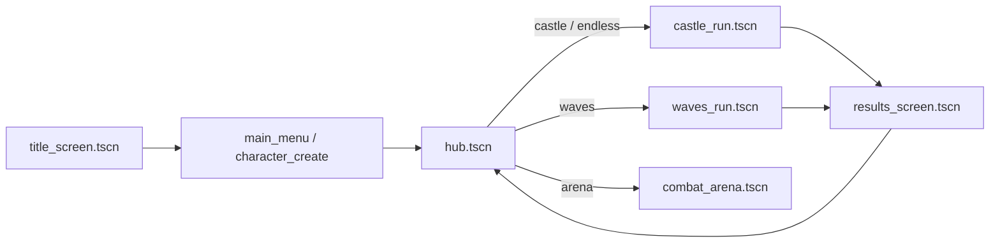
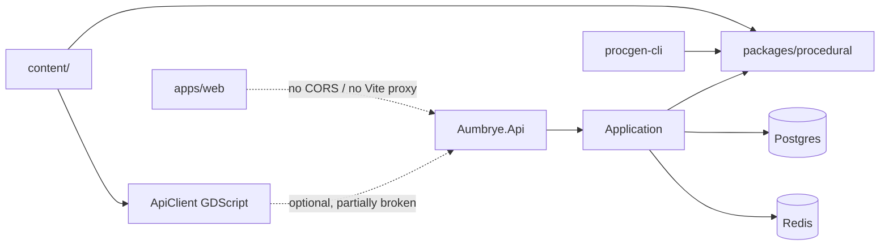

# Aumbrye — Architecture

> Source of truth: current repository code only. Prior deleted documentation is intentionally ignored.

How the repo is wired **today**, verified against paths on disk. Claims about missing pieces are marked **ABSENT FROM CODEBASE**.

**Stack:** Godot 4.7 client; ASP.NET Core 8 API; C# procgen (`packages/procedural`); React/Vite site (`apps/web`); JSON `content/` + schemas. Play loop is offline-first; online procgen is compiled off.

---

## 1. Repository layout

```
Aumbrye/
├── apps/game/client/     # Godot 4.7 project (PRIMARY gameplay)
├── apps/web/             # React + TS + Vite (Landing, Account, Wiki, Patch Notes, Leaderboards)
├── services/backend/     # ASP.NET Core 8 (Api / Application / Domain / Infrastructure)
├── packages/procedural/  # C# dungeon generator
├── packages/shared/      # C# DTOs + OpenAPI yaml
├── content/              # JSON defs + content/schemas/*.v1.json + fixtures
├── tools/procgen-cli/    # CLI over packages/procedural
├── scripts/              # validate-content, validation runners
├── assets/               # Shared asset notes (Godot runtime assets live under apps/game/client/assets/)
├── docs/                 # ARCHITECTURE, ADR, existing_codebase/, actual_improvements/
├── docker-compose.yml    # postgres + redis only (no API container)
└── .github/workflows/    # ci.yml, release.yml
```

**ABSENT FROM CODEBASE:** `Dockerfile` / API container image. API is run with `dotnet run --project services/backend/src/Aumbrye.Api`.

Main scene: `apps/game/client/scenes/ui/title_screen.tscn` (`project.godot` → `run/main_scene`).

---

## 2. Client autoloads (`apps/game/client/project.godot`)

| Autoload | Script | Role |
|----------|--------|------|
| `RunFlow` | `scripts/app/run_flow.gd` | Hub ↔ dungeon ↔ results; floor cache; `USE_ONLINE_PROCgen := false` |
| `ApiConfig` | `scripts/net/api_config.gd` | Base URL + tokens |
| `LocalSave` | `scripts/save/local_save.gd` | JSON save, roster, active-run snapshots |
| `CharacterService` | `scripts/save/character_service.gd` | Gold/coins, flags, quests, class/appearance |
| `ProgressionService` | `scripts/progression/progression_service.gd` | XP, level, talents |
| `RunBuffs` | `scripts/combat/run_buffs.gd` | Run-scoped buffs/relics |
| `InventoryService` | `scripts/inventory/inventory_service.gd` | Grid inventory + equipment |
| `StorageService` | `scripts/hub/storage_service.gd` | Hub stash |
| `QuestService` | `scripts/quests/quest_service.gd` | Quests |
| `AudioDirector` | `scripts/audio/audio_director.gd` | Buses / audio profiles |
| `AchievementService` | `scripts/meta/achievement_service.gd` | Local achievements → Steam sync hooks |
| `SteamService` | `scripts/platform/steam_service.gd` | GodotSteam or dev stub (`DEV_APP_ID := 480`) |
| `CrashLogger` | `scripts/platform/crash_logger.gd` | Crash breadcrumbs under `user://crash_reports/` |
| `WavesRunService` | `scripts/dungeon/waves_run_service.gd` | Waves mode state |
| `DungeonTierService` | `scripts/dungeon/dungeon_tier_service.gd` | Theme tier unlocks |
| `VfxService` | `scripts/art/vfx/vfx_service.gd` | Hit/burst VFX |
| `PlayerControls` | `scripts/app/player_controls.gd` | Meta UI (inventory/settings/talents/pause) — **not** locomotion |
| `WorldState` | `scripts/app/world_state.gd` | Run-scoped key/value flags |
| `PixelDioramaViewport` | `scripts/art/pipeline/pixel_diorama_viewport.gd` | Low-res SubViewport mirror |
| `AttackTokenService` | `scripts/combat/attack_token_service.gd` | Per-room attacker concurrency |
| `GameFacade` | `scripts/app/game_facade.gd` | Thin grouping accessors |

Non-autoload helpers include catalogs under `scripts/content/`, `BiomeRegistry`, `DungeonCatalog`, `ContentLoader`, scene routers under `scripts/app/`.

---

## 3. Scene flow



| Mode | Floors / end | Biome | Scene |
|------|--------------|-------|-------|
| `castle` | 10; floor 10 final | Selected dungeon biome | `scenes/dungeon/castle_run.tscn` |
| `endless` | unbounded | Forced `umbral_chapel` | same |
| `waves` | wave counter → 50 | Waves service / umbral | `scenes/dungeon/waves_run.tscn` |

Room kits: `scenes/rooms/{castle,crystal,swamp,frozen,cathedral,vault,prism,mire,hollow,umbral}/`.  
Player: `scenes/player/player.tscn`.

---

## 4. Run / dungeon assembly


- **Primary offline gen:** `scripts/dungeon/local_procgen.gd` → GDScript `scripts/dungeon/procgen/dungeon_procgen.gd`
- **Fallback:** `dotnet run` on `tools/procgen-cli` → `packages/procedural` (emits a materially poorer shape: no `roomContent` / `locks` / `puzzles`; swap is silent)
- **Online path:** `RunFlow.USE_ONLINE_PROCgen` is **`false`** — `ApiClient.create_run` is not used in the live play path

**Incomplete builder hooks** (`scripts/dungeon/dungeon_builder.gd`):

| Hook | Status |
|------|--------|
| `_build_height_transitions()` | Explicit `pass` (called, no-op) |
| `_build_shortcut_corridors()` | Implemented, **no call site** |

Room geometry is `MeshInstance3D` boxes + `StaticBody3D` from `castle_blockout.gd` — **not CSG**. `cross_stack_parity_suite.gd` currently asserts GDScript-only behaviour, not C# parity.

---

## 5. Combat (client-authoritative)

**Happy path:** `WeaponController` → `Hitbox` → `Hurtbox.receive_hit` → guard / i-frames / defense → `Health` / `Poise` / statuses → hit feedback / `VfxService`.

**Bypasses (also live):** `poison_hazard` apply and poison DoT ticks call `Health` directly and never enter `receive_hit`, so dodge i-frames and defense do not apply. Detail: [`existing_codebase/combat-hazards.md`](existing_codebase/combat-hazards.md).

Present systems (scripts under `scripts/combat/`, `scripts/player/`, `scripts/enemies/`, `scripts/bosses/`): stamina, mana node + HUD, guard/parry, dodge i-frames, lock-on, weapons from `content/weapons/`, statuses from `content/statuses/`, `RunBuffs`, `AttackTokenService`.

**Noted gaps (code):**

- `Mana.consume` — **no gameplay callers** (HUD bar stays full)
- `WeaponController.get_attack_lunge_velocity()` returns `Vector3.ZERO`
- Weapon art is **unreachable**: input + `_try_weapon_art()` exist, but no `content/weapons/*.json` has `"art"`, and `content/schemas/weapon-definition.v1.json` sets `additionalProperties: false` without that key
- Enemy scenes lack a `StatusController` child (only `player.tscn` mounts one) — player-inflicted statuses are dropped
- Player hit feedback is often inert (`HitFeedback.camera_path` wrong; `AnimDirector` cached before creation) — see [`existing_codebase/player-combat.md`](existing_codebase/player-combat.md)
- Character / weapon / prop visuals are procedural box diorama under `scripts/art/`

---

## 6. Hub & meta

`scripts/hub/hub.gd` + `scenes/hub/hub.tscn`: castle / endless / waves portals, arena entry, merchant, blacksmith, storage, quest board.

**Hidden at runtime:** `hub.gd` sets `$SkiesPortal.visible = false` and `$CathedralPortal.visible = false` after `hub_diorama.gd` dresses them. Treat as not player-facing until shown.

Related: `BlacksmithService`, merchant UI, `StorageService`, `QuestService`, dialogue under `scripts/dialogue/` + `scripts/ui/dialogue_ui.gd`.

---

## 7. Backend / packages / web



**API** (`services/backend/src/Aumbrye.Api/` — 11 routes including health):

| Group | Routes |
|-------|--------|
| Health | `GET /api/v1/health` |
| Auth | `POST /api/v1/auth/register`, `/login`, `/refresh` |
| Runs | `POST /api/v1/runs/`, `GET .../{id}/dungeon`, `POST .../{id}/complete` |
| Saves | `GET/PUT /api/v1/saves/current` |
| Leaderboards | `GET /api/v1/leaderboards/`, `POST .../submit` |

**Web** (`apps/web/src/App.tsx`): button-switched SPA pages — Landing, Account, Patch Notes, Wiki, Leaderboards. **ABSENT:** React Router / URL routes. API via `apps/web/src/api/client.ts` + `VITE_API_URL`. Browser→API is non-functional without a CORS policy or Vite proxy. Account page reads `save.state` while the API returns `stateJson`.

**Client networking:** `ApiClient.get_save()` reads `result.body` while GET payloads land under `definition` — cloud save pull never succeeds. See [`existing_codebase/networking.md`](existing_codebase/networking.md).

**Steam auth ticket exchange endpoint:** **ABSENT FROM CODEBASE** (`get_auth_ticket_hex()` returns `""` from both branches).

**Multiplayer / co-op / dedicated game server:** **ABSENT FROM CODEBASE** under `apps/game/client/scripts/`.

**ABSENT:** `Dockerfile` for the API. `.github/workflows/release.yml` still builds from that path and fails on a clean checkout.

---

## 8. Content pipeline

- Source: `content/**/*.json` + `content/schemas/*.v1.json`
- Client load: `ContentLoader` resolves repo root (`res://` → `../../..`) or `aumbrye/content_root`
- CI: `scripts/validate-content/validate.mjs` (strict placeholder run has `continue-on-error: true`)
- Domains present on disk: enemies, bosses, weapons, items, biomes, affixes, progression, talents, relics, statuses, quests, dialogue, NPCs, recipes, merchant, classes, audio_profiles, achievements, loot, fixtures

DungeonDefinition produced by offline GDScript gen (primary) or C# CLI (fallback). The two shapes differ; do not assume parity from `cross_stack_parity_suite.gd` alone.

---

## 9. Save & progression

- Runtime save `schemaVersion` = **4** (`scripts/save/save_migrator.gd` → `CURRENT_VERSION := 4`)
- Paths: `user://aumbrye_save.json`, `user://character_roster.json`, `user://characters/*.json`, backups under `user://backups/` (legacy path rotation; character-file backup coverage is limited)
- `itemInstances` field exists and is preserved when present; new defaults are `{}` — affix data primarily lives on inventory slots
- Progression: `ProgressionService` + `content/progression/xp_curve.json` + `content/talents/tree.json`
  - Schema economy keys (`baseXpPerRun`, …) are **not** what `calculate_run_xp` reads (`baseXpPerKill` / `bossBonusXp` / `escapeBonusXp` — absent → hardcoded defaults)
  - Several aptitude talents (`lootQuality`, `xpGain`, `goldFind`, `cooldownReduction`) have **no runtime consumer**
- Affix rolling (`AffixRoller`) is effectively **waves-only**; castle chest/pickup paths use plain `add_item`
- Active run + waves snapshots via `LocalSave` / `WavesRunService`
- `WorldState`: run flags only (not a durable world sim)

Optional cloud hooks exist but `get_save()` is broken (wrong result key) — offline play is unaffected.

---

## 10. Art / pixel diorama

| Piece | Path |
|-------|------|
| Viewport mirror | `scripts/art/pipeline/pixel_diorama_viewport.gd` |
| Settings / style | `pixel_diorama_settings.gd`, `pixel_diorama_style.gd` |
| Shaders | `assets/shared/pixel_diorama_*.gdshader`, `pixel_diorama_finish.gdshaderinc`, `portal_ellipse.gdshader`, `pixel_sky.gdshader` |
| Lighting | `scripts/art/lighting/visual_lighting.gd` (sole owner of outdoor/indoor lighting) |
| Camera snap | `scripts/art/pipeline/pixel_camera_snap.gd` — off by default; applied only to the pixel **render** camera, never the gameplay camera |
| Characters / anims | `diorama_character_skin.gd`, `diorama_anim_library.gd`, controller |
| Weapons / props | `diorama_weapon_kit.gd`; `DioramaPropFactory` / `diorama_prop_kit.tscn` are editor-only (no gameplay call site) |
| Room dressing | `diorama_room_dressing.gd` + biome materials |
| VFX | `VfxService` |
| Audio | `AudioDirector` + `content/audio_profiles/` + `assets/audio/` |

Display: 1920×1080, `canvas_items` stretch, integer scale (`project.godot`). Default pixel preset is native 1080p.

**Critical art-direction fact:** characters are **not** authored from pixels or voxels. `DioramaCharacterSkin` assembles every body at runtime from 6–9 `BoxMesh` primitives (`PROFILES` + `PixelDioramaStyle.add_box`). There are **zero** raster / model / voxel character assets under `apps/game/client/` (only `icon.svg`). The "pixel" look is a procedural shader pattern plus an optional low-res SubViewport. See [`existing_codebase/character-authoring.md`](existing_codebase/character-authoring.md) and the replacement plan [`actual_improvements/character-authoring.md`](actual_improvements/character-authoring.md).

**Animation events are dead:** the exporter writes `events_path = ""`, and the runtime resolver rejects every shipped node layout, so `FOOTSTEP` / `SWING_VFX` / `HITBOX_ON` / `HITBOX_OFF` method tracks never fire.

**Audio:** OGG ambience/boss themes exist under `assets/audio/`, but `AudioDirector._restore_generator_streams()` unconditionally replaces loaded streams with `AudioStreamGenerator` sine tones after biome load. Combat SFX have no file-backed path.

---

## 11. CI (`.github/workflows/ci.yml`)

| Area | What runs |
|------|-----------|
| backend | `dotnet` build/test + procgen-cli |
| web | lint + build |
| python | `ruff` on `tools/` |
| content | `scripts/validate-content` (strict pass has `continue-on-error: true`) |
| gdscript | gdtoolkit on an **allowlist of ~8 files** (~3% of client `.gd`) |
| godot | headless anim export + `validation_main.gd` |

**Skew:** CI / release pin Godot **4.4.0**; `project.godot` features **4.7**.

**Release:** `.github/workflows/release.yml` builds `services/backend/Dockerfile` (ABSENT) and needs a gitignored `export_presets.cfg` — both jobs fail on a clean checkout.

Validation runner registers **24** suites in `SUITE_PATHS` (matches the 24 files on disk). Several assertions still require deleted documentation paths and fail for non-code reasons.

---

## 12. Extension hooks (code that exists)

| Goal | Where |
|------|-------|
| New biome/theme | `content/biomes/`, `BiomeRegistry`, `scenes/rooms/<theme>/`, dungeon catalog entries |
| New enemy | `content/enemies/` + scene/script (often extends `CastleEnemyBase`) |
| New weapon | `content/weapons/` + equipment item + diorama kit |
| New room content type | `scripts/dungeon/room_content/*` + assigner/spawner |
| Enable online runs | Flip `USE_ONLINE_PROCgen`, run API, harden CompleteRun |
| New validation | Suite under `scripts/validation/suites/` + `SUITE_PATHS` |
| Web page | `apps/web/src/pages/` + `App.tsx` nav |

---

## Related

- Doc conventions: [DOC-CONVENTIONS.md](DOC-CONVENTIONS.md)
- Inventory: [existing_codebase/README.md](existing_codebase/README.md)
- Improvements: [actual_improvements/README.md](actual_improvements/README.md)
- Character authoring (largest art gap): [existing_codebase/character-authoring.md](existing_codebase/character-authoring.md) / [actual_improvements/character-authoring.md](actual_improvements/character-authoring.md)
- ADR on disk: [ADR/0001-client-server-authority.md](ADR/0001-client-server-authority.md) (authority notes; play path remains offline-first)
