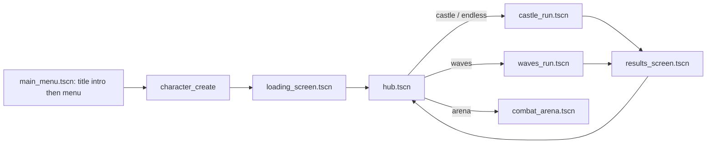
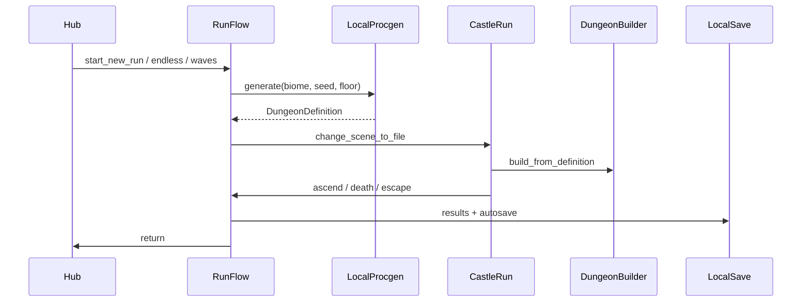
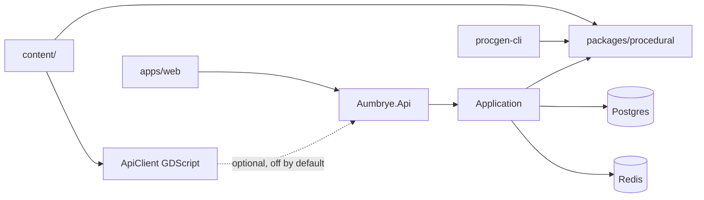

# Aumbrye — Architecture

> **Source of truth: the code on disk.** Every claim below was verified against the repository on
> 2026-08-06. Where a system is genuinely missing, it is tagged **ABSENT** with where it was looked for.
> Open defects and accepted debt are catalogued separately in [`remaining_points.md`](remaining_points.md)
> and referenced here by ID (e.g. `R-02`).

**Stack:** Godot 4.7 client (`.godot-version` pins `4.7.0`); ASP.NET Core 8 API; C# procgen
(`packages/procedural`); React 19 + Vite SPA (`apps/web`); JSON `content/` with schemas under
`content/schemas/`. The play loop is offline-first — online procgen is compiled off.

---

## 1. Repository layout

```
Aumbrye/
├── apps/game/client/     # Godot 4.7 project (primary gameplay)
├── apps/web/             # React 19 + TypeScript + Vite marketing/account site
├── services/backend/     # ASP.NET Core 8 (Api / Application / Domain / Infrastructure)
├── packages/procedural/  # C# dungeon generator (server-authoritative + parity tests)
├── packages/shared/      # C# DTOs + OpenAPI yaml
├── content/              # 323 JSON definitions + content/schemas/*.v1.json + fixtures
├── tools/procgen-cli/    # CLI over packages/procedural
├── tools/voxel-import/   # Voxel art import tooling
├── art-source/           # 262 authored .vox character sources
├── scripts/              # validate-content, balance, openapi-drift, audio generators
└── docker-compose.yml    # postgres + redis + api
```

Main scene: `apps/game/client/scenes/ui/main_menu.tscn` (`project.godot` → `run/main_scene`). It
plays the title intro on the first visit of a process and is the plain menu on every later one.

The API **does** have a container image: `services/backend/Dockerfile` exists and `docker-compose.yml`
defines an `api` service (`container_name: aumbrye-api`). Building and publishing it is a manual step —
there is no automated pipeline.

---

## 2. Client autoloads

27 autoloads are registered in `apps/game/client/project.godot` under `[autoload]`. All paths below are
`res://`-relative.

| Autoload | Script | Role |
|----------|--------|------|
| `RunFlow` | `scripts/app/run_flow.gd` | Hub ↔ dungeon ↔ results; floor cache; `USE_ONLINE_PROCgen := false` |
| `ApiConfig` | `scripts/net/api_config.gd` | Base URL, token storage, HTTP request pool |
| `LocalSave` | `scripts/save/local_save.gd` | JSON save, roster, active-run snapshots |
| `CharacterService` | `scripts/save/character_service.gd` | Gold/coins, flags, class, appearance |
| `ProgressionService` | `scripts/progression/progression_service.gd` | XP, level, talents |
| `RunBuffs` | `scripts/combat/run_buffs.gd` | Run-scoped buffs and relics |
| `InventoryService` | `scripts/inventory/inventory_service.gd` | Grid inventory + equipment |
| `StorageService` | `scripts/hub/storage_service.gd` | Hub stash |
| `QuestService` | `scripts/quests/quest_service.gd` | Quest state |
| `AudioDirector` | `scripts/audio/audio_director.gd` | Buses, layers, SFX bank, reverb |
| `AchievementService` | `scripts/meta/achievement_service.gd` | Local achievements + Steam sync hooks |
| `SteamService` | `scripts/platform/steam_service.gd` | GodotSteam or dev stub (`DEV_APP_ID := 480`) |
| `CrashLogger` | `scripts/platform/crash_logger.gd` | Breadcrumbs under `user://crash_reports/` |
| `WavesRunService` | `scripts/dungeon/waves_run_service.gd` | Waves-mode state |
| `DungeonTierService` | `scripts/dungeon/dungeon_tier_service.gd` | Per-dungeon tier unlocks |
| `VfxService` | `scripts/art/vfx/vfx_service.gd` | Pooled bursts, decals, hitstop, shake |
| `DisplayService` | `scripts/app/display_service.gd` | Window mode, vsync, FPS cap, UI scale |
| `PlayerControls` | `scripts/app/player_controls.gd` | Meta UI gating — **not** locomotion |
| `MenuStack` | `scripts/ui/menu_stack.gd` | Menu push/pop |
| `WorldState` | `scripts/app/world_state.gd` | Run-scoped key/value flags |
| `PixelDioramaViewport` | `scripts/art/pipeline/pixel_diorama_viewport.gd` | Low-res SubViewport camera mirror |
| `AttackTokenService` | `scripts/combat/attack_token_service.gd` | Per-room attacker concurrency |
| `GameFacade` | `scripts/app/game_facade.gd` | Grouping accessors |
| `InputRebindService` | `scripts/app/input_rebind_service.gd` | Runtime input remapping |
| `DebugConsole` | `scripts/debug/debug_console.gd` | `F12` console (`content_reload` clears catalog caches) |
| `InputGlyphWatcher` | `scripts/ui/input_glyph_watcher.gd` | Device-change → glyph refresh |
| `UISymbolBus` | `scripts/ui/ui_symbol_bus.gd` | Shared UI symbol lookup |

Non-autoload statics carry a large share of state: catalogs under `scripts/content/`, plus
`BiomeRegistry`, `DungeonCatalog`, `ContentLoader`, `EnemyPool`, `VoxelMeshBuilder`.

> The size of this list is itself a finding — see `R-01` in [`remaining_points.md`](remaining_points.md).

---

## 3. Scene and run flow



Floor counts come from `scripts/dungeon/run_floor_config.gd`:

| Mode | Floors | Biome | Scene |
|------|--------|-------|-------|
| `castle` | `MAX_FLOORS := 10`; floor 10 is final | Selected dungeon biome | `scenes/dungeon/castle_run.tscn` |
| `endless` | `ENDLESS_MAX_FLOORS := 999999`; `is_final_floor()` always false | Forced `umbral_chapel` | same |
| `waves` | Wave counter | Waves service | `scenes/dungeon/waves_run.tscn` |

Ten biomes, each with a matching dungeon definition and room kit:
`forgotten_castle`, `crystal_caverns`, `poison_swamp`, `frozen_fortress`, `dark_cathedral`,
`iron_vault`, `prism_depths`, `venom_mire`, `glacial_hollow`, `umbral_chapel`.

Room kits live at `scenes/rooms/{castle,crystal,swamp,frozen,cathedral,vault,prism,mire,hollow,umbral}/`
and are resolved by **string interpolation**, not by static reference:
`BiomeRegistry.room_scene_path()` builds `"res://scenes/rooms/%s/%s_%s.tscn"`. A typo in a content
`scene` field therefore fails at spawn time, not at import time.

Player scene: `scenes/player/player.tscn`.

---

## 4. Dungeon assembly



- **Live offline path:** `scripts/dungeon/local_procgen.gd` → `scripts/dungeon/procgen/dungeon_procgen.gd`
  (GDScript).
- **Online path:** `RunFlow.USE_ONLINE_PROCgen` is `false` (`run_flow.gd:29`), so
  `ApiClient.create_run` is not on the live play path. The check is at `run_flow.gd:225`.
- **Server / parity path:** `packages/procedural` (C#), exercised by `tools/procgen-cli` and
  `cross_stack_parity_suite.gd`.

The duplication between the GDScript and C# generators is tracked as `R-02`, and the contract that
holds them together is [`ADR/0002-procgen-authority-split.md`](ADR/0002-procgen-authority-split.md).

Room geometry is `MeshInstance3D` boxes plus `StaticBody3D` from `castle_blockout.gd` — not CSG.
`DungeonBuilder.build_from_source()` is chunked across frames (33 `await` points) so a floor
transition yields rather than stalling.

Builder hooks worth knowing:

| Hook | State |
|------|-------|
| `_build_height_transitions()` | Implemented — reads `maxHeightLevel`, walks rooms and edges (`dungeon_builder.gd:332`) |
| `_build_shortcut_corridors()` | **ABSENT** — no such function; shortcut edges are handled by `_wire_shortcut_edges()` (`:236`) |

---

## 5. Combat

Client-authoritative. Happy path:

`WeaponController` → `Hitbox` → `Hurtbox.receive_hit()` → i-frames / immunity / parry / block / arc
multipliers / defense / resistances → `Health` + `Poise` + `StatusController` → `HitFeedback` +
`VfxService`.

`Hurtbox.receive_hit()` (`scripts/combat/hurtbox.gd:44`) builds a `DamageResolution`
(`scripts/combat/damage_resolution.gd`) and emits `hit_resolved` at every exit, including dodged and
parried hits. The legacy `damaged(info)` signal is still emitted for existing listeners.

**Node names are the API.** `Hurtbox` locates `Guard`, `Dodge`, `StatusController` and `HitFeedback` by
literal node name; renaming any of them silently disables that stage.

Collision layers (`project.godot` → `[layer_names]`):

| Layer | Name |
|-------|------|
| 1 | `world` |
| 2 | `player_body` |
| 3 | `hitbox` |
| 4 | `hurtbox` |
| 5 | `interactable` |
| 6 | `trap` |
| 7 | `projectile` |
| 8 | `camera_blocker` |

Hit detection is both event-driven and polled: `Hitbox` connects `area_entered` **and** runs a shape
query while active, but only while active — `set_physics_process()` is toggled with the hitbox, and
the file documents why the redundant query is kept (a dropped hit reads as the game cheating). Enemy
line-of-sight raycasts are LOD-strided by distance (`AI_LOD_NEAR_RANGE_SQ`, `AI_LOD_MID_STRIDE`,
`AI_LOD_FAR_STRIDE`) rather than run every physics frame.

---

## 6. Character art pipeline

Characters are **not** runtime box primitives only — there are three parallel representations on disk:

| Representation | Count | Location | Used at runtime |
|---|---|---|---|
| `.vox` authored source | 262 | `art-source/characters/` | No (source) |
| `.tres` baked ArrayMesh | 40 | `apps/game/client/assets/characters/` | Yes — all 40 referenced |
| `.voxels.json` runtime JSON | 115 | `apps/game/client/assets/characters/` | Yes — 133 manifest references |

Rig manifests under `content/characters/*.json` map part names (`LegL`, `Torso`, `Head`, `ArmL`, …) to a
mesh path and a joint offset. `DioramaCharacterSkin` walks the manifest and builds a pivot hierarchy,
loading meshes through `VoxelMeshBuilder.load_mesh()`. Profiles for bodies without a manifest fall back to
`PROFILES` box primitives in `scripts/art/characters/diorama_character_skin.gd`.

`VoxelMeshBuilder` reads `res://` paths directly (so exported `.pck` builds work) and implements a
real binary-plane greedy mesher. It still prefers a baked `.tres` sibling when one exists, so the
same geometry lives in `.vox`, `.tres` and `.voxels.json` form — consolidation is tracked as `R-03`.

**Rendering:** `PixelDioramaViewport` mirrors the gameplay camera into a low-res `SubViewport`
(`render_target_update_mode = UPDATE_ALWAYS`) and sets `root.disable_3d = true`. The scene graph is never
reparented; only the camera is mirrored.

---

## 7. Audio

`AudioDirector` owns four layers (`ambience`, `music`, `explore`, `combat`), a stinger player, an
eight-player SFX pool, four `AudioStreamPlayer3D` slots, five buses, per-biome reverb and a duck.

Authored OGG stems are the live path. All ten biomes have all four stems under
`apps/game/client/assets/audio/<biome_id>/`, plus `shared/sting_boss.ogg`, `shared/sting_clear.ogg` and
24 SFX files. `AudioStreamGenerator` synthesis is a genuine fallback: `_process()` only fills a layer
whose `stream is AudioStreamGenerator`, and loaded stems replace the generator, so synthesis does not run
in normal play. `audio_suite.gd` asserts this behaviourally (`audio.no_process_synthesis_with_stems`).

The legacy repo-root `assets/` scaffold (C-38) and the duplicate `.wav` sources next to their `.ogg`
counterparts are gone; the tree ships `.ogg` only, and all audio lives under
`apps/game/client/assets/audio/`. Eight SFX are still synthesised placeholders — see C-250.

---

## 8. Content pipeline

- Source: `content/**/*.json` validated against `content/schemas/*.v1.json`.
- Client load: `ContentLoader.content_root()` honours `aumbrye/content_root` when set, resolves to the
  repo root under the editor, and falls back to the executable directory in exported builds.
- Directory catalogs (`ItemCatalog`, `EnemyCatalog`, `ClassCatalog`, `RelicCatalog`, `QuestCatalog`,
  `DialogueCatalog`) share `ContentDirLoader.load_id_map()`.
- `content/items/catalog.json` is the tooling index. Set `aumbrye/strict_item_catalog=true` to intersect
  disk ids against it; default is `false`.
- Run relics live under `content/relics/` via `RelicCatalog`, not in `items/catalog.json`.
- Dev reload: `DebugConsole` → `content_reload` calls `ContentLoader.clear_all_caches()`.
- `ContentLoader.load_json()` caches parsed documents and hands back a deep copy per call.

Save format: `SaveMigrator.CURRENT_VERSION` is **10**. See [`SAVE_MIGRATIONS.md`](SAVE_MIGRATIONS.md).

---

## 9. Backend, packages, web



**API** (`services/backend/src/Aumbrye.Api/Endpoints/`), grouped:

| Group | Routes |
|-------|--------|
| Health | `GET /api/v1/health`, `GET /api/v1/health/ready` |
| Auth | `POST /api/v1/auth/register`, `/login`, `/refresh`, `/logout`, `/steam` |
| Account | `GET /api/v1/account`, `POST /api/v1/account/link-steam` |
| Runs | `POST /api/v1/runs`, `GET /api/v1/runs/{id}/dungeon`, `POST /api/v1/runs/{id}/complete` |
| Saves | `GET/PUT /api/v1/saves/current` |
| Leaderboards | `GET /api/v1/leaderboards`, `POST /api/v1/leaderboards/submit` |
| Telemetry | `POST /api/v1/telemetry/crash` |

A Steam auth ticket exchange endpoint **does** exist (`/api/v1/auth/steam`, backed by
`Infrastructure/Security/SteamAuthService.cs`). What is missing is the client half: GodotSteam binaries
are absent, so `SteamService` runs in stub mode and cannot produce a ticket (`R-10`).

CORS **is** configured — `Program.cs:87-89` reads `Cors:AllowedOrigins` and `Program.cs:215` calls
`app.UseCors("web")`; `CorsTests.cs` covers it.

**Web** (`apps/web/src/`, 27 files): React 19 SPA using React Router 7 with real URL routes
(`App.tsx` declares `/`, `/account`, `/patch-notes`, `/wiki`, `/leaderboards`). API access via
`src/api/client.ts` + `VITE_API_URL`. `vite.config.ts` prerenders five routes with Puppeteer at build
time.

**Multiplayer / co-op / dedicated game server:** **ABSENT** — no networking code for it under
`apps/game/client/scripts/`.

---

## 10. Build and validation

There is no hosted CI. Validation runs locally through `scripts/validate.mjs`, which drives four
layers — `dotnet`, `content`, `python`, `godot` — and writes `reports/validation-summary.json`:

```bash
node scripts/validate.mjs                      # everything
node scripts/validate.mjs --layer content      # one layer
```

The `godot` layer runs the headless smoke test (`godot --headless -- --smoke-test`), which boots
every autoload and subsystem an exported build needs and returns an exit code. The in-engine
validation suites were removed: 28,631 lines against a ~100k-line client, never once running to
completion, and a larger maintenance surface than the code they covered. `pre-commit` hooks cover
content JSON validation, Ruff, gdformat and ESLint on staged files.

Gaps worth knowing before trusting a green run:

- Nothing exercises an **exported** build, so defects that only manifest outside the editor cannot be
  caught this way.
- The frame-budget gate skips when `user://perf_baseline.json` is absent, so it is inert on a machine
  that has never recorded a baseline.
- Releases (API image, web bundle, Windows Godot export) are built by hand.

---

## 11. Related

- [`remaining_points.md`](remaining_points.md) — open defects, accepted debt and deferred design decisions
- [`../project_structure.json`](../project_structure.json) — measured repository inventory
- [`ADR/0001-client-server-authority.md`](ADR/0001-client-server-authority.md) — authority boundaries
- [`SAVE_MIGRATIONS.md`](SAVE_MIGRATIONS.md) — save schema history
- [`DOC-CONVENTIONS.md`](DOC-CONVENTIONS.md) — how to write docs in this repo
- [`validation/manual-checklist.md`](validation/manual-checklist.md) — manual QA items
