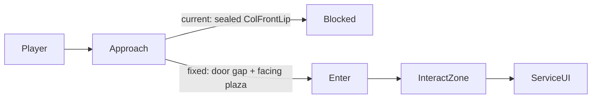

# Hub Area Enhancement Plan

First-place polish for the Aumbrye hub plaza. Grounded exclusively in systems already shipping: [`hub.tscn`](../../apps/game/client/scenes/hub/hub.tscn), [`HubDiorama`](../../apps/game/client/scripts/hub/hub_diorama.gd), [`PixelDioramaStyle.add_hub_tent`](../../apps/game/client/scripts/art/pixel_diorama_style.gd), existing hub materials, interactables, and service UIs.

**Goal:** The hub must feel like a warm, readable caravan plaza the moment the player arrives—walkable tents with real doorways, solid perimeter walls, and a composition that sells the fantasy before any menu opens.

---

## Diagnosis (what already exists)

The hub is already a dressed plaza. Service buildings are **already meant to be tents** (legacy box meshes are hidden at runtime). Interaction, UIs, and services (blacksmith / merchant / storage / quest board) work.

Concrete bugs that break the first impression:

1. **False “door” blocks every tent.** `add_hub_tent` builds `WallFrontLip` / `ColFrontLip` as a **full-width** box whose depth is `half_d - entrance_half`. `entrance_width` never opens a gap—so collision seals the front.

2. **Southern tents face the wall, not the plaza.** Entrance is hardcoded on local **+Z**. Merchant / Storage / QuestBoard sit at `z ≈ 14` with identity rotation, so their open side faces the south wall and their **back** faces the player.

3. **Perimeter `LandmarkWalls` are mesh-only**—no `StaticBody3D`, so players walk out of the plaza.

---

## Design goals

### Functional craft

- **Readable tent vernacular:** pitched ridge, open flap doorway, poles, fabric walls—not square houses.
- **Collision matches silhouette:** solid fabric walls block; doorway is walkable; roof stays non-colliding (awning feel).
- **Approach from plaza center:** every service tent door faces inward; NPCs stand in/near the doorway.
- **Interact where you look:** `HubInteractable` volumes sit at the entrance, not buried inside sealed collision.
- **Reuse dungeon wall pattern:** mirror `CastleBlockout` door split for tent front lips and plaza walls.

### First-impression beauty (hub is the front door)

The hub is the player’s first living world space. Beauty here is not decoration for its own sake—it is **clarity, warmth, and identity** built from the existing pixel-diorama toolkit.

- **One clear composition on spawn.** Player starts at `(0, 0, 4)` facing the north portal row. The first seconds should read: warm plaza floor → three portals ahead → service tents on the sides/south → arena to the east. No landmark should feel like a sealed box or a back-facing shed.
- **Warm “caravan dusk” atmosphere.** Tune `WorldEnvironment` / sun already set in `HubDiorama._style_environment` toward golden ambient, softer sky wash, and gentle depth (fog or ambient energy) so the diorama feels inviting rather than flat gray-blue.
- **Landmark lighting identity.** Add small `OmniLight3D` accents already used elsewhere in dressing patterns:
  - Blacksmith: warm forge bloom near the chimney / forge prop (`mats.forge` already emissive).
  - Merchant: soft lantern near the counter / awning.
  - Storage: cooler practical lamp.
  - Quest board: gentle paper-side light.
  - Portals: subtle rim/pad glow (castle gold vs umbral purple) so gateways feel alive.
- **Floor that guides the eye.** Keep the checkerboard tiles, but break monotony with a center aisle / ring of `mats.floor_alt` or accent stones leading from spawn toward the castle portal, and small pad accents under each tent mouth.
- **Distinct tent personalities (same builder, different dress).**
  - Blacksmith: soot-darker fabric bias, chimney + forge glow, tools readable from plaza.
  - Merchant: striped awning on the **door edge**, crates spilling toward the mouth (not blocking it).
  - Storage: heavier canopy, barrels/crates as massing, practical not festive.
  - Quest board: lighter canopy, notices facing plaza, open and approachable.
- **Perimeter as place, not void.** Crenelated walls already get trim; reinforce silhouette with occasional banner / torch accents on long walls so the plaza feels enclosed and authored.
- **Portal spectacle as hero north.** Portals are the run call-to-action. Strengthen pillar/lintel/pad read, keep labels billboarded and legible, ensure sightline from spawn is unobstructed.
- **NPC as host, not furniture.** Place Aldric / Elara / Mira in doorway light so the first human read is “someone is waiting for you,” matching their service.
- **Quiet motion, not noise.** Prefer 1–2 intentional cues already cheap in-engine: forge light flicker (or emissive pulse), portal interior shader already present—avoid particle spam.
- **Readable labels and hanging signs.** Small ridge signs / raised `Label3D` so services remain identifiable when tents get richer silhouettes.

**Out of scope for this pass:** new hub features, currency unification, dungeon tents, rewriting `DioramaPropFactory`, new mesh asset packs, audio redesign (unless a one-line hook already exists).

---

## Phase 1 — Tent doorway + silhouette (core fix)

**File:** `apps/game/client/scripts/art/pixel_diorama_style.gd` — rewrite `add_hub_tent`.

### Door geometry (must match collision)

- Keep back / left / right walls.
- Replace full-width front lip with **two thin front panels** flanking the entrance (same pattern as castle door cutouts):
  - left lip width = `(width - entrance_width) * 0.5`
  - right lip width = same
  - thickness ≈ `wall_thickness` at `z = +half_d`
- Short fabric flaps (visual only) hanging in the doorway so the opening reads as a tent mouth.
- Keep `entrance_width` ≥ ~2.0 (player capsule ~0.8 wide).

### Tent silhouette upgrade (box/cylinder/prism primitives only)

- Ridge pole along width + two slanted roof panels (`PrismMesh` or rotated thin boxes) instead of flat stacked caps.
- Corner poles remain; add a simple guy-line / stake accent if cheap.
- Distinct fabric vs wood materials via `mats.wall` / `mats.wood` / `mats.accent`.

### Collision contract

- `TentCollision` (`StaticBody3D`, `collision_layer = 1`) mirrors **only** fabric wall segments (back, sides, front lips).
- No roof / pole / flap collision.
- Interior props stay visual-only unless footprints stay clear of the walk path.

### API

Keep `add_hub_tent(landmark, mats, width, depth, wall_height, entrance_width, roof_peak)` so `hub_diorama.gd` callers stay simple. Add `facing_yaw: float = 0.0` applied to the visuals + collision root (preferred over rotating landmark nodes and fighting InteractArea transforms).

---

## Phase 2 — Plaza-facing layout + interact zones

**File:** `apps/game/client/scripts/hub/hub_diorama.gd` (+ light edits in `hub.tscn` if needed).

| Landmark   | Position       | Face door toward | Suggested yaw        |
|------------|----------------|------------------|----------------------|
| Blacksmith | west `(-18,-4)` | plaza (+X)      | `-PI/2` (open on +X) |
| Merchant   | SW `(-12,14)`   | plaza (-Z)      | `PI`                 |
| Storage    | south `(0,14)`  | plaza (-Z)      | `PI`                 |
| QuestBoard | SE `(12,14)`    | plaza (-Z)      | `PI`                 |

After tent rebuild:

- Reposition each building’s `InteractArea` CollisionShape to the **door threshold** (just outside / straddling the opening), sized ~`entrance_width × 2.5 × 2.0`.
- Move NPCs to doorway pads (Aldric at blacksmith mouth, Elara at merchant mouth, Mira at quest board mouth).
- Nudge interior props (forge, counter, shelves) toward the **back** so the walk-in path stays clear.

No change to `hub.gd` interact priority or service UIs—only reachability.

---

## Phase 3 — Perimeter wall collision

**File:** `hub_diorama.gd` `_dress_walls`.

When dressing `LandmarkWalls`, add a sibling `WallCollision` `StaticBody3D` (`collision_layer = 1`) with one `BoxShape3D` per wall matching mesh footprint (North / East / West / South), respecting existing transforms.

Visual trim/crenels stay mesh-only. Do **not** add portal/arena frame collision (those are gateways).

---

## Phase 4 — First-impression beauty pass

Stay inside existing dressing / materials / lights—no new content pipeline.

### Atmosphere

- Retune `_style_environment`: warmer background + ambient, slightly stronger sun color toward late-afternoon gold, optional light fog for diorama depth.
- Confirm shadows remain on (already enabled on `DirectionalLight3D`).

### Guided floor

- In `_dress_floor`, add a north–south accent path from spawn toward castle portal and small door-pad tiles under each tent entrance using existing `mats.floor` / `floor_alt` / `accent`.

### Landmark light + identity

- Per-service `OmniLight3D` with restrained range/energy (forge warm, merchant soft, storage cool, quest gentle).
- Portal pads/rims: subtle themed light so north wall reads as the adventure exit.
- Fix merchant/quest prop offsets for new facing; awning stripes on the door edge; notices face plaza.
- Optional wall banners / corner braziers on long perimeter spans (visual-only meshes, same helpers as tent props).

### Hierarchy and readability

- Hanging sign box or raised service `Label3D` above each tent ridge.
- Ensure Welcome / prompt labels do not fight portal labels in the spawn view.
- Keep arena east readable as a secondary destination (banner already present).

### Motion budget (max 2 intentional cues)

- Forge emissive or light intensity nudge.
- Existing portal ellipse shader as the “alive gateway” cue.

---

## Phase 5 — Validation

Extend `apps/game/client/scripts/validation/suites/hub_m4_suite.gd` with lightweight structural checks:

- Each service landmark has `TentCollision` with ≥3 shapes and **no** sealed full-width front lip.
- Hub / `LandmarkWalls` has `WallCollision` with 4 shapes.
- Optional assertions that tent dressing roots exist and facing yaw was applied.

### Manual first-impression checklist

1. Load hub → first camera view shows portals ahead, tents facing plaza, warm light.
2. Walk into each tent doorway from plaza center; press **E**; confirm correct UI.
3. Walk into perimeter walls and stop (no exit through mesh).
4. Approach each NPC in a doorway; confirm prompt / fallback interact still works.
5. From spawn, confirm blacksmith / merchant / storage / quest / arena / portals are visually distinct within a few seconds of looking around.

---

## Implementation order

1. Fix `add_hub_tent` door + pitched silhouette + collision parity.
2. Face tents / move interact zones / NPCs / prop offsets in `HubDiorama`.
3. Add perimeter `WallCollision` in `_dress_walls`.
4. Beauty pass: environment, floor path, landmark lights, signs, portal/wall accents.
5. Suite assertions + manual smoke (editor / Godot MCP scene run if available).

---

## Key files

| File | Role |
|------|------|
| `apps/game/client/scripts/art/pixel_diorama_style.gd` | Tent builder, collision helpers |
| `apps/game/client/scripts/hub/hub_diorama.gd` | Facing, walls, props, lights, atmosphere, NPCs |
| `apps/game/client/scenes/hub/hub.tscn` | Landmark / NPC / interact transforms if authored in-scene |
| `apps/game/client/assets/hub/mat_*.tres` | Legacy scene materials (runtime uses `make_hub_materials`) |
| `apps/game/client/scripts/validation/suites/hub_m4_suite.gd` | Regression hooks |

---

## Success criteria

- Player cannot walk through plaza perimeter walls.
- Player can walk through each service tent doorway from the plaza without hitting sealed fronts.
- Blacksmith, merchant, storage, quest board remain interactable via **E** at the doorway (landmark zone and/or NPC).
- Buildings read as tents (ridge + open mouth), not sealed box houses.
- On spawn, the hub reads as a warm, authored caravan plaza with clear destinations and inviting light—not a gray blockout with unreachable sheds.
