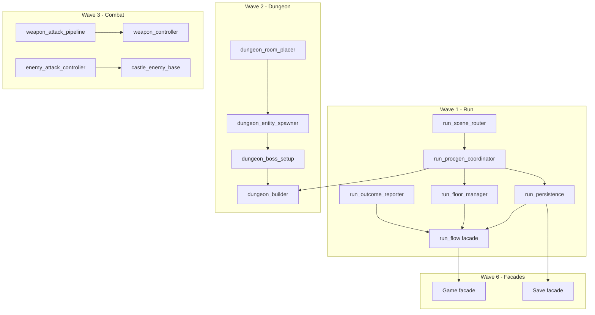

# Refactoring Plan — Post-Audit 2026-08

**Status:** Analysis only — no implementation in this document.  
**Audience:** Engineers extending combat, procgen, UI, or client architecture after the five audit implementation agents.  
**Rule:** Follow [CODING.md](../CODING.md) — **extend, do not replace** working behavior. Each wave adds modules and thins facades; avoid behavioral rewrites.

---

## 1. Executive summary — top 5 priorities (risk × impact)

| Rank | Priority | Why now | Primary risk if deferred | Primary risk when doing it |
|------|----------|---------|--------------------------|----------------------------|
| **1** | **Procgen single authority** | Three generators (GDScript `room_graph_generator.gd`, C# `LayoutGraphGenerator.cs`, CLI) still diverge on yaw, schema fields, and algorithms ([AUDIT §3.5](AUDIT_2026-08.md)). Parity suite only checks prefixes + schema keys. | Silent layout/content drift between client, API, and tests; deferred navmesh/verticality work multiplies paths. | Changing generation output — mitigated by keeping GDScript as caller-only first. |
| **2** | **RunFlow decomposition** | `run_flow.gd` (632 lines) is the hub↔dungeon orchestrator with ~40 direct callers; only `run_lifecycle.gd` (41 lines) extracted so far. | Every new run mode, save field, or floor rule touches a god object; regressions span hub, castle, endless, waves. | Scene transition / save restore bugs — mitigated by facade preserving all public methods and signals. |
| **3** | **Autoload facades** | **20** autoloads in `project.godot` (lines 25–44); gameplay, UI, and validation reach into globals directly (`LocalSave` 21 refs, `RunFlow` 15+, hub 15+). | New features add more autoloads; circular init and test setup cost grow. | Startup order / signal wiring — mitigated by lazy sub-service init inside facades. |
| **4** | **Combat god-file splits** | `castle_enemy_base.gd` (590) and `weapon_controller.gd` (409) bundle AI, attacks, visuals, and player weapon phases. Audit added many states without modular boundaries. | Enemy AI and weapon arts extensions become high-conflict edits; feel regressions hard to isolate. | Combat feel regression — mitigated by splitting RefCounted/helpers first, scene nodes last. |
| **5** | **≤300-line compliance (UI + art)** | `inventory_ui.gd` (760), `pixel_diorama_style.gd` (761), `hub_diorama.gd` (632) violate [CODING.md](../CODING.md); art pipeline and inventory are active areas. | Slower reviews, duplicated palette/material logic, UI drag-drop bugs span 700+ lines. | Low runtime risk for pure UI/art splits; scene preload paths must stay stable. |

**Not in top 5 but track:** affix/catalog duplication (loot integrity), save v1→v3 round-trip tests, ADR vs `USE_ONLINE_PROCgen := false`, perf/LOD (needs profiling gate first).

---

## 2. God object splits

### 2.1 RunFlow (`scripts/app/run_flow.gd` — 632 lines)

**Current responsibilities (by function cluster):**

| Cluster | Lines (approx) | Key symbols |
|---------|----------------|-------------|
| Run entry API | 51–122 | `start_new_run`, `continue_castle_run`, `start_waves_run` |
| Mode bootstrap + procgen | 124–204 | `_start_mode_run`, `_generate_dungeon`, `_try_online_generate` |
| Save restore | 206–248 | `_restore_castle_run` |
| Scene enter + meta | 251–287 | `_enter_run`, root metas, `LocalSave.set_active_run` |
| Hub / abandon | 289–315 | `return_to_hub`, `abandon_active_run` |
| Outcomes | 316–385 | `complete_run_via_portal`, `on_player_died`, `rest_at_bonfire` |
| Floor transitions | 414–556 | `ascend_floor`, `_transition_floor`, floor cache |
| Loot / stats API | 567–618 | `register_loot`, `_reset_run_stats` |
| Cloud + escape/death meta | 619–691 | `_cloud_finalize_run`, `_handle_escape_meta` |
| Waves mode | 696–753 | `_start_waves_run`, `complete_waves_run`, `on_waves_failed` |

**Already extracted:** `run_lifecycle.gd` (41 lines) — `RunLifecycle.build_escape_results` / `build_death_results`.

**Proposed modules (all under `scripts/app/run/`):**

| New file | ~lines target | Responsibility | Depends on |
|----------|---------------|----------------|------------|
| `run_scene_router.gd` | ≤120 | `_goto_scene`, scene path constants, root meta set/clear | `LocalSave` (inject later) |
| `run_procgen_coordinator.gd` | ≤150 | `_generate_dungeon`, online vs `LocalProcgen`, seed/tier/floor inputs | `ApiClient`, `LocalProcgen`, `ApiConfig` |
| `run_persistence.gd` | ≤150 | `_persist_active_run`, `_restore_castle_run`, snapshot merge | `LocalSave`, `RunProcgenCoordinator` |
| `run_floor_manager.gd` | ≤120 | Floor cache, `_transition_floor`, ascend/descend, chunk unload | `RunProcgenCoordinator`, `DungeonSeedService` |
| `run_outcome_reporter.gd` | ≤150 | Escape/death assembly, cloud finalize, XP constants (`900.0`, `500` → named) | `RunLifecycle`, `ProgressionService`, `ApiClient` |
| `run_waves_adapter.gd` | ≤100 | Waves start/quit/complete/fail paths | `WavesRunService`, `RunOutcomeReporter` |
| `run_flow.gd` (facade autoload) | ≤200 | Public API, signals (`run_started`, `run_ended`, `returned_to_hub`), delegates to modules | All above |

**Dependency order:** `RunSceneRouter` → `RunProcgenCoordinator` → `RunPersistence` + `RunFloorManager` → `RunOutcomeReporter` → `RunWavesAdapter` → thin `RunFlow`.

**Extend-don't-replace:** Keep every existing `RunFlow.*` method name on the autoload; implement as `return _floor_manager.ascend_floor()` etc. No caller edits in wave 1.

**High coupling callers (migrate to signals later, not in wave 1):** `hub.gd` (15), `castle_run.gd` (13), `dungeon_builder.gd` (14), `m7_suite.gd` (10).

---

### 2.2 Inventory UI (`scripts/ui/inventory_ui.gd` — 760 lines)

**Current structure:**

| Section | Lines | Functions |
|---------|-------|-----------|
| Constants + state | 1–135 | Context binding (main vs waves inventory) |
| Shell layout | 136–213 | `_build_ui_shell`, filters, detail/compare labels |
| Input / toggle | 214–291 | `_unhandled_input`, `toggle`, show/hide |
| Equipment panel | 292–310 | `_build_equipment_panel`, equip cells |
| Grid render | 311–426 | `_build_grid`, `_refresh_grid`, cell styling |
| Detail + navigation | 427–643 | `_update_detail`, filters, sort cycles |
| Drag-drop | 644–755 | Mouse handlers, ghost, equip drag |
| Tooltips / glyphs | 756–863 | `_format_slot_tooltip`, `_item_glyph` |

**Proposed modules (under `scripts/ui/inventory/`):**

| New file | ~lines | Responsibility |
|----------|--------|----------------|
| `inventory_ui_shell.gd` | ≤180 | Panel construction, `GameUISkin` layout, open/close, backdrop |
| `inventory_grid_view.gd` | ≤200 | Grid cells, refresh, highlight cursor, filter labels |
| `inventory_equipment_panel.gd` | ≤120 | Equip slots, equip/unequip from panel |
| `inventory_drag_controller.gd` | ≤150 | Press/release, ghost, grid/equip drop targets |
| `inventory_item_presenter.gd` | ≤150 | Tooltips, compare delta, abbrev/glyph helpers, `_item_def` |
| `inventory_ui.gd` | ≤150 | Orchestrator: wires child modules, exposes `toggle()` / `is_open()` |

**Dependency order:** `InventoryItemPresenter` (pure) → `InventoryGridView` + `InventoryEquipmentPanel` → `InventoryDragController` → `InventoryUiShell` → `inventory_ui.gd`.

**Scene note:** If inventory is scene-rooted, keep node path `inventory_ui.gd` on the autoload/scene script; child modules are `RefCounted` or child `Node` helpers.

---

### 2.3 Castle enemy base (`scripts/enemies/castle_enemy_base.gd` — 590 lines)

**Current structure:**

| Section | Lines | Responsibility |
|---------|-------|----------------|
| Setup / visual | 52–202 | Diorama skin, health bar, hurtbox data, tint |
| Lifecycle | 202–344 | Respawn, death, stagger, state capture |
| Animation | 344–386 | Diorama anim sync |
| AI FSM | 387–488 | Patrol, chase, investigate, retreat |
| Combat | 489–627 | Windup, attack, combo, token, parry hook |
| Facing / patrol | 650–698 | LOS, boss boundary, debug draw |

**Proposed modules (under `scripts/enemies/`):**

| New file | ~lines | Type | Responsibility |
|----------|--------|------|----------------|
| `enemy_visual_setup.gd` | ≤140 | `RefCounted` | `_setup_diorama_visual`, HP bar attach, telegraph height, mesh tint |
| `enemy_ai_controller.gd` | ≤180 | `RefCounted` | FSM states (non-attack), aggro, LOS, patrol targets; holds `State` enum |
| `enemy_attack_controller.gd` | ≤160 | `RefCounted` | Windup/attack/recovery, combo followups, token acquire/release, attack data selection |
| `enemy_lifecycle.gd` | ≤120 | `RefCounted` | Death visuals, coins, global drop, `capture_state` / `apply_state` |
| `castle_enemy_base.gd` | ≤200 | `CharacterBody3D` | `_physics_process` delegates; signals; exports |

**Dependency order:** `EnemyVisualSetup` → `EnemyLifecycle` → `EnemyAiController` + `EnemyAttackController` → `CastleEnemyBase`.

**Subclass note:** Thin enemies (`castle_grunt.gd` etc.) stay as-is; they override `get_enemy_id()` only.

---

### 2.4 Dungeon builder (`scripts/dungeon/dungeon_builder.gd` — 594 lines)

**Current pipeline (`build_from_source`, lines 57–93):** rooms → shortcuts → floor shell → player → enemies → loot → traps → content → boss → exit → stairs → boss door.

**Proposed modules (under `scripts/dungeon/build/`):**

| New file | ~lines | Responsibility |
|----------|--------|----------------|
| `dungeon_room_placer.gd` | ≤150 | `_build_rooms`, `_build_floor_shell`, `_build_shortcut_corridors`, placement offset |
| `dungeon_entity_spawner.gd` | ≤180 | Enemies, loot, traps, `RoomContentSpawner`, enemy scene map |
| `dungeon_boss_setup.gd` | ≤120 | `_setup_boss`, boss door, exit portal, boss intro hook |
| `dungeon_stair_setup.gd` | ≤100 | Stair levers, spawn positions, unlock |
| `dungeon_snapshot_service.gd` | ≤120 | `capture_enemy_states`, `respawn_enemies`, `capture_loot_states`, `apply_snapshot` |
| `dungeon_builder.gd` | ≤150 | Orchestrator, signals, `unload_from_parent`, public getters |

**Dependency order:** `DungeonRoomPlacer` → `DungeonEntitySpawner` → `DungeonBossSetup` + `DungeonStairSetup` → `DungeonSnapshotService` → `DungeonBuilder`.

**RunFlow coupling:** 14 references to `RunFlow.is_final_floor()`, `get_run_mode()`, etc. — inject a small `RunContext` interface (floor, mode, tier) in wave 2 to decouple from autoload.

---

### 2.5 Hub diorama (`scripts/hub/hub_diorama.gd` — 632 lines)

Static `RefCounted` with `apply(hub)` — split by geographic concern:

| New file | Lines (current fn range) | Responsibility |
|----------|--------------------------|----------------|
| `hub_diorama_floor.gd` | 62–132 | Floor tiles, accent paths, door pads |
| `hub_diorama_walls.gd` | 193–384 | Walls, parapets, turrets, perimeter accents |
| `hub_diorama_portals.gd` | 164–471 | Portal position, dress, theme accents |
| `hub_diorama_services.gd` | 472–678 | Tents, blacksmith/merchant/storage/quest board, NPC position |
| `hub_diorama.gd` | ≤80 | `apply()` orchestration, constants (`TILE_SIZE`, portal Z) |

**Dependency:** All use `PixelDioramaStyle.make_hub_materials()` — no change to material API.

---

### 2.6 Pixel diorama style (`scripts/art/pixel_diorama_style.gd` — 761 lines)

| New file | Lines (current fn range) | Responsibility |
|----------|--------------------------|----------------|
| `pixel_palette.gd` | 14–226 | Enums, `PALETTES`, `theme_from_biome`, `get_palette_color` |
| `pixel_surface_materials.gd` | 227–380 | Shader material factories, caches, `clear_material_caches` |
| `pixel_geometry_kit.gd` | 414–512 | `add_box`, `add_cylinder`, `add_collision_box`, `hide_legacy_meshes` |
| `pixel_portal_materials.gd` | 438–496 | Portal shader materials and interior |
| `pixel_hub_kit.gd` | 513–821 | `add_hub_tent`, `add_hub_fountain`, fountain particles |
| `pixel_diorama_style.gd` | ≤120 | Facade re-exporting static methods for backward compatibility |

**Critical:** Many preloads reference `PixelDioramaStyle` class_name — keep class_name on facade file; new files use `class_name` only if needed for tests.

---

### 2.7 Weapon controller (`scripts/combat/weapon_controller.gd` — 409 lines)

| New file | ~lines | Responsibility |
|----------|--------|----------------|
| `weapon_attack_pipeline.gd` | ≤150 | Phase machine: startup/active/recovery, combo idle, hyperarmor, hitbox enable |
| `weapon_bow_controller.gd` | ≤100 | DRAWING phase, charge, fire shot, aim flag |
| `weapon_modifiers.gd` | ≤80 | Two-hand toggle, weapon art, damage multiplier refresh, stat modifiers |
| `weapon_soft_lock.gd` | ≤80 | Cone snap, `_find_soft_lock_target`, facing |
| `weapon_controller.gd` | ≤150 | Input routing, `_is_action_blocked`, weapon load, movement lock API |

**Dependency order:** `WeaponModifiers` → `WeaponSoftLock` → `WeaponBowController` + `WeaponAttackPipeline` → `WeaponController`.

**Locked behavior:** Movement lock / dodge cancel APIs are M1-locked — facade must preserve `locks_movement()`, `get_move_speed_multiplier()`, `get_rotation_cap_multiplier()` signatures exactly.

---

## 3. Autoload reduction — current state and facade proposal

### 3.1 Current autoloads (20)

| Autoload | Path | Role |
|----------|------|------|
| `RunFlow` | `scripts/app/run_flow.gd` | Run orchestration |
| `ApiConfig` | `scripts/net/api_config.gd` | API base URL |
| `LocalSave` | `scripts/save/local_save.gd` | Save I/O |
| `CharacterService` | `scripts/save/character_service.gd` | Character stats / level |
| `ProgressionService` | `scripts/progression/progression_service.gd` | XP, talents |
| `RunBuffs` | `scripts/combat/run_buffs.gd` | Temporary run buffs |
| `InventoryService` | `scripts/inventory/inventory_service.gd` | Grid + equipment |
| `StorageService` | `scripts/hub/storage_service.gd` | Hub storage |
| `QuestService` | `scripts/quests/quest_service.gd` | Quest flags |
| `AudioDirector` | `scripts/audio/audio_director.gd` | Music/SFX |
| `AchievementService` | `scripts/meta/achievement_service.gd` | Achievements |
| `SteamService` | `scripts/platform/steam_service.gd` | Steam stub |
| `CrashLogger` | `scripts/platform/crash_logger.gd` | Crash reporting |
| `WavesRunService` | `scripts/dungeon/waves_run_service.gd` | Waves mode state |
| `DungeonTierService` | `scripts/dungeon/dungeon_tier_service.gd` | Tier unlocks |
| `VfxService` | `scripts/art/vfx/vfx_service.gd` | Combat VFX |
| `PlayerControls` | `scripts/app/player_controls.gd` | Pause / input mode |
| `WorldState` | `scripts/app/world_state.gd` | Cross-scene flags |
| `PixelDioramaViewport` | `scripts/art/pipeline/pixel_diorama_viewport.gd` | Render pipeline |
| `AttackTokenService` | `scripts/combat/attack_token_service.gd` | Enemy attack tokens |

**Not autoloads but globally reached:** `ContentLoader`, catalog static classes, `DisplaySettings`, `AudioSettings`, `AccessibilitySettings`.

### 3.2 Target facades (8 autoloads)

| Facade | Absorbs | Public surface |
|--------|---------|----------------|
| **`Game`** | `RunFlow`, `WorldState`, `PlayerControls`, `WavesRunService`, `DungeonTierService` | `Game.run`, `Game.world`, `Game.input`, `Game.waves`, `Game.dungeon_tier` |
| **`Save`** | `LocalSave`, `CharacterService`, `ProgressionService` | `Save.local`, `Save.character`, `Save.progression` |
| **`Inventory`** | `InventoryService`, `StorageService`, `RunBuffs` | `Inventory.run`, `Inventory.storage`, `Inventory.buffs` |
| **`Quests`** | `QuestService`, `AchievementService` | `Quests.service`, `Quests.achievements` |
| **`Audio`** | `AudioDirector` (+ wire `AudioSettings` as child, not autoload) | `Audio.director` |
| **`Combat`** | `AttackTokenService`, `VfxService` | `Combat.tokens`, `Combat.vfx` |
| **`Net`** | `ApiConfig`, `ApiClient` (optional autoload) | `Net.config`, `Net.client` |
| **`Platform`** | `SteamService`, `CrashLogger` | `Platform.steam`, `Platform.crash` |
| **`Render`** | `PixelDioramaViewport` | `Render.diorama` |

**Migration pattern:**

1. Add facades as **new** autoloads; old names remain aliases (`var RunFlow = Game.run` deprecated shim in `run_flow.gd` extending facade child).
2. Wave 2: update validation suites and hub first; gameplay scripts last.
3. Wave 3: remove deprecated autoload entries from `project.godot`.

**Init order:** `Save` before `Game`; `Inventory` before `Game.run` loot registration; `Render` before hub scene.

---

## 4. Duplication — GDScript vs C# catalogs, affix rollers, generators

### 4.1 Dungeon generators

| Implementation | Location | Notes |
|----------------|----------|-------|
| **GDScript (authoritative today)** | `dungeon/procgen/room_graph_generator.gd` (405), `dungeon_procgen.gd` (168), `local_procgen.gd` (153) | Full yaw, `roomContent`, locks, puzzles |
| **C# layout** | `packages/procedural/Layout/LayoutGraphGenerator.cs` | Yaw 0; used by `DungeonGenerator.cs` |
| **C# orchestration** | `packages/procedural/Generation/DungeonGenerator.cs` | API path |
| **CLI** | `tools/procgen-cli` | CI + dev parity |

**Recommendation:** Declare **GDScript graph + assigners** authoritative for EA client; C# becomes **thin JSON emitter** calling shared algorithms OR GDScript exports graph JSON for C# to wrap. Short-term: extend `cross_stack_parity_suite.gd` (57 lines) with hash signatures of room count, edge count, boss id, and `used_fallback` for same seed across CLI vs GDScript.

**Files to align:** `room_template_catalog.gd` (141) ↔ `RoomTemplateCatalog.cs`; `biome_registry.gd` (368) ↔ `BiomeCatalog.cs`.

### 4.2 Affix rollers

| | GDScript | C# |
|---|----------|-----|
| File | `loot/affix_roller.gd` (124) | `packages/procedural/Loot/AffixRoller.cs` |
| Seed model | `roll_seed` int on instance | `DeriveRollSeed(instanceId)` SHA256 |
| Rarity | `_pick_rarity` with `RarityRegistry.mode_drop_bonus` | `RollRarity` without mode bonus |
| Instance id | `item_id + "_" + seed` | Caller-supplied `instanceId` |

**Drift risk:** Client local rolls ≠ server rolls in online mode.

**Recommendation:**

1. Add `scripts/validation/suites/affix_parity_suite.gd` — fixed `(instanceId, itemId)` table asserted against C# CLI output.
2. Unify instance-id + seed derivation in `packages/shared` contract JSON.
3. GDScript `AffixRoller` becomes display/cache layer; production loot from API payload.

### 4.3 Content catalogs (dual loaders)

| Domain | GDScript | C# |
|--------|----------|-----|
| Items | `content/item_catalog.gd` | `Content/ItemCatalog.cs` |
| Enemies | `content/enemy_catalog.gd` | `Content/EnemyCatalog.cs` |
| Classes | `content/class_catalog.gd` | — |
| Talents | — | `Content/TalentCatalog.cs` |
| Affixes | inline in `affix_roller.gd` | `Content/AffixCatalog.cs` |

**Recommendation:** Keep JSON as SOF; add parity tests per catalog (id list + schema version). Optional: generate GDScript id enums from JSON at build time (no runtime duplication).

### 4.4 Other duplication

- **Level ownership:** `character_service.gd` (109) vs `progression_service.gd` (153) — consolidate under `Save.progression` facade.
- **Inventory UI:** `waves_inventory_ui.gd` (5) delegates to main — good pattern; extend for any new inventory modes.
- **Validation suites:** `m5_suite.gd` (586), `m6_suite.gd` (541), `m7_suite.gd` (885) overlap hub/run tests — split by milestone but share `test_context.gd` (214).

---

## 5. File size violations (>300 lines) — split recommendations

**Scope:** `apps/game/client/scripts/**` (excludes `addons/godot_mcp`). **Rule:** [CODING.md](../CODING.md) ≤300 lines/file.

### 5.1 Critical (>500 lines) — split in phases 2–3

| Lines | File | Split target |
|-------|------|--------------|
| 761 | `art/pixel_diorama_style.gd` | §2.6 modules |
| 760 | `ui/inventory_ui.gd` | §2.2 modules |
| 632 | `app/run_flow.gd` | §2.1 modules |
| 632 | `hub/hub_diorama.gd` | §2.5 modules |
| 594 | `dungeon/dungeon_builder.gd` | §2.4 modules |
| 590 | `enemies/castle_enemy_base.gd` | §2.3 modules |
| 515 | `art/diorama_anim_library.gd` | Split per archetype: `diorama_anim_sword.gd`, `diorama_anim_bow.gd`, etc.; keep aggregator `diorama_anim_library.gd` ≤100 |
| 466 | `ui/settings_ui.gd` | `settings_audio_panel.gd`, `settings_display_panel.gd`, `settings_accessibility_panel.gd` |
| 409 | `combat/weapon_controller.gd` | §2.7 modules |
| 405 | `dungeon/procgen/room_graph_generator.gd` | `room_graph_walk.gd`, `room_graph_fill.gd`, `room_graph_secrets.gd`, generator orchestrator |

### 5.2 High (350–500 lines)

| Lines | File | Split recommendation |
|-------|------|----------------------|
| 399 | `save/local_save.gd` | `local_save_io.gd` (paths, atomic write), `local_save_run_state.gd` (active run blob) |
| 388 | `inventory/grid_inventory.gd` | `grid_inventory_core.gd`, `grid_inventory_equip.gd` (equip/weapon resolution) |
| 376 | `dungeon/diorama_room_dressing.gd` | `room_dressing_props.gd`, `room_dressing_lighting.gd` |
| 368 | `dungeon/biome_registry.gd` | `biome_scene_registry.gd` + data table JSON migration |
| 350 | `art/pixel_diorama_settings.gd` | `pixel_diorama_defaults.gd` (constants), settings UI binding stays thin |
| 342 | `art/vfx/vfx_service.gd` | `vfx_hit_burst.gd`, `vfx_telegraph.gd`, `vfx_trail.gd` (pool already partial) |
| 338 | `dungeon/procgen/room_graph_geometry.gd` | `room_graph_placement.gd`, `room_graph_door_validation.gd` |
| 334 | `dungeon/waves_run.gd` | Scene wiring vs `waves_run_controller.gd` |
| 321 | `dungeon/castle_run.gd` | `castle_run_scene.gd` (lifecycle), keep run scene thin |
| 316 | `dungeon/procgen/room_content_assigner.gd` | `room_content_pacing.gd`, `room_content_weights.gd` |
| 316 | `art/diorama_character_skin.gd` | Profile tables vs mesh build |

### 5.3 Moderate (301–350 lines)

| Lines | File | Split recommendation |
|-------|------|----------------------|
| 339 | `hub/hub.gd` | `hub_portal_controller.gd`, `hub_npc_controller.gd` |
| 304 | `ui/combat_hud.gd` | `combat_hud_status.gd`, `combat_hud_boss_bar.gd`, `combat_hud_compass.gd` |
| 315 | `art/diorama_anim_controller.gd` | Animation state routing vs hitbox marker handlers |

### 5.4 Validation suites (test code — optional split)

| Lines | File | Note |
|-------|------|------|
| 885 | `validation/suites/m7_suite.gd` | Split by feature: `m7_run_flow_suite.gd`, `m7_waves_suite.gd` |
| 586 | `validation/suites/m5_suite.gd` | Progression/combat bands |
| 541 | `validation/suites/m6_suite.gd` | Hub/merchant bands |

---

## 6. Deferred audit items — how refactoring should address them

| Deferred item (AUDIT) | Refactoring lever | Suggested owner module |
|------------------------|-------------------|------------------------|
| Loop budget / critical-path-first layout | Single procgen authority; add `room_graph_loops.gd` without touching builder | `room_graph_generator` split |
| Height / verticality | `room_graph_geometry` placement `y` + `DungeonRoomPlacer` | Phase 4 after graph stable |
| Navmesh spawn sampling | `DungeonEntitySpawner` injects `NavigationServer3D` sampler | `dungeon/build/` |
| Cross-room nav links | `CastleBlockout` (167) + builder post-pass | `dungeon_room_placer` |
| Landmarks / sightlines | Metadata on definition; builder spawns landmark nodes | `dungeon_boss_setup` |
| Secret puzzles (illusory walls) | Room content type + builder hook | `room_content` + spawner |
| Three generators consolidation | C# calls shared contract or exports GDScript graph | `RunProcgenCoordinator` |
| Branch preview banners | UI reads `room_content_assigner` metadata | New `minimap_branch_preview.gd` |
| Death XP recovery spot | `RunPersistence` stores death position | `run_outcome_reporter` |
| Waves early-exit policy | `RunWavesAdapter` + design flag | `run_waves_adapter.gd` |
| Item placeholder copy | `validate.mjs` only — no refactor | CI |
| Level dual ownership | `Save` facade single owner | `progression_service` owns level |
| Relic drop reachability | Loot tables — data, not refactor | content |
| fp_viewmodel / character rig scenes | Art assets — split `diorama_viewmodel.gd` (91) when scene exists | art |
| Authored animation libraries | Replace chunks of `diorama_anim_library.gd` | art pipeline |
| GPU trails / decal telegraphs | `vfx_trail.gd` module | `Combat.vfx` |
| Occlusion / LOD | After `perf_gate_suite` real gate | profiling wave |
| Floor chunk cache / prior-floor cache | `RunFloorManager` + save v4 | `run_floor_manager.gd`, `local_save` |
| ADR vs client-side procgen | ADR update **or** finish online path in `RunProcgenCoordinator` | docs + `run_procgen_coordinator` |
| Server combat validation | Backend only; client submits via `RunOutcomeReporter` | API |
| Explore/combat music layers | `Audio` facade sub-mixer | `audio_director.gd` split |
| Save migration round-trip tests | `save_suite.gd` extension | validation |

---

## 7. Suggested phases — ordered refactor waves

Each wave: **add modules → delegate from facade → run validation → remove dead code only when parity green.**

### Wave 0 — Baseline (no behavior change)

- Document autoload dependency graph.
- Add `affix_parity_suite.gd` and expand `cross_stack_parity_suite.gd` (layout signature).
- Extract magic numbers in `run_flow.gd` to `run_constants.gd` (`ESCAPE_SPEED_CLEAR`, `WAVES_XP`, etc.).

### Wave 1 — Run spine (highest coupling)

1. `RunSceneRouter`, `RunProcgenCoordinator`, `RunPersistence` — delegate from `RunFlow`.
2. `RunLifecycle` already exists; add `RunOutcomeReporter`.
3. Run `flow_suite`, `save_suite`, `room_graph_suite`, `m7_suite` (run-related cases).

**Gate:** All run start/continue/death/escape paths unchanged; snapshot round-trip manual playtest.

### Wave 2 — Dungeon build pipeline

1. Split `dungeon_builder.gd` into `scripts/dungeon/build/*`.
2. Introduce `RunContext` resource (floor, mode, tier, biome) passed into builder instead of `RunFlow` globals.
3. Split `room_graph_generator.gd` walk/fill/secrets.

**Gate:** `dungeon_suite`, `room_graph_suite`, `room_content_suite`, `procgen_suite`; one full floor ascend/descend.

### Wave 3 — Combat modules

1. `weapon_controller` split (§2.7).
2. `castle_enemy_base` split (§2.3).
3. Do **not** change state enums or signal names.

**Gate:** `combat_suite`, `lock_on_suite`, `arena_suite`; combat arena manual pass.

### Wave 4 — UI and inventory

1. Inventory UI modules (§2.2).
2. `settings_ui.gd` panel split.
3. `combat_hud.gd` split.

**Gate:** `inventory_suite`, `hub_m4_suite`; equip, drag-drop, waves inventory context.

### Wave 5 — Art / pixel pipeline

1. `pixel_diorama_style` + `hub_diorama` splits.
2. `diorama_anim_library` per-archetype files.
3. `vfx_service` split.

**Gate:** `pixel_pipeline_suite`, `diorama_anim_suite`, visual smoke in hub + one dungeon biome.

### Wave 6 — Autoload facades

1. Add `Game`, `Save`, `Inventory`, etc.
2. Deprecation shims for old autoload names.
3. Update `validation_runner` setup to use facades.

**Gate:** Full `validation_main.gd` headless run + CI Godot job.

### Wave 7 — Procgen / loot authority (strategic)

1. C# generator thin-wrapper or shared graph JSON contract.
2. Affix roller single derivation path.
3. Optional: `USE_ONLINE_PROCgen` true in dev CI job only.

**Gate:** `cross_stack_parity_suite`, `affix_parity_suite`, backend integration tests, `DungeonGenerator` tests.

### Wave 8 — Performance and cache (after profiling)

1. Real `perf_gate_suite` thresholds.
2. Floor definition cache in save v4.
3. LOD/occlusion only if perf gate fails.

**Gate:** `perf_gate_suite`, manual 1080p60 spot check doc in `20-PERFORMANCE.md`.

---

## 8. Testing strategy — validation after each wave

### 8.1 Always run (local + CI)

| Command / job | When |
|---------------|------|
| `npm run validate` (`scripts/validate-content`) | Every wave |
| `dotnet test` (backend + procedural) | Waves 1, 2, 7 |
| `godot --path apps/game/client --headless --script res://scripts/validation/validation_main.gd` | Every wave (matches `.github/workflows/ci.yml` Godot job) |

### 8.2 Per-wave suite focus

| Wave | Primary suites | Secondary suites |
|------|----------------|------------------|
| 0 | `cross_stack_parity_suite`, new `affix_parity_suite` | `content_suite` |
| 1 | `flow_suite`, `save_suite`, `m7_suite` (run) | `hub_suite` |
| 2 | `room_graph_suite`, `dungeon_suite`, `procgen_suite`, `room_content_suite` | `cross_stack_parity_suite` |
| 3 | `combat_suite`, `lock_on_suite`, `arena_suite` | `player_suite` |
| 4 | `inventory_suite`, `hub_m4_suite`, `m5_suite` (UI bands) | `flow_suite` |
| 5 | `pixel_pipeline_suite`, `diorama_anim_suite` | `content_suite` (audio profiles) |
| 6 | All suites (full runner) | — |
| 7 | `cross_stack_parity_suite`, `affix_parity_suite`, C# `AffixRollerTests` | `procgen_suite` |
| 8 | `perf_gate_suite` (when implemented) | Manual perf checklist |

### 8.3 Manual smoke (minimum)

| Wave | Smoke |
|------|-------|
| 1 | New castle run → die → results → hub; continue run; endless ascend one floor |
| 2 | Full floor with boss door, stairs, rest room, merchant room |
| 3 | Arena: block, parry, bow, two-hand, enemy combo |
| 4 | Inventory drag-equip, blacksmith, loadout gate on portal |
| 5 | Hub diorama + forgotten_castle lighting; F2 debug overlays |
| 6 | Cold boot title → hub → run (facade init order) |
| 7 | Dev API run create + dungeon fetch vs local same seed |
| 8 | Floor transition timing; 5-room combat stress |

### 8.4 Regression principles

- **Extend-don't-replace:** New modules get unit tests via validation suites first; avoid rewriting working paths.
- **Facade compatibility:** Public autoload APIs unchanged until Wave 6 explicitly migrates callers.
- **Determinism:** Any procgen change must update `room_graph_suite` seed A/B signatures and `used_fallback` assertions.
- **No MCP validation in refactor PRs** unless CI Godot job is insufficient — prefer headless `validation_main.gd`.

---

## 9. Dependency graph (implementation order)

---

## 10. References

- [AUDIT_2026-08.md](AUDIT_2026-08.md) — fixed vs deferred inventory
- [CODING.md](../CODING.md) — ≤300 lines, extend-don't-replace
- [04-ARCHITECTURE.md](../plan/04-ARCHITECTURE.md) — authority boundaries
- [ADR-0001](../ADR/0001-client-server-authority.md) — server-owned procgen/loot (client reality differs)
- `apps/game/client/project.godot` — autoload list (lines 25–44)
- `apps/game/client/scripts/app/run_lifecycle.gd` — existing partial RunFlow extraction

---

*Generated by refactoring analysis agent — August 2026. Do not implement from this doc without explicit user request per project Rule 1.*
