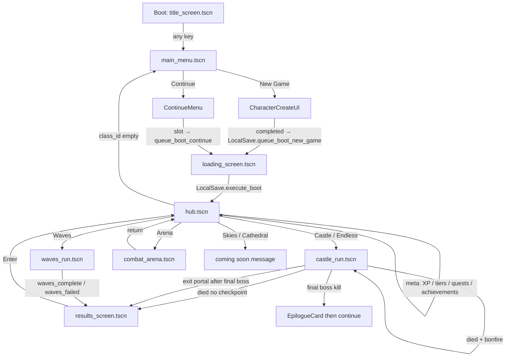

# Game loop — actual player journey

**Status:** Cross-cutting synthesis of what the code does today.  
**Authority scripts:** `project.godot` main scene, `title_screen.gd`, `main_menu.gd`, `loading_screen.gd`, `hub.gd`, `run_flow.gd`, `run_scene_router.gd`, `castle_run.gd`, `waves_run.gd`, `results_screen.gd`.

Per-system docs cover internals. This file maps **boot → meta** and marks every **broken / missing / fake** link.

---

## Loop diagram

---

## Stage-by-stage

### 1. Boot → title

| | |
|--|--|
| **Entry** | `project.godot` `run/main_scene` → `scenes/ui/title_screen.tscn` |
| **Script** | `scripts/ui/title_screen.gd` |
| **Player sees** | Lore panel, ColorRect tower silhouette, “Early Access — Pixel Diorama build” |
| **Status** | Works. Art is PLACEHOLDER. |

### 2. Title → main menu

| | |
|--|--|
| **Transition** | Any key / continue → `main_menu.tscn` |
| **Script** | `title_screen.gd` `_go_to_main_menu()` |
| **Status** | Works. |

### 3. Main menu → character create / continue

| | |
|--|--|
| **New Game** | `main_menu.gd` spawns `CharacterCreateUI` — class, name, appearance |
| **Preview** | FAKE — `GameUISkin.build_human_silhouette()` ColorRects |
| **Continue** | Slot picker → `LocalSave.queue_boot_continue_character()` |
| **Status** | Works. Identity presentation is placeholder. |

### 4. Loading → hub

| | |
|--|--|
| **Gate** | `loading_screen.gd` → `LocalSave.execute_boot()` → `hub.tscn` |
| **Failure** | Returns to main menu |
| **Hub guard** | `hub.gd` `_boot_save_and_services()` — empty `class_id` → main menu |
| **Audio** | `AudioDirector.play_hub_ambience()` — generator tones (PLACEHOLDER / clobbers OGG) |
| **Cloud** | `await LocalSave.sync_from_cloud()` — soft-fails without auth |
| **Status** | Works offline. Cloud is optional/noisy. |

### 5. Hub (meta home)

| Action | Wiring | Status |
|--------|--------|--------|
| Castle portal | `castle_entry_menu` → `RunFlow.start_new_run` / continue / seed | OK |
| Endless (Umbral) | `RunFlow.start_endless_run()` → same `castle_run.tscn` | OK; **no escape portal** by design (`run_flow` gates) |
| Waves | `RunFlow` → `waves_run.tscn` | OK |
| Arena | `RunFlow.go_to_arena()` → `combat_arena.tscn` | OK; training death skips run penalties |
| Blacksmith / merchant / storage / quest board | Interactables in `hub.gd` | Services OK; UI chrome PLACEHOLDER |
| NPC dialogue | Hub NPC group signals | Thin content |
| Aumbrye Skies | Hidden portal + “coming soon.” | **MISSING link** |
| Aumbrye Cathedral | Hidden portal + “coming soon.” | **MISSING link** |
| First-visit tips | `HubTutorialService` | Thin onboarding |

**Hub → run entry:** `RunFlow._enter_run()` / router paths in `run_scene_router.gd`.

### 6. Run — castle / endless (primary loop)

| Phase | Script | Status |
|-------|--------|--------|
| Floor gen | Offline `DungeonProcgen` (online flag false) | OK; fallback graph if gen fails |
| Build | `DungeonBuilder` instances room templates | OK; all rooms blockout |
| Explore / combat | Player + `CastleEnemyBase` | Mechanics OK; feel PLACEHOLDER |
| Boss room | `boss_intro_ui` + boss spawn | Intro lore sparse; several bosses STUB AI |
| Stairs | Stair lever → next floor | OK |
| Floor 10 | Hardcoded Forgotten Sovereign layout | Works; **ignores tier biome fantasy** |
| Final kill | `castle_run` sets `story_completed`, shows `EpilogueCard` | OK for castle finale |
| Exit portal | `exit_portal.gd` → `complete_run_via_portal` | OK; gated by boss + final floor |
| Mid-run retreat | Stair lever Ctrl+retreat after boss | OK |
| Pause abandon | `pause_menu.gd` → `abandon_active_run` → hub | OK |

### 7. Death paths

| Path | Behavior | Status |
|------|----------|--------|
| Arena death | Ignored by `on_player_died` if `training_arena` | OK |
| Bonfire checkpoint | Reload `castle_run.tscn` via `_bonfire_death_respawn` — **no results screen** | OK (intentional) |
| Full death | 50% XP, strip run loot, recoverable shard flag, → results | OK |
| Results copy | “Echo Returned” | OK for castle death |

### 8. Victory / escape

| Path | Behavior | Status |
|------|----------|--------|
| Portal escape | Full XP, keep loot, achievements, tier clear | OK |
| Results copy | “Run Complete” / “Oath Fulfilled” if `story_completed` | OK for castle |
| Meta unlocks | `DungeonTierService.on_dungeon_cleared` | OK |

### 9. Waves mode

| Path | Behavior | Status |
|------|----------|--------|
| Victory pick | `waves_run_ui` → `complete_waves_run` → results with `waves_complete` | Loop OK |
| Failure | `on_waves_failed` → results with `waves_failed` | Loop OK |
| Results UI | `results_screen.gd` does **not** branch on waves outcomes | **BROKEN presentation** — failure can read as success |

### 10. Results → hub → meta

| Step | Script | Status |
|------|--------|--------|
| Enter | `results_screen.gd` → `RunFlow.return_to_hub(message)` | OK scene change |
| Message text | Death vs “Run complete!” only | **Wrong for waves_failed** |
| Persist | `LocalSave.autosave` already on run end | OK |
| Quests | `QuestService` on `run_ended` | **BROKEN** escape-on-any-end; fetch never registers |
| Achievements | Local catalog + toast | OK; Steam stub |
| Leaderboard / cloud finalize | `_cloud_finalize_run` | Soft-fail without backend/auth |

---

## Broken / missing links (checklist)

Use this as the acceptance gate for “the loop is closed.”

| # | Link | Severity | Fix locus |
|---|------|----------|-----------|
| 1 | Waves results ignore `waves_complete` / `waves_failed` | P0 UX | `results_screen.gd` |
| 2 | Escape quest completes on death / any `run_ended` | P0 meta lie | `quest_service.gd` `_on_run_ended` / `_check_escape_quests` |
| 3 | `register_fetch` never called → `fetch_scrap` impossible | P0 meta | Inventory/loot pickup → `QuestService.register_fetch` |
| 4 | Boss placement ID ≠ `get_enemy_id()` (crystal/swamp) | P0 balance/tracking | Boss scripts or spawn resolver |
| 5 | Affix rolls ignore rarity tier tables | P0 loot rarity honesty | `affix_roller.gd` |
| 6 | Audio OGG loaded then replaced by generators | P0 feel | `audio_director.gd` stop clobbering file streams |
| 7 | Skies / Cathedral portals | P1 content hole | Ship biome or remove interactables entirely |
| 8 | Floor 10 always uses the Forgotten Sovereign layout | P1 finale biome hardcode | `dungeon_procgen` final floor |
| 9 | Heal/hit feedback on wrong mesh / stagger-as-heal | P1 combat feel | `player_anim_director`, `player_combat_reactions` |
| 10 | Online procgen / Steam / cloud | P2 platform | Flags + real SDK — not required for local loop |
| 11 | Onboarding beyond tip toast | P1 onboarding gap | Guided first run / arena → first castle |

---

## Mode matrix (what “a run” means)

| Mode | Scene | Win | Lose | Persist |
|------|-------|-----|------|---------|
| Castle tier | `castle_run` | Final boss + exit portal | Death (or bonfire retry) | XP / loot rules / tier unlock |
| Endless | `castle_run` | Survive / deepen floors | Death | XP; no escape portal |
| Waves | `waves_run` | Wave clear + reward pick | Player death | Outcome keys (UI broken) |
| Arena | `combat_arena` | Leave when done | N/A | No run economy |

---

## Observable run milestones

The current loop exposes these state transitions:

1. Character creation emits a selected class, name, and appearance profile.
2. The hub starts castle, endless, waves, or arena modes through `RunFlow`.
3. Castle bosses unlock stairs or a retreat option; the final castle boss enables the exit path.
4. Castle completion sets `story_completed` and shows `EpilogueCard`.
5. Results return to the hub, where progression, quests, and achievements receive run-end events.

The documented gaps above remain: hit audio uses generated tones, chest loot does not consistently use rolled rarity, quest completion can be inaccurate, waves results do not branch by outcome, and floor 10 is hardcoded to the Forgotten Sovereign layout.

Across every stage the player sees **placeholder character art** — every body is a runtime box assembly, not authored pixels. That is out of scope for the loop wiring itself but dominates the feel of every combat and hub beat; see [`character-authoring.md`](character-authoring.md).

---

## Related

- Placeholder rollup: [`00-PLACEHOLDER-INVENTORY.md`](00-PLACEHOLDER-INVENTORY.md)
- Character authoring: [`character-authoring.md`](character-authoring.md)
- Per-flow internals: [`run-flow.md`](run-flow.md), [`hub.md`](hub.md), [`castle-run.md`](castle-run.md), [`waves-run.md`](waves-run.md), [`ui/run_outcome.md`](ui/run_outcome.md)
- Doc conventions: [`../DOC-CONVENTIONS.md`](../DOC-CONVENTIONS.md)
