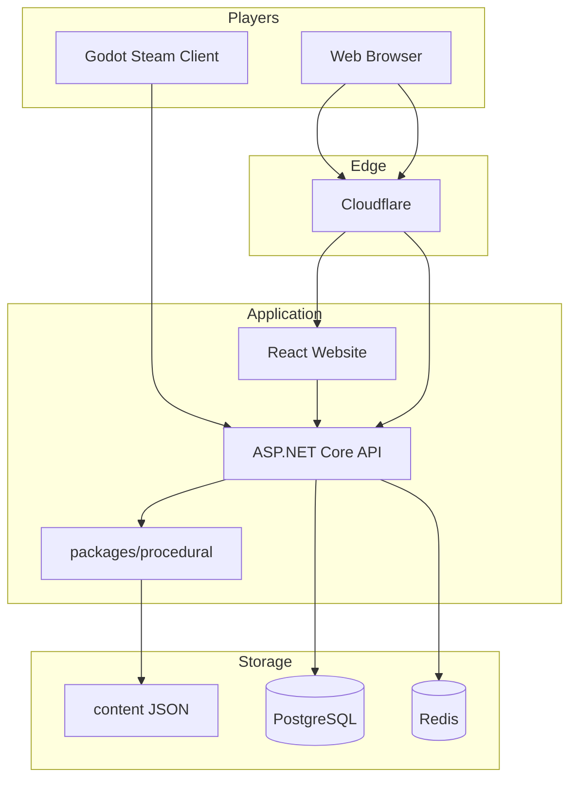
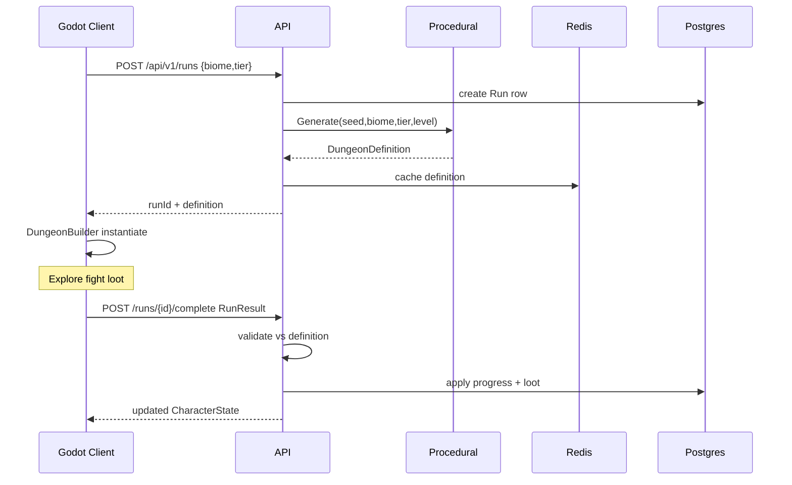

# Architecture

---

## Runtime topology



---

## Authority boundaries

| Concern | Owner | Consumer |
|---------|-------|----------|
| Auth identity | API | Web, Godot |
| Character permanent progress | API + Postgres | Godot (read/apply) |
| Dungeon seed + definition | API + procedural | Godot builder |
| Loot affix rolls | API | Godot display/equip |
| Hit detection feel | Godot | — (server validates run outcomes coarsely) |
| Run completion rewards | API validates | Godot submits `RunResult` |

**Anti-cheat EA posture:** server trusts timing coarsely; validates loot against definition allowances; rejects impossible inventories. Full deterministic combat sim is out of EA scope.

---

## Godot client layering

```
apps/game/client/
  scenes/
    hub/
    dungeon/
    debug/
  scripts/
    app/           # boot, autoloads, config
    input/
    player/
    camera/
    combat/
    enemies/
    bosses/
    dungeon/       # builder, streaming
    items/
    inventory/
    ui/
    audio/
    net/           # API client
    data/          # Resource mirrors of content
    save/
  assets/          # imported runtime assets only
```

**Rule:** gameplay systems do not import UI implementation details; UI listens to signals/state.

---

## Backend layering

```
services/backend/
  src/
    Aumbrye.Api/           # endpoints, DI, auth
    Aumbrye.Application/   # use cases
    Aumbrye.Domain/        # entities, enums
    Aumbrye.Infrastructure/# EF, Redis, files
  tests/
    Aumbrye.UnitTests/
    Aumbrye.IntegrationTests/
packages/
  procedural/              # pure gen, no HTTP
  shared/                  # contracts
```

Feature folders inside Api: `Auth/`, `Runs/`, `Saves/`, `Leaderboards/`, `Content/`.

---

## Dungeon definition flow



---

## Content pipeline

1. Author JSON under `content/`.
2. Validate with JSON Schema in CI (`scripts/validate-content`).
3. API loads content at startup (or hot-reload in dev).
4. Godot imports via exporter script or duplicated Resource defs (milestone-defined).
5. Never silently diverge: schema version field on every pack.

---

## ADR requirement

Any change to DEC-* locks requires `docs/ADR/NNNN-title.md` with:

- Context
- Decision
- Consequences
- Supersedes (if any)
